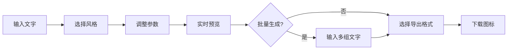

## 1. 产品概述

Web端图标生成器，用户输入文字即可生成多种风格的图标，支持尺寸调节、颜色自定义和批量生成，为设计师和开发者提供快速创建图标的解决方案。

## 2. 核心功能

### 2.1 用户角色
| 角色 | 注册方式 | 核心权限 |
|------|---------|----------|
| 普通用户 | 无需注册 | 使用所有图标生成功能，下载生成的图标 |

### 2.2 功能模块
1. **图标生成器主页面**：文字输入、风格选择、参数配置、实时预览
2. **图标预览区**：多种风格图标展示、尺寸调节、颜色选择
3. **批量生成区**：多文字输入、批量导出功能

### 2.3 页面详情
| 页面名称 | 模块名称 | 功能描述 |
|---------|---------|----------|
| 主页面 | 输入控制区 | 文字输入框、图标尺寸滑块、主色调选择器 |
| 主页面 | 风格选择区 | 线框、填充、渐变、3D四种风格切换 |
| 主页面 | 实时预览区 | Canvas/SVG渲染的图标实时预览 |
| 主页面 | 批量生成区 | 多文字输入、批量生成和下载 |
| 主页面 | 导出控制区 | 格式选择（PNG/SVG）、下载按钮 |

## 3. 核心流程

用户输入文字 → 选择图标风格 → 调整尺寸和颜色参数 → 实时预览生成效果 → （可选）批量输入多组文字 → 选择导出格式 → 下载图标文件

## 4. 用户界面设计

### 4.1 设计风格
- **主色调**：深蓝色渐变（#1e3a8a 到 #3b82f6），体现科技感和专业性
- **辅助色**：紫色（#8b5cf6）作为强调色，用于按钮和交互元素
- **按钮风格**：圆角胶囊型，带有微妙阴影和悬停动效
- **字体**：标题使用 'Space Grotesk'，正文使用 'Inter'，营造现代感
- **布局风格**：卡片式布局，带有玻璃态效果（backdrop-filter）
- **图标风格**：统一使用线性图标，保持简洁现代

### 4.2 页面设计概述
| 页面名称 | 模块名称 | UI元素 |
|---------|---------|--------|
| 主页面 | 标题区域 | 大标题、副标题、渐变背景装饰 |
| 主页面 | 控制面板 | 左侧竖向排列的控制卡片 |
| 主页面 | 预览区域 | 右侧大面积预览画布，网格背景 |
| 主页面 | 批量区域 | 可展开的批量输入面板 |

### 4.3 响应式
- Desktop-first 设计，桌面端为左右分栏布局
- 平板端改为上下布局
- 移动端单列流式布局，优化触摸操作

### 4.4 交互动效
- 图标生成时的淡入缩放动画
- 参数调整时的平滑过渡效果
- 悬停按钮的微交互（轻微上浮+阴影增强）
- 画布背景的微妙动态渐变效果
