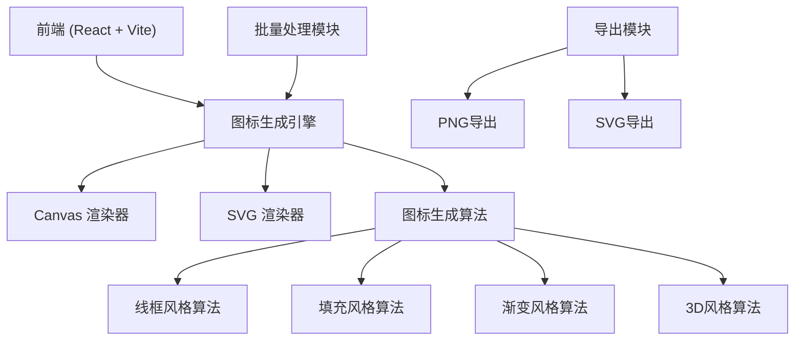

## 1. 架构设计



## 2. 技术描述

- **前端框架**：React@18 + TypeScript
- **构建工具**：Vite@5
- **样式方案**：TailwindCSS@3 + PostCSS
- **图标渲染**：原生 Canvas API + SVG
- **状态管理**：React Hooks (useState, useReducer)
- **后端**：Node.js + Express（提供批量生成API服务）
- **包管理**：npm

## 3. 目录结构

```
├── src/
│   ├── components/
│   │   ├── ControlPanel.tsx      # 控制面板组件
│   │   ├── IconPreview.tsx       # 图标预览组件
│   │   ├── StyleSelector.tsx     # 风格选择器
│   │   ├── BatchGenerator.tsx    # 批量生成组件
│   │   └── ExportPanel.tsx       # 导出面板
│   ├── engine/
│   │   ├── IconGenerator.ts      # 图标生成核心类
│   │   ├── renderers/
│   │   │   ├── CanvasRenderer.ts # Canvas渲染器
│   │   │   └── SvgRenderer.ts    # SVG渲染器
│   │   └── styles/
│   │       ├── outline.ts        # 线框风格算法
│   │       ├── filled.ts         # 填充风格算法
│   │       ├── gradient.ts       # 渐变风格算法
│   │       └── threeD.ts         # 3D风格算法
│   ├── hooks/
│   │   └── useIconGenerator.ts   # 图标生成Hook
│   ├── utils/
│   │   ├── download.ts           # 下载工具函数
│   │   └── color.ts              # 颜色处理工具
│   ├── App.tsx
│   ├── main.tsx
│   └── index.css
├── server/
│   └── index.ts                  # Express后端服务
├── package.json
├── vite.config.ts
└── tailwind.config.js
```

## 4. 核心数据类型

```typescript
// 图标风格类型
type IconStyle = 'outline' | 'filled' | 'gradient' | '3d';

// 图标配置
interface IconConfig {
  text: string;
  size: number;
  primaryColor: string;
  secondaryColor?: string;
  style: IconStyle;
  padding: number;
  borderRadius: number;
}

// 批量生成项
interface BatchItem {
  id: string;
  text: string;
  config: Partial<IconConfig>;
}

// 导出格式
type ExportFormat = 'png' | 'svg';
```

## 5. 后端API定义

### 5.1 批量生成图标
**POST** `/api/batch-generate`

请求体：
```typescript
{
  items: {
    text: string;
    config: IconConfig;
  }[];
  format: ExportFormat;
}
```

响应：
```typescript
{
  success: boolean;
  data: {
    id: string;
    text: string;
    dataUrl: string;
  }[];
}
```

### 5.2 下载批量图标
**POST** `/api/download-batch`

请求体：
```typescript
{
  icons: {
    name: string;
    dataUrl: string;
  }[];
  format: 'zip';
}
```

响应：ZIP文件流

## 6. 图标生成算法说明

### 6.1 线框风格 (Outline)
- 检测文字轮廓，使用贝塞尔曲线平滑处理
- 提取文字边缘路径
- 添加圆角和装饰性线条
- 支持多色线框和虚线效果

### 6.2 填充风格 (Filled)
- 基于文字形状创建几何图形
- 添加内部装饰元素（圆点、线条、图案）
- 支持阴影和内发光效果
- 自动调整字重和形状比例

### 6.3 渐变风格 (Gradient)
- 线性/径向/锥形渐变填充
- 动态渐变角度调整
- 多层渐变叠加效果
- 渐变纹理映射

### 6.4 3D风格 (3D)
- 伪3D透视效果
- 多层挤压和深度感
- 光影模拟（高光+阴影）
- 等距视角变换
