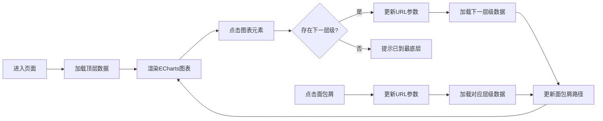

## 1. 产品概述
Web端图表钻取分析组件，支持用户通过点击图表元素逐层下钻查看细分数据，实现从宏观到微观的数据分析体验。解决传统静态图表无法深入探索数据的痛点，为数据分析师和业务决策者提供交互式数据探索工具。

## 2. 核心功能

### 2.1 用户角色
| 角色 | 注册方式 | 核心权限 |
|------|----------|----------|
| 数据分析师 | 无需注册，直接使用 | 查看图表、钻取分析、路径回退 |
| 业务决策者 | 无需注册，直接使用 | 查看图表、钻取分析、分享链接 |

### 2.2 功能模块
1. **图表展示区**：ECharts可视化图表，支持柱状图、饼图等多种图表类型
2. **钻取交互**：点击图表元素触发下钻，展示下一层级数据
3. **路径导航**：面包屑导航显示当前钻取路径，支持点击回退到任意层级
4. **状态持久化**：URL参数记录钻取状态，支持刷新保留和链接分享
5. **层级信息展示**：显示当前层级、可用钻取层级、钻取历史记录

### 2.3 页面详情
| 页面名称 | 模块名称 | 功能描述 |
|-----------|-------------|---------------------|
| 首页 | 图表展示区 | 渲染ECharts图表，支持点击下钻交互，数据动态切换 |
| 首页 | 钻取路径导航 | 面包屑组件展示钻取路径，支持点击回退，显示当前层级名称 |
| 首页 | 状态信息面板 | 显示当前钻取深度、总数据量、操作提示信息 |
| 首页 | 重置按钮 | 一键重置到顶层数据，清空钻取历史 |

## 3. 核心流程
用户进入页面 → 查看顶层数据图表（全国销售数据）→ 点击某省份柱状图 → 图表刷新展示该省份下各城市数据 → 面包屑更新为"全国 > 某省" → 点击某城市继续下钻 → 面包屑更新为"全国 > 某省 > 某市" → 点击面包屑中"全国" → 回到顶层数据。

## 4. 用户界面设计

### 4.1 设计风格
- **主色调**：深邃蓝 #1e3a8a，代表专业和数据感
- **辅助色**：青色 #06b6d4，用于交互元素和高亮
- **强调色**：暖橙 #f97316，用于数据突出显示
- **背景**：深色渐变背景，营造沉浸式数据可视化氛围
- **字体**：Display: Space Grotesk, Body: IBM Plex Sans，现代科技感
- **按钮风格**：圆角8px，悬停有轻微放大和阴影效果
- **布局风格**：卡片式布局，层次分明，留白充足

### 4.2 页面设计概述
| 页面名称 | 模块名称 | UI元素 |
|-----------|-------------|-------------|
| 首页 | 页面标题区 | 大字体标题 + 副标题说明 + 渐变装饰线 |
| 首页 | 图表卡片 | 白色半透明玻璃态背景，圆角16px，阴影层次感 |
| 首页 | 面包屑导航 | 分隔符为斜箭头，当前项高亮，悬停有背景色变化 |
| 首页 | 信息面板 | 网格布局展示统计数据，图标+数字+标签结构 |
| 首页 | 操作按钮 | 渐变背景，图标+文字，悬停有微动效 |

### 4.3 响应性
- 桌面端优先设计，宽度≥1200px时三栏布局
- 平板端（768px-1200px）两栏布局，信息面板移至图表下方
- 移动端（<768px）单栏布局，面包屑改为横向滚动，图表自适应宽度

### 4.4 交互动效
- 图表元素悬停：放大1.05倍，阴影增强
- 下钻切换：数据渐隐渐出过渡动画（300ms）
- 面包屑点击：路径切换有滑动过渡效果
- 页面加载：骨架屏占位，内容渐入动画
