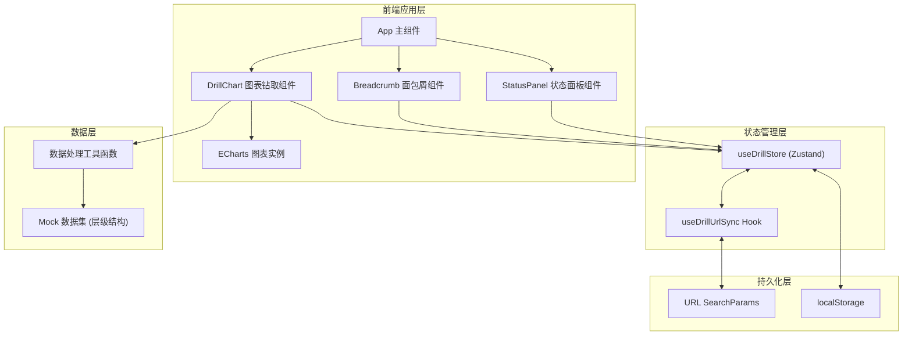
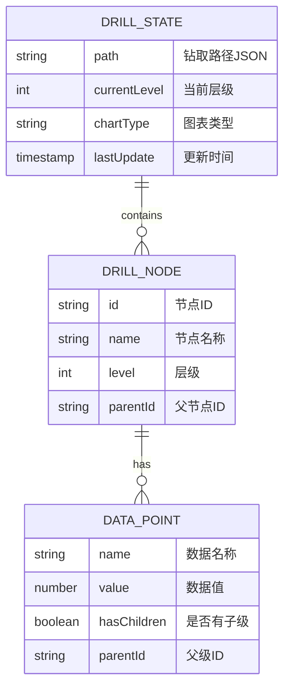

## 1. 架构设计


## 2. 技术描述
- **前端框架**：React@18 + TypeScript
- **构建工具**：Vite@5
- **图表库**：echarts@5 + echarts-for-react
- **状态管理**：zustand@4
- **路由**：react-router-dom@6（用于URL参数管理）
- **样式**：tailwindcss@3
- **图标**：lucide-react
- **数据**：内置Mock数据，支持国家→省份→城市三级钻取

## 3. 路由定义
| 路由 | 用途 | URL参数说明 |
|-------|---------|-------------|
| / | 首页，图表钻取分析主页面 | `?path=国家,省份,城市` - 钻取路径，逗号分隔<br>`?level=2` - 当前层级深度<br>`?chartType=bar` - 图表类型 |

## 4. 核心数据模型

### 4.1 钻取路径数据结构
```typescript
interface DrillNode {
  id: string;
  name: string;
  level: number;
  parentId: string | null;
}

interface DrillState {
  path: DrillNode[];
  currentLevel: number;
  chartType: 'bar' | 'pie' | 'line';
  isDrilling: boolean;
}
```

### 4.2 层级数据集结构
```typescript
interface DataPoint {
  name: string;
  value: number;
  hasChildren: boolean;
}

interface LevelData {
  level: number;
  levelName: string;
  parentId: string | null;
  data: DataPoint[];
}
```

## 5. 数据模型

### 5.1 数据模型定义


### 5.2 Mock数据定义
```typescript
const mockData = {
  country: {
    name: '全国',
    data: [
      { name: '北京市', value: 12500, hasChildren: true },
      { name: '上海市', value: 11800, hasChildren: true },
      { name: '广东省', value: 15600, hasChildren: true },
      { name: '浙江省', value: 9800, hasChildren: true },
      { name: '江苏省', value: 10200, hasChildren: true },
    ]
  },
  province: {
    '广东省': {
      name: '广东省',
      data: [
        { name: '广州市', value: 5200, hasChildren: true },
        { name: '深圳市', value: 6800, hasChildren: true },
        { name: '东莞市', value: 2100, hasChildren: true },
        { name: '佛山市', value: 1500, hasChildren: true },
      ]
    },
    // ... 其他省份数据
  },
  city: {
    '深圳市': {
      name: '深圳市',
      data: [
        { name: '南山区', value: 2800, hasChildren: false },
        { name: '福田区', value: 1800, hasChildren: false },
        { name: '龙岗区', value: 1200, hasChildren: false },
        { name: '宝安区', value: 1000, hasChildren: false },
      ]
    },
    // ... 其他城市数据
  }
};
```

## 6. 目录结构
```
src/
├── components/
│   ├── ChartDrill/         # 图表钻取核心组件
│   │   ├── index.tsx
│   │   └── ChartDrill.css
│   ├── Breadcrumb/         # 面包屑导航组件
│   │   └── index.tsx
│   └── StatusPanel/        # 状态信息面板
│       └── index.tsx
├── hooks/
│   ├── useDrillStore.ts    # Zustand状态管理
│   └── useDrillUrlSync.ts  # URL参数同步Hook
├── data/
│   └── mockData.ts         # Mock数据集
├── utils/
│   └── drillUtils.ts       # 钻取工具函数
├── types/
│   └── drill.ts            # TypeScript类型定义
├── pages/
│   └── Home/
│       └── index.tsx
├── App.tsx
└── main.tsx
```

## 7. 状态同步机制

### 7.1 URL参数同步流程
1. 组件初始化：读取URL参数 → 解析path → 恢复钻取状态
2. 钻取操作：更新Store → 同步到URL SearchParams → 持久化到localStorage
3. 页面刷新：读取URL参数优先级 > localStorage

### 7.2 状态持久化策略
- **URL参数**：用于分享链接和浏览器前进后退
- **localStorage**：用于页面刷新后的状态恢复（URL缺失时）
- **Store内存**：运行时状态管理
