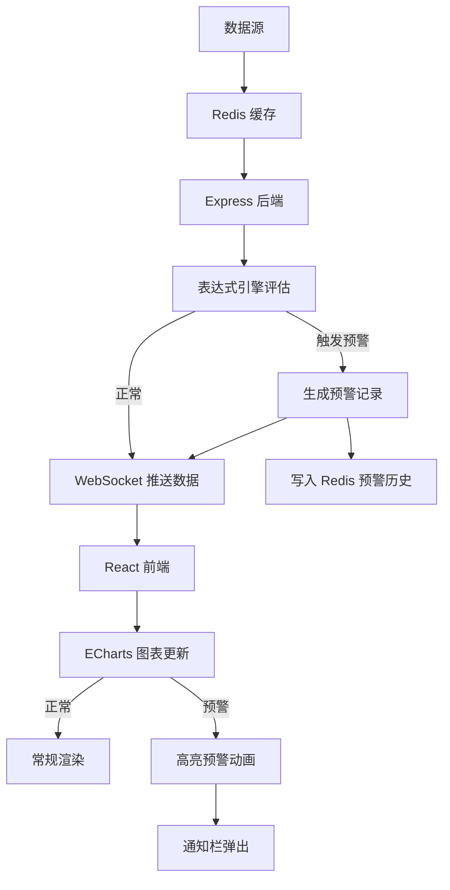

## 1. 产品概述

图表数据预警组件是一个实时监控仪表盘应用，通过 WebSocket 实时推送数据源变化，当数值超出配置阈值时，ECharts 图表自动高亮预警。面向运维工程师、数据分析师等需要实时监控数据异常场景的用户。

- 解决传统图表需人工巡检的问题，实现数据异常自动感知与可视化预警
- 支持灵活的多阈值配置与表达式条件，适配复杂业务监控需求

## 2. 核心功能

### 2.1 用户角色

| 角色 | 注册方式 | 核心权限 |
|------|----------|----------|
| 监控管理员 | 默认登录 | 配置阈值、管理预警规则、查看历史记录 |
| 观察者 | 默认登录 | 查看图表、查看预警历史 |

### 2.2 功能模块

1. **监控仪表盘页**：实时图表展示、预警高亮动画、数据指标卡片
2. **预警配置页**：阈值规则配置、表达式编辑器、预警等级管理
3. **预警历史页**：历史记录列表、筛选与搜索、预警详情回放

### 2.3 页面详情

| 页面名称 | 模块名称 | 功能描述 |
|----------|----------|----------|
| 监控仪表盘 | 实时图表面板 | ECharts 折线图/柱状图实时渲染，WebSocket 推送数据自动更新 |
| 监控仪表盘 | 预警高亮 | 数值超出阈值时图表区域变色、脉冲动画、边框闪烁 |
| 监控仪表盘 | 数据指标卡片 | 关键指标实时数值展示，带预警状态颜色指示 |
| 监控仪表盘 | 预警通知栏 | 右侧滑出式预警通知列表，实时推送新预警 |
| 预警配置 | 阈值规则表 | 多级阈值配置（警告/危险/严重），支持增删改 |
| 预警配置 | 表达式编辑器 | 可视化条件表达式编辑，支持 AND/OR/比较运算符 |
| 预警配置 | 预警等级管理 | 自定义预警等级颜色、图标、通知方式 |
| 预警历史 | 历史记录列表 | 分页展示预警记录，含时间、指标、阈值、当前值 |
| 预警历史 | 筛选与搜索 | 按时间范围、预警等级、指标名称、状态筛选 |
| 预警历史 | 预警详情回放 | 点击记录查看当时图表快照与数据详情 |

## 3. 核心流程

用户打开监控仪表盘，系统通过 WebSocket 建立实时连接，后端定时从 Redis 读取数据并推送到前端。前端 ECharts 图表实时更新，表达式引擎对每条新数据执行预警规则判断。当数据满足预警条件时，图表区域自动高亮变色，同时预警记录写入 Redis 并在通知栏实时弹出。用户可在预警配置页管理阈值规则和表达式，在预警历史页回顾和分析历史预警。

## 4. 用户界面设计

### 4.1 设计风格

- **主题**：深色工业风控制台（Dark Industrial Control Room）
- **主色调**：深蓝黑底色 (#0a0e17)，青色数据流 (#00d4ff)，琥珀预警 (#f59e0b)，红色严重 (#ef4444)
- **按钮风格**：圆角微3D，带微妙光泽和悬停发光效果
- **字体**：JetBrains Mono（数据/数字），DM Sans（标签/正文）
- **布局风格**：左侧导航栏 + 主内容区，卡片式模块布局
- **图标风格**：线性描边图标（Lucide），预警使用脉冲动画效果

### 4.2 页面设计概览

| 页面名称 | 模块名称 | UI 元素 |
|----------|----------|---------|
| 监控仪表盘 | 实时图表面板 | 深色背景 ECharts 图表，网格线淡灰色，数据线青色渐变，预警区域红色半透明覆盖 |
| 监控仪表盘 | 预警高亮 | 阈值线虚线标注（琥珀/红色），超出区域填充渐变色，脉冲边框动画 |
| 监控仪表盘 | 数据指标卡片 | 深灰卡片，左边缘彩色指示条，数字用 JetBrains Mono 大号显示 |
| 监控仪表盘 | 预警通知栏 | 右侧抽屉式面板，新通知从顶部滑入，带闪烁指示灯 |
| 预警配置 | 阈值规则表 | 深色表格行，操作按钮悬停发光，表头固定 |
| 预警配置 | 表达式编辑器 | 代码编辑区风格，语法高亮，运算符按钮面板 |
| 预警配置 | 预警等级管理 | 彩色标签卡片，拖拽排序，颜色选择器 |
| 预警历史 | 历史记录列表 | 斑马纹深色表格，预警等级彩色圆点标记，时间轴样式 |
| 预警历史 | 筛选与搜索 | 顶部筛选条，下拉选择器+日期范围+搜索框 |
| 预警历史 | 预警详情回放 | 模态对话框，图表快照+数据表格+预警条件高亮 |

### 4.3 响应式设计

- 桌面优先设计，1280px+ 最佳体验
- 平板（768px-1279px）：图表缩小为单列，通知栏改为底部面板
- 手机（<768px）：简化视图，仅显示指标卡片和预警列表

### 4.4 动效设计

- 页面加载：卡片依次渐入（stagger animation）
- 预警触发：图表区域脉冲闪烁 + 通知滑入
- 数据更新：数字翻牌动效（odometer effect）
- 侧边栏：悬停展开标签文字
