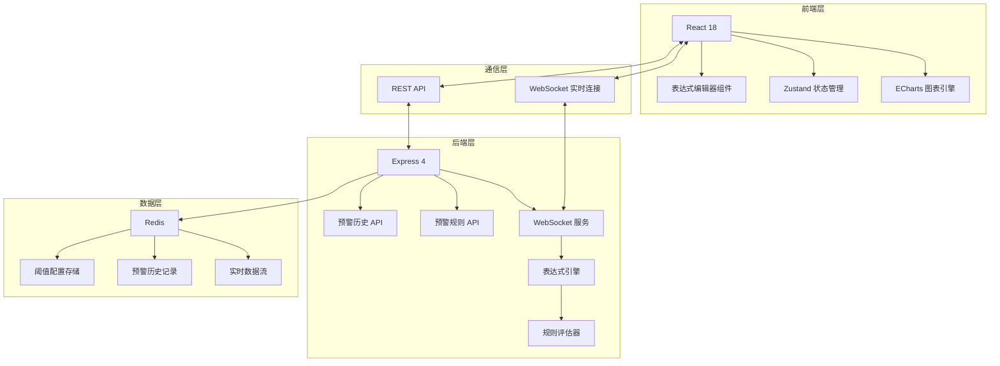
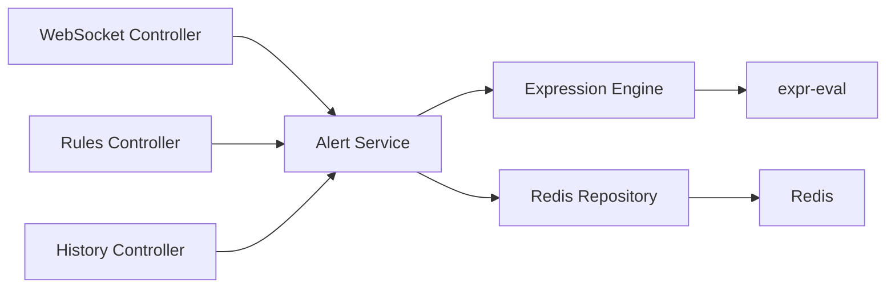
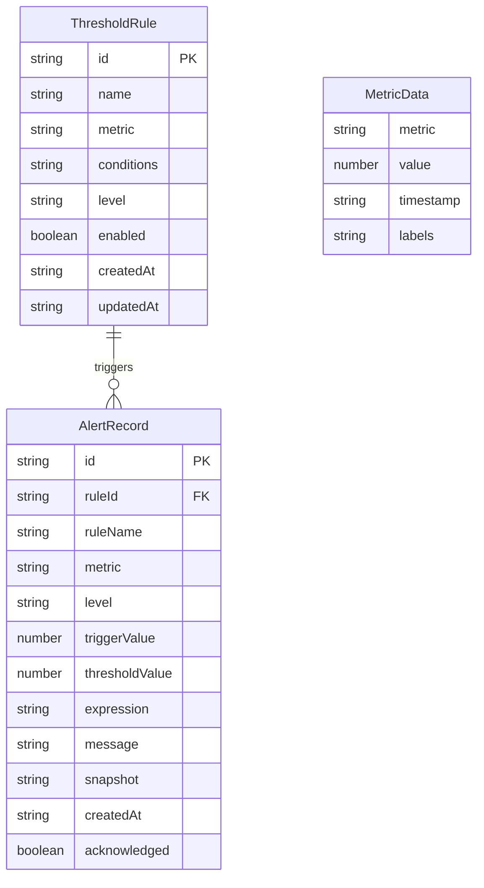

## 1. 架构设计



## 2. 技术说明

- **前端**：React@18 + TypeScript + Tailwind CSS@3 + Vite
- **图表引擎**：echarts@5 + echarts-for-react
- **状态管理**：zustand
- **路由**：react-router-dom@6
- **图标**：lucide-react
- **表达式引擎**：expr-eval（轻量级数学/逻辑表达式解析器）
- **初始化工具**：vite-init（react-express-ts 模板）
- **后端**：Express@4 + TypeScript + ws（WebSocket）
- **数据库**：Redis（ioredis 驱动）
- **实时通信**：WebSocket（ws 库）

## 3. 路由定义

| 路由 | 用途 |
|------|------|
| / | 监控仪表盘 - 实时图表与预警展示 |
| /config | 预警配置 - 阈值规则与表达式管理 |
| /history | 预警历史 - 历史记录查询与回放 |

## 4. API 定义

### 4.1 预警规则 API

```typescript
interface ThresholdRule {
  id: string;
  name: string;
  metric: string;
  conditions: AlertCondition[];
  level: 'warning' | 'danger' | 'critical';
  enabled: boolean;
  createdAt: string;
  updatedAt: string;
}

interface AlertCondition {
  field: string;
  operator: '>' | '<' | '>=' | '<=' | '==' | '!=';
  value: number;
  logic?: 'AND' | 'OR';
}

// GET /api/rules - 获取所有预警规则
// POST /api/rules - 创建预警规则
// PUT /api/rules/:id - 更新预警规则
// DELETE /api/rules/:id - 删除预警规则
```

### 4.2 预警历史 API

```typescript
interface AlertRecord {
  id: string;
  ruleId: string;
  ruleName: string;
  metric: string;
  level: 'warning' | 'danger' | 'critical';
  triggerValue: number;
  thresholdValue: number;
  expression: string;
  message: string;
  snapshot: ChartSnapshot;
  createdAt: string;
  acknowledged: boolean;
}

interface ChartSnapshot {
  seriesData: number[];
  timestamp: string;
  xAxisLabels: string[];
}

interface AlertHistoryQuery {
  page: number;
  pageSize: number;
  level?: 'warning' | 'danger' | 'critical';
  metric?: string;
  startTime?: string;
  endTime?: string;
  acknowledged?: boolean;
}

// GET /api/alerts - 查询预警历史（分页+筛选）
// GET /api/alerts/:id - 获取预警详情
// PUT /api/alerts/:id/acknowledge - 确认预警
```

### 4.3 实时数据 API

```typescript
interface MetricData {
  metric: string;
  value: number;
  timestamp: string;
  labels: Record<string, string>;
}

interface WebSocketMessage {
  type: 'data' | 'alert' | 'config_update';
  payload: MetricData | AlertRecord | ThresholdRule;
}
```

## 5. 服务端架构图



## 6. 数据模型

### 6.1 数据模型定义



### 6.2 Redis 数据结构

```
# 预警规则（Hash）
rule:{id} -> {name, metric, conditions, level, enabled, createdAt, updatedAt}

# 实时指标数据（Sorted Set，按时间排序）
metric:{name} -> [{timestamp: value}]

# 预警历史记录（List，最新在前）
alert:history -> [{id, ruleId, ...}]

# 预警详情（Hash）
alert:{id} -> {ruleId, ruleName, metric, level, ...}

# 全局自增ID
counter:rule -> integer
counter:alert -> integer
```
