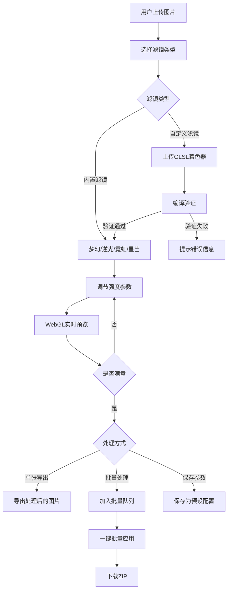

## 1. 产品概述

Web端光效滤镜库——一个基于WebGL的专业级图片光效滤镜应用平台，提供梦幻、逆光、霓虹、星芒四种核心光效滤镜，支持强度实时调节与预览，同时允许用户上传自定义GLSL着色器滤镜、批量处理多张图片、保存和加载滤镜参数配置。

- 目标用户：摄影师、设计师、社交媒体内容创作者、图片后期爱好者
- 核心价值：零门槛使用专业级GPU加速光效滤镜，实时预览所见即所得，自定义扩展无限可能

## 2. 核心功能

### 2.1 用户角色

| 角色 | 注册方式 | 核心权限 |
|------|----------|----------|
| 普通用户 | 无需注册 | 使用内置滤镜、上传图片、调节参数、实时预览、保存参数到本地 |
| 高级用户 | 无需注册 | 以上权限 + 上传自定义着色器、批量应用、导出处理结果 |

### 2.2 功能模块

1. **工作台页面**：图片上传/拖放、滤镜选择面板、强度调节滑块、WebGL实时预览画布、参数保存/加载、批量处理队列、自定义滤镜上传入口

### 2.3 页面详情

| 页面名称 | 模块名称 | 功能描述 |
|----------|----------|----------|
| 工作台 | 图片上传区 | 拖拽或点击上传图片，支持JPG/PNG/WebP，显示缩略图列表 |
| 工作台 | 滤镜选择面板 | 展示四种内置滤镜（梦幻/逆光/霓虹/星芒）+ 用户自定义滤镜，点击切换 |
| 工作台 | 强度调节器 | 每种滤镜独立的强度滑块(0-100%)，支持细粒度微调 |
| 工作台 | WebGL预览画布 | 实时渲染滤镜效果，原图/效果图对比切换，缩放拖拽查看细节 |
| 工作台 | 自定义滤镜上传 | 上传GLSL片段着色器文件，自动编译验证，即时可用 |
| 工作台 | 批量处理 | 选择多张图片 + 滤镜配置，一键批量应用并下载ZIP |
| 工作台 | 参数保存/加载 | 保存当前滤镜配置为预设，从已保存预设加载，支持导出JSON |
| 工作台 | 导出面板 | 单张导出(含元数据)、批量导出ZIP、选择输出格式与质量 |

## 3. 核心流程

用户打开应用 → 上传图片 → 选择滤镜 → 调节强度 → 实时预览效果 → 满意后导出/保存参数

批量流程：上传多张图片 → 配置滤镜参数 → 加入批量队列 → 一键批量处理 → 下载ZIP

自定义滤镜流程：编写GLSL着色器 → 上传.frag文件 → 系统编译验证 → 验证通过后出现在滤镜面板 → 使用

## 4. 用户界面设计

### 4.1 设计风格

- **主色调**：深色系背景(#0A0E17) + 霓虹青色(#00F5D4)作为主强调色 + 琥珀色(#FFB800)作为辅助强调色
- **按钮风格**：圆角(8px)、半透明玻璃拟态背景、霓虹发光边框hover效果
- **字体**：标题使用Outfit（几何感现代字体），正文使用DM Sans
- **布局风格**：左侧滤镜面板 + 中央画布预览 + 右侧参数面板的三栏布局
- **图标风格**：线性图标，24px，lucide-react图标库

### 4.2 页面设计概述

| 页面名称 | 模块名称 | UI元素 |
|----------|----------|--------|
| 工作台 | 整体布局 | 三栏布局，深色背景，微光网格纹理，玻璃拟态面板 |
| 工作台 | 图片上传区 | 虚线边框拖拽区，hover时边框霓虹发光，上传后显示缩略图网格 |
| 工作台 | 滤镜面板 | 垂直卡片列表，每个卡片含滤镜缩略图预览+名称，选中时霓虹边框 |
| 工作台 | 预览画布 | 居中大画布，原图/效果左右对比分割线，底部缩放控制条 |
| 工作台 | 参数面板 | 自定义Range滑块(霓虹渐变轨道)，实时数值显示，预设保存/加载按钮组 |
| 工作台 | 自定义滤镜上传 | 上传区域+编译状态指示器(绿/红圆点)，错误时显示行号和原因 |
| 工作台 | 批量处理 | 底部可展开面板，缩略图队列+进度条+批量导出按钮 |
| 工作台 | 导出面板 | 弹出模态框，格式选择(JPG/PNG/WebP)、质量滑块、导出按钮 |

### 4.3 响应式设计

- 桌面端(≥1280px)：三栏完整布局
- 平板端(768-1279px)：滤镜面板折叠为图标栏，参数面板改为底部抽屉
- 移动端(<768px)：单栏布局，滤镜横向滑动选择，画布全屏预览

### 4.4 动效设计

- 滤镜切换时画布平滑过渡(300ms crossfade)
- 滑块拖动时实时着色器uniform更新，60fps流畅预览
- 面板展开/收起使用spring弹性动画
- 背景网格微妙呼吸动画
- 上传成功时缩略图弹入动画
- 批量处理进度条霓虹脉冲动画
