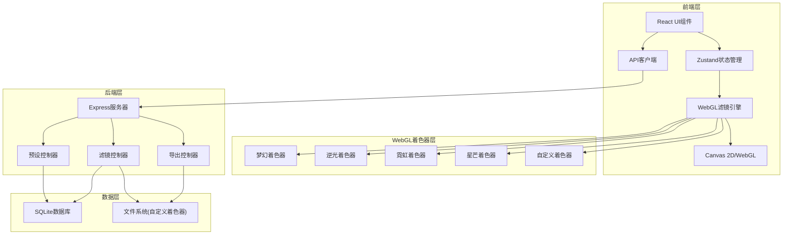
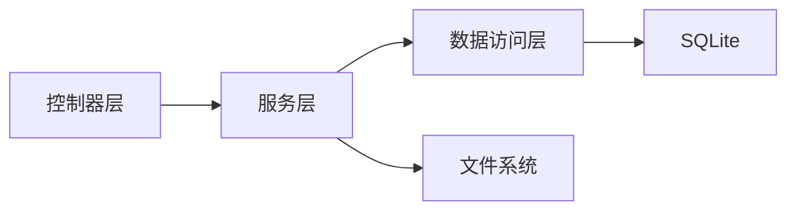
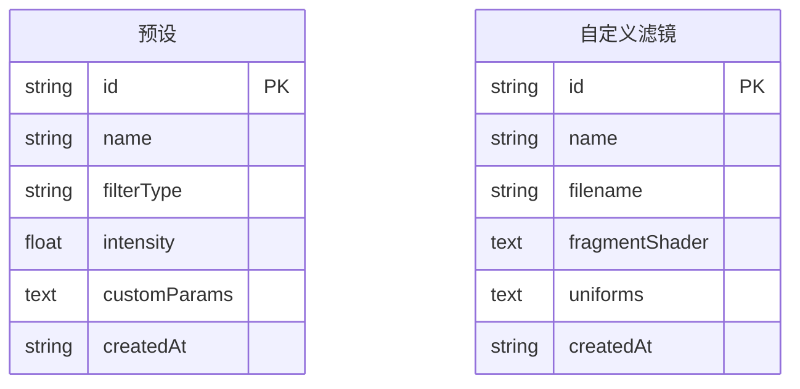

## 1. 架构设计



## 2. 技术说明

- **前端**：React@18 + TypeScript + TailwindCSS@3 + Vite + Zustand
- **初始化工具**：vite-init (react-express-ts模板)
- **WebGL渲染**：原生WebGL2 API，自定义着色器管理器
- **后端**：Express@4 + TypeScript (ESM)
- **数据库**：SQLite (better-sqlite3)，存储预设配置和自定义滤镜元数据
- **文件存储**：本地文件系统存储自定义着色器文件和导出图片

## 3. 路由定义

| 路由 | 用途 |
|------|------|
| / | 工作台主页面，滤镜选择、预览、参数调节 |
| /batch | 批量处理页面，多图片队列管理 |

## 4. API定义

### 4.1 预设管理

```typescript
interface FilterPreset {
  id: string;
  name: string;
  filterType: string;
  intensity: number;
  customParams: Record<string, number>;
  createdAt: string;
}

// GET /api/presets - 获取所有预设
// POST /api/presets - 创建预设
// DELETE /api/presets/:id - 删除预设
// PUT /api/presets/:id - 更新预设
```

### 4.2 自定义滤镜管理

```typescript
interface CustomFilter {
  id: string;
  name: string;
  filename: string;
  fragmentShader: string;
  uniforms: ShaderUniform[];
  createdAt: string;
}

interface ShaderUniform {
  name: string;
  type: 'float' | 'vec2' | 'vec3' | 'vec4';
  defaultValue: number | number[];
  min?: number;
  max?: number;
}

// GET /api/filters/custom - 获取自定义滤镜列表
// POST /api/filters/custom - 上传自定义滤镜(含着色器编译验证)
// DELETE /api/filters/custom/:id - 删除自定义滤镜
// POST /api/filters/custom/validate - 验证着色器编译
```

### 4.3 导出

```typescript
// POST /api/export/single - 导出单张图片
// POST /api/export/batch - 批量导出(ZIP)
```

## 5. 服务器架构图



## 6. 数据模型

### 6.1 数据模型定义



### 6.2 数据定义语言

```sql
CREATE TABLE presets (
  id TEXT PRIMARY KEY,
  name TEXT NOT NULL,
  filterType TEXT NOT NULL,
  intensity REAL NOT NULL DEFAULT 0.5,
  customParams TEXT DEFAULT '{}',
  createdAt TEXT NOT NULL DEFAULT (datetime('now'))
);

CREATE TABLE custom_filters (
  id TEXT PRIMARY KEY,
  name TEXT NOT NULL,
  filename TEXT NOT NULL,
  fragmentShader TEXT NOT NULL,
  uniforms TEXT DEFAULT '[]',
  createdAt TEXT NOT NULL DEFAULT (datetime('now'))
);

CREATE INDEX idx_presets_filterType ON presets(filterType);
CREATE INDEX idx_custom_filters_name ON custom_filters(name);
```

## 7. WebGL着色器架构

### 7.1 着色器管理器

核心类`ShaderManager`负责：
- 编译和链接着色器程序
- 管理uniform变量
- 处理纹理上传和绑定
- 自定义着色器的热编译和错误处理

### 7.2 内置着色器效果

| 滤镜 | 核心技术 | 关键Uniform |
|------|----------|-------------|
| 梦幻 | 高斯模糊 + 色彩偏移 + 光晕叠加 | uIntensity, uBlurRadius, uGlowColor |
| 逆光 | 径向渐变 + 镜头光晕 + 对比度增强 | uIntensity, uLightPos, uFlareSize |
| 霓虹 | 边缘检测 + 发光描边 + 色彩饱和度增强 | uIntensity, uGlowWidth, uNeonColor |
| 星芒 | 极坐标变换 + 放射线条 + 十字光芒 | uIntensity, uRayCount, uRayLength |

### 7.3 渲染管线

```
上传图片 → 创建WebGL纹理 → 选择着色器程序 → 设置uniform → 渲染到FBO → 读回像素/显示到画布
```
