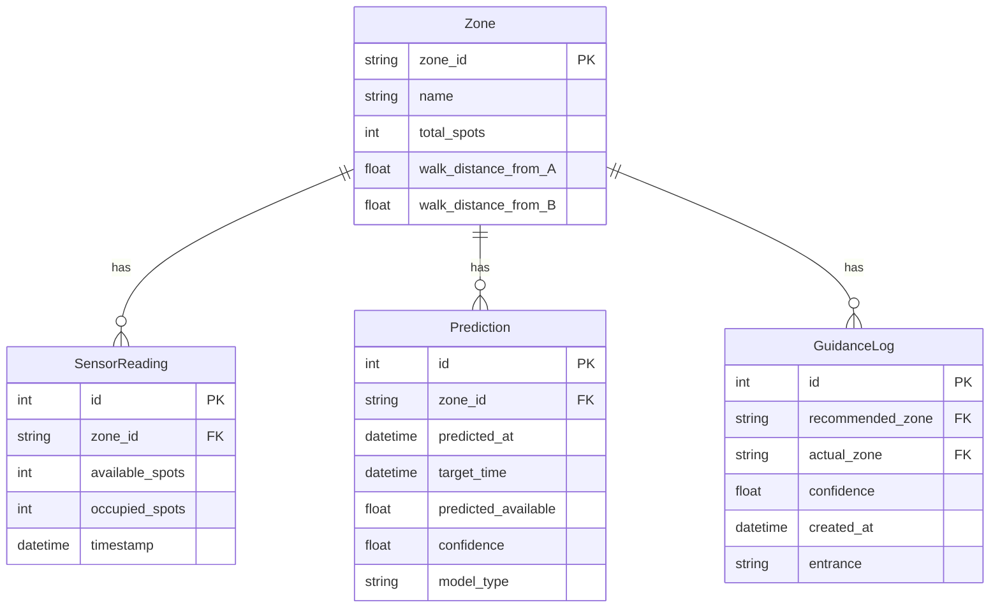

## 1. 架构设计

```mermaid
graph TB
    subgraph "前端层"
        "React + Vite" --> "地图组件(SVG)"
        "React + Vite" --> "实时监控面板"
        "React + Vite" --> "预测趋势图"
        "React + Vite" --> "引导推荐UI"
    end
    subgraph "后端层(Python FastAPI)"
        "API路由" --> "传感器服务"
        "API路由" --> "预测服务"
        "API路由" --> "引导服务"
        "传感器服务" --> "数据存储"
        "预测服务" --> "时序模型"
        "引导服务" --> "RL Agent"
    end
    subgraph "数据层"
        "SQLite" --> "历史记录"
        "SQLite" --> "传感器读数"
        "SQLite" --> "引导日志"
    end
    subgraph "模型层"
        "时序模型" --> "ARIMA/LSTM预测"
        "RL Agent" --> "Q-Learning策略"
    end
    "传感器模拟器" --> "传感器服务"
    "React + Vite" -->|"WebSocket/SSE"| "API路由"
```

## 2. 技术说明

- 前端：React@18 + TypeScript + TailwindCSS@3 + Vite + Zustand + Recharts
- 初始化工具：vite-init
- 后端：Python 3.10+ / FastAPI
- 数据库：SQLite（轻量级，单文件部署）
- 时序预测：statsmodels（ARIMA）+ 简化LSTM（纯numpy实现）
- 强化学习：Q-Learning（纯Python实现）
- 传感器API：模拟传感器数据生成器
- 地图：SVG矢量图（自绘停车场布局）

## 3. 路由定义

| 路由 | 用途 |
|------|------|
| / | 监控大屏页 - 主页面，实时地图与监控 |
| /analytics | 数据分析页 - 历史数据与模型评估 |
| /guide | 引导推荐页 - 最优推荐与模拟 |

## 4. API定义

### 4.1 传感器数据接口

```typescript
interface SensorReading {
  zone_id: string
  total_spots: number
  occupied_spots: number
  available_spots: number
  timestamp: string
}

// GET /api/zones - 获取所有区域实时状态
// GET /api/zones/{zone_id} - 获取单个区域状态
// GET /api/zones/{zone_id}/history?hours=24 - 获取历史数据
```

### 4.2 预测接口

```typescript
interface PredictionResult {
  zone_id: string
  predictions: { timestamp: string; available_spots: number; confidence: number }[]
  model_type: string
  accuracy_metrics: { mae: number; rmse: number }
}

// GET /api/predict/{zone_id}?minutes=30 - 获取预测结果
// POST /api/predict/train - 触发模型重新训练
```

### 4.3 引导接口

```typescript
interface GuidanceResult {
  recommended_zone: string
  estimated_available_time: string
  confidence: number
  walking_distance: number
  reason: string
  alternatives: { zone_id: string; score: number }[]
}

// GET /api/guide/recommend?entrance=A - 获取推荐区域
// GET /api/guide/simulate?entrance=A&zone_id=B - 模拟到达
// POST /api/guide/feedback - 提交引导反馈（用于RL训练）
```

### 4.4 SSE实时推送

```
// GET /api/stream - SSE实时数据推送
// 事件类型: zone_update, prediction_update, guide_update
```

## 5. 服务端架构图

```mermaid
graph LR
    "FastAPI Router" --> "SensorService"
    "FastAPI Router" --> "PredictionService"
    "FastAPI Router" --> "GuidanceService"
    "SensorService" --> "SensorSimulator"
    "SensorService" --> "Database"
    "PredictionService" --> "ARIMAModel"
    "PredictionService" --> "Database"
    "GuidanceService" --> "QLearningAgent"
    "GuidanceService" --> "PredictionService"
    "GuidanceService" --> "Database"
```

## 6. 数据模型

### 6.1 数据模型定义



### 6.2 数据定义语言

```sql
CREATE TABLE zones (
    zone_id TEXT PRIMARY KEY,
    name TEXT NOT NULL,
    total_spots INTEGER NOT NULL,
    walk_distance_from_entrance_a REAL NOT NULL,
    walk_distance_from_entrance_b REAL NOT NULL
);

CREATE TABLE sensor_readings (
    id INTEGER PRIMARY KEY AUTOINCREMENT,
    zone_id TEXT NOT NULL REFERENCES zones(zone_id),
    available_spots INTEGER NOT NULL,
    occupied_spots INTEGER NOT NULL,
    timestamp DATETIME NOT NULL DEFAULT CURRENT_TIMESTAMP
);

CREATE TABLE predictions (
    id INTEGER PRIMARY KEY AUTOINCREMENT,
    zone_id TEXT NOT NULL REFERENCES zones(zone_id),
    predicted_at DATETIME NOT NULL DEFAULT CURRENT_TIMESTAMP,
    target_time DATETIME NOT NULL,
    predicted_available REAL NOT NULL,
    confidence REAL NOT NULL,
    model_type TEXT NOT NULL
);

CREATE TABLE guidance_logs (
    id INTEGER PRIMARY KEY AUTOINCREMENT,
    recommended_zone TEXT NOT NULL REFERENCES zones(zone_id),
    actual_zone TEXT REFERENCES zones(zone_id),
    confidence REAL NOT NULL,
    entrance TEXT NOT NULL,
    created_at DATETIME NOT NULL DEFAULT CURRENT_TIMESTAMP
);

INSERT INTO zones VALUES ('A', 'A区-地面层', 50, 10, 120);
INSERT INTO zones VALUES ('B', 'B区-地面层', 40, 50, 80);
INSERT INTO zones VALUES ('C', 'C区-地下一层', 60, 90, 40);
INSERT INTO zones VALUES ('D', 'D区-地下一层', 45, 130, 20);
INSERT INTO zones VALUES ('E', 'E区-地下二层', 55, 100, 60);
```
