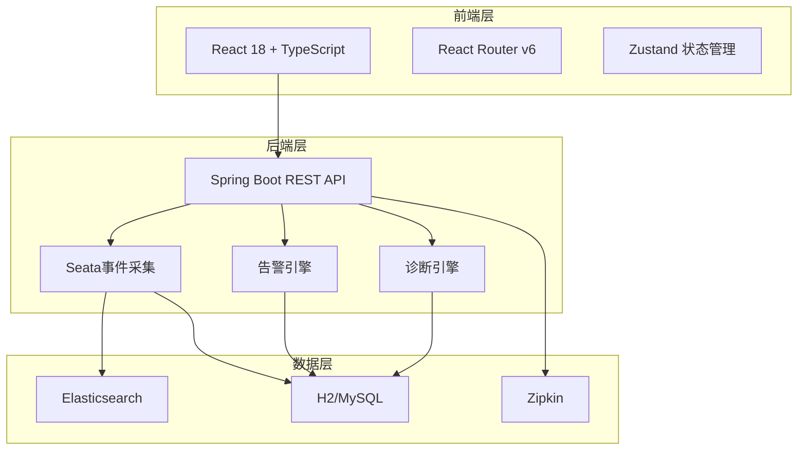
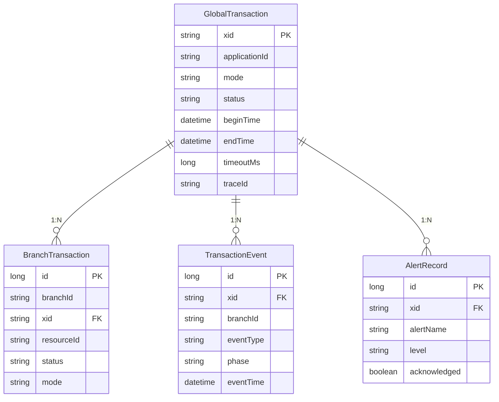

## 1. 架构设计



## 2. 技术说明
- 前端：React@18 + TypeScript + TailwindCSS@3 + Vite
- 初始化工具：vite-init
- 后端：Java 11 + Spring Boot 2.7 + Seata 1.7.1（已独立实现）
- 数据库：H2（开发）/ MySQL（生产）+ Elasticsearch 7.17
- 链路追踪：Zipkin + Brave
- 图表库：Recharts
- DAG可视化：React Flow

## 3. 路由定义
| 路由 | 用途 |
|------|------|
| / | 仪表盘 - 全局事务概览 |
| /transactions | 事务列表 - 筛选与浏览 |
| /transactions/:xid | 事务详情 - 基本信息、分支、事件 |
| /trace/:traceId | 链路可视化 - DAG图与Span时间线 |
| /alerts | 告警管理 - 告警列表与规则 |
| /diagnosis/:xid | 异常诊断 - 诊断报告 |

## 4. API定义

### 4.1 事务API
```typescript
interface GlobalTransaction {
  xid: string;
  applicationId: string;
  transactionServiceGroup: string;
  mode: 'TCC' | 'SAGA' | 'AT' | 'XA';
  status: 'BEGIN' | 'COMMITTING' | 'COMMITTED' | 'ROLLBACKING' | 'ROLLEDBACK' | 'TIMEOUT' | 'FAILED' | 'UNKNOWN';
  beginTime: string;
  endTime: string | null;
  timeoutMs: number | null;
  traceId: string | null;
  remark: string | null;
  rollbackReason: string | null;
}

interface BranchTransaction {
  id: number;
  branchId: string;
  xid: string;
  resourceId: string;
  status: string;
  mode: string;
  applicationId: string;
  beginTime: string;
  endTime: string | null;
  traceId: string | null;
  spanId: string | null;
  errorMessage: string | null;
}

interface TransactionEvent {
  id: number;
  xid: string;
  branchId: string | null;
  eventType: string;
  phase: string;
  traceId: string | null;
  spanId: string | null;
  applicationId: string | null;
  payload: string | null;
  errorMessage: string | null;
  eventTime: string;
}
```

### 4.2 告警API
```typescript
interface AlertRecord {
  id: number;
  alertName: string;
  xid: string;
  branchId: string | null;
  level: 'INFO' | 'WARNING' | 'CRITICAL' | 'EMERGENCY';
  alertRule: string;
  message: string;
  acknowledged: boolean;
  acknowledgedBy: string | null;
  triggeredAt: string;
}

interface AlertRule {
  name: string;
  description: string;
  level: string;
  condition: string;
  thresholdMs: number;
  enabled: boolean;
}
```

### 4.3 诊断API
```typescript
interface DiagnosisReport {
  xid: string;
  severity: 'LOW' | 'MEDIUM' | 'HIGH' | 'CRITICAL';
  rootCause: string;
  suggestion: string;
  items: DiagnosisItem[];
  relatedTransactions: string[];
}

interface DiagnosisItem {
  category: string;
  description: string;
  detail: string;
  severity: string;
}
```

### 4.4 链路追踪API
```typescript
interface TraceSpan {
  traceId: string;
  spanId: string;
  parentSpanId: string | null;
  name: string;
  serviceName: string;
  startMicros: number;
  endMicros: number;
  durationMicros: number;
  kind: string;
  tags: { key: string; value: string }[];
}

interface TraceDag {
  traceId: string;
  nodes: { id: string; name: string; serviceName: string; durationMs: number; status: string }[];
  edges: { source: string; target: string; label: string }[];
}
```

### 4.5 统计API
```typescript
interface TransactionStats {
  byStatus: Record<string, number>;
  byMode: Record<string, number>;
  activeCount: number;
  lastHourCount: number;
}
```

## 5. 服务端架构（已实现）
后端采用Spring Boot多模块Maven架构，包含：
- monitor-core：核心实体与Service
- monitor-collector：Seata事件采集
- monitor-trace：Zipkin链路追踪集成
- monitor-storage：Elasticsearch存储
- monitor-alert：告警引擎
- monitor-diagnosis：异常诊断
- monitor-api：REST API + WebSocket

## 6. 数据模型

### 6.1 数据模型定义

