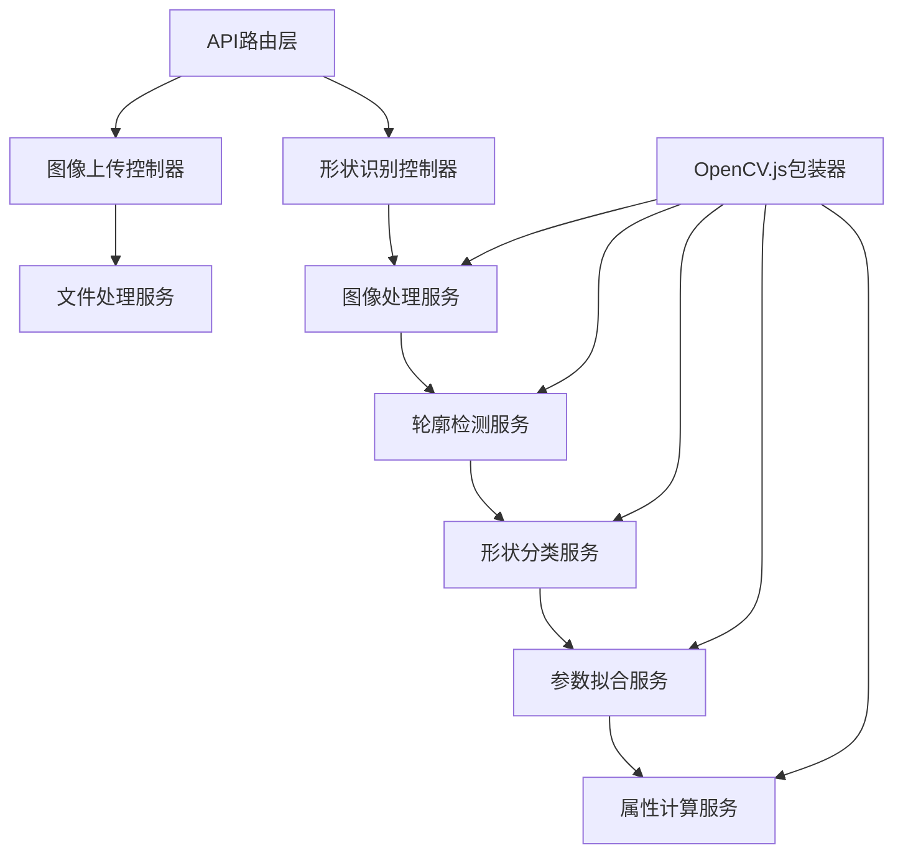

## 1. 架构设计

```mermaid
graph TD
    subgraph "前端 (React + Vite"
        A["Canvas画布组件"] --> B["形状渲染层"]
        A --> C["手绘交互层"]
        D["工具栏组件"] --> E["手绘工具
        D --> F["上传工具"]
        D --> G["识别工具"]
        H["属性面板组件"] --> H1["形状列表"]
        H --> H2["属性测量显示"]
        H --> H3["形状编辑控制"]
        I["形状编辑模块"] --> I1["顶点拖拽"]
        I --> I2["缩放旋转"]
        I --> I3["样式调整"]
        J["API服务层"] --> J1["图像上传API"]
        J --> J2["形状识别API"]
    end
    
    subgraph "后端 (Node.js + Express"
        K["Express服务器"] --> L["图像处理中间件"]
        L --> M["OpenCV.js / 算法层"]
        M --> N["轮廓检测算法"]
        M --> O["形状分类算法"]
        M --> P["参数拟合算法"]
        K --> Q["属性计算服务"]
        K --> R["形状拟合服务"]
    end
    
    subgraph "数据层"
        S["内存存储（识别结果
        T["临时文件存储（上传图像"]
    end
```

## 2. 技术描述

- **前端**：React@18 + Vite@5 + TypeScript
- **样式**：TailwindCSS@3
- **画布**：原生 Canvas API + 自定义渲染引擎
- **后端**：Node.js + Express@4
- **图像处理**：OpenCV.js (WebAssembly)
- **形状识别**：自定义轮廓检测 + RANSAC参数拟合
- **通信**：RESTful API

## 3. 路由定义

| 路由 | 用途 |
|-------|------|
| / | 主工作台页面 |
| /api/recognize | 形状识别接口 |
| /api/upload | 图像上传接口 |

## 4. API 定义

### 4.1 形状识别接口

**POST /api/recognize**

请求体：
```typescript
interface RecognizeRequest {
  imageData: string; // base64编码的图像数据
  options?: {
    minContourArea?: number;
    epsilonFactor?: number;
  };
}
```

响应体：
```typescript
interface RecognizeResponse {
  success: boolean;
  shapes: Shape[];
  processingTime: number;
}

interface Shape {
  id: string;
  type: 'rectangle' | 'circle' | 'triangle' | 'polygon';
  points: Point[];
  boundingBox: { x: number; y: number; width: number; height: number };
  area: number;
  perimeter: number;
  center: Point;
  rotation?: number;
  radius?: number;
  confidence: number;
}

interface Point {
  x: number;
  y: number;
}
```

### 4.2 图像上传接口

**POST /api/upload**

请求体：`multipart/form-data`
- `file`: 图像文件

响应体：
```typescript
interface UploadResponse {
  success: boolean;
  imageUrl: string;
  width: number;
  height: number;
}
```

## 5. 服务器架构图



## 6. 核心算法模块

### 6.1 轮廓检测
- 使用Sobel/Canny边缘检测
- 轮廓提取与筛选
- 轮廓近似（Douglas-Peucker算法

### 6.2 形状分类
- 基于轮廓特征的分类器
- 圆形度、矩形度、三角形度计算

### 6.3 参数拟合
- 最小二乘法拟合
- RANSAC鲁棒拟合
- 多边形顶点优化

## 7. 前端核心模块

### 7.1 Canvas引擎
- 手绘路径捕捉
- 形状渲染与高亮
- 变换矩阵管理

### 7.2 交互系统
- 顶点拖拽
- 缩放旋转控制
- 多选与框选

### 7.3 状态管理
- React useState/useReducer
- 形状状态树
- 历史记录管理（撤销/重做
