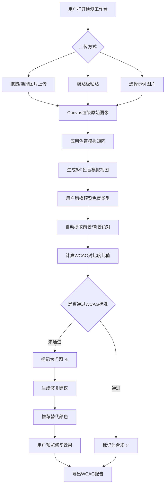

## 1. 产品概述

色盲无障碍检测工具（ColorA11y）是一款面向Web开发者和设计师的专业无障碍检测平台。通过上传页面截图或直接输入URL，模拟8种色盲视图，自动检测对比度问题，并根据WCAG 2.1标准给出具体修复建议，帮助团队构建更具包容性的数字产品。

- 解决核心问题：开发者难以直观感知色盲用户的体验，手动对比度计算繁琐且易遗漏
- 目标用户：前端开发者、UI/UX设计师、无障碍测试工程师、产品经理

## 2. 核心功能

### 2.1 用户角色

| 角色 | 使用方式 | 核心权限 |
|------|----------|----------|
| 普通用户 | 无需注册 | 上传图片检测、色盲模拟预览、查看WCAG报告 |
| Chrome扩展用户 | 安装扩展 | 实时页面色盲模拟、一键检测当前页面 |

### 2.2 功能模块

1. **检测工作台页面**：图片上传/粘贴、色盲模拟实时预览、颜色拾取器、对比度检测结果
2. **WCAG报告页面**：详细合规报告、问题高亮标记、修复建议清单、报告导出

### 2.3 页面详情

| 页面名称 | 模块名称 | 功能描述 |
|----------|----------|----------|
| 检测工作台 | 图片上传区 | 支持拖拽上传、剪贴板粘贴、示例图片选择 |
| 检测工作台 | 色盲模拟预览 | 8种色盲类型实时模拟（Protanopia/Protanomaly/Deuteranopia/Deuteranomaly/Tritanopia/Tritanomaly/Achromatopsia/Achromatomaly），左右对比滑块 |
| 检测工作台 | 颜色拾取器 | 点击图像任意位置拾取颜色，显示原始色与模拟色对比 |
| 检测工作台 | 对比度面板 | 自动提取图像中前景/背景色对，计算对比度比值，标注WCAG AA/AAA合规状态 |
| WCAG报告 | 合规概览 | 通过/未通过统计、严重程度分级（Critical/Major/Minor） |
| WCAG报告 | 问题列表 | 每个对比度问题的详细说明、位置标记、修复建议 |
| WCAG报告 | 修复建议 | 推荐替代颜色、可点击预览修复效果、一键复制色值 |

## 3. 核心流程

用户打开检测工作台 → 上传页面截图或选择示例图片 → 系统自动生成8种色盲模拟视图 → 用户切换不同色盲类型查看模拟效果 → 系统自动检测图像中文字与背景的对比度 → 生成WCAG合规报告 → 展示问题与修复建议 → 用户应用修复建议或导出报告

## 4. 用户界面设计

### 4.1 设计风格

- 主色调：深蓝灰(#1a1d23) + 亮青色(#00d4aa) 作为强调色，搭配暖橙(#ff6b35)作为警告/问题标记色
- 按钮风格：圆角矩形(8px)，主要操作用实心填充，次要操作用描边样式
- 字体：显示字体使用 JetBrains Mono（工具感），正文使用 DM Sans
- 布局风格：左右分栏布局，左侧为图像预览区，右侧为检测面板
- 图标风格：使用 Lucide 线性图标

### 4.2 页面设计概览

| 页面名称 | 模块名称 | UI元素 |
|----------|----------|--------|
| 检测工作台 | 图片上传区 | 虚线边框拖拽区域、上传图标、支持格式提示 |
| 检测工作台 | 色盲模拟预览 | 双画布左右对比、滑块拖拽控制、色盲类型标签栏 |
| 检测工作台 | 颜色拾取器 | 放大镜光标、取色浮窗、HEX/RGB/HSL显示 |
| 检测工作台 | 对比度面板 | 对比度数值徽章、AA/AAA达标指示器、色块预览 |
| WCAG报告 | 合规概览 | 环形图统计、严重程度标签、通过率百分比 |
| WCAG报告 | 问题列表 | 问题卡片列表、严重程度排序、位置缩略图 |
| WCAG报告 | 修复建议 | 建议卡片、修复前后色块对比、一键复制按钮 |

### 4.3 响应式设计

- 桌面端优先（1440px基准），左右分栏布局
- 平板端（768px-1024px）切换为上下布局
- 移动端（<768px）单列布局，面板折叠为标签页切换

### 4.4 Chrome扩展设计

- Popup面板：色盲类型切换、开关控制、快捷检测按钮
- Content Script：通过CSS滤镜实时模拟色盲视图，覆盖当前页面
- 支持一键切换色盲类型，实时预览效果
