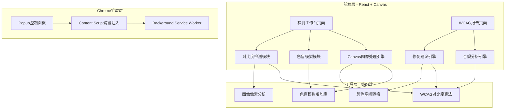
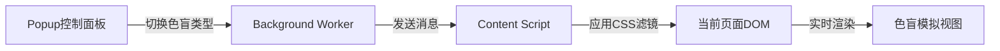

## 1. 架构设计



## 2. 技术说明

- 前端：React@18 + TypeScript + Vite + TailwindCSS@3
- 初始化工具：vite-init
- 状态管理：Zustand
- 后端：无（纯前端应用，所有计算在浏览器端完成）
- 数据库：无（无需持久化存储）
- 图标：lucide-react
- Chrome扩展：Manifest V3

## 3. 路由定义

| 路由 | 用途 |
|------|------|
| `/` | 检测工作台 - 主页面，图片上传、色盲模拟、对比度检测 |
| `/report` | WCAG报告 - 合规检测结果、问题列表、修复建议 |

## 4. 核心算法

### 4.1 色盲模拟矩阵

基于Brettel/Viénot研究论文的颜色变换矩阵，将RGB颜色空间映射到色盲感知空间：

- **Protanopia（红色盲）**：缺失L锥细胞
- **Protanomaly（红色弱）**：L锥细胞灵敏度偏移
- **Deuteranopia（绿色盲）**：缺失M锥细胞
- **Deuteranomaly（绿色弱）**：M锥细胞灵敏度偏移
- **Tritanopia（蓝色盲）**：缺失S锥细胞
- **Tritanomaly（蓝色弱）**：S锥细胞灵敏度偏移
- **Achromatopsia（全色盲）**：全锥细胞缺失
- **Achromatomaly（全色弱）**：锥细胞灵敏度降低

### 4.2 WCAG对比度算法

```
相对亮度 L = 0.2126 * R' + 0.7152 * G' + 0.0722 * B'
其中 R'/G'/B' = (C/12.92) 若 C <= 0.03928, 否则 ((C+0.055)/1.055)^2.4

对比度比值 = (L1 + 0.05) / (L2 + 0.05)
- AA标准：普通文本 ≥ 4.5:1，大文本 ≥ 3:1
- AAA标准：普通文本 ≥ 7:1，大文本 ≥ 3:1
```

### 4.3 修复建议算法

基于HSL颜色空间调整：
1. 保持色相不变，调整亮度差至满足对比度要求
2. 若亮度调整不足，微调饱和度
3. 提供多个候选颜色方案

## 5. 项目目录结构

```
src/
├── components/
│   ├── ImageUploader.tsx        # 图片上传组件
│   ├── ColorblindPreview.tsx    # 色盲模拟预览组件
│   ├── CompareSlider.tsx        # 左右对比滑块
│   ├── ColorPicker.tsx          # 颜色拾取器
│   ├── ContrastPanel.tsx        # 对比度面板
│   ├── WcagBadge.tsx            # WCAG合规徽章
│   ├── IssueCard.tsx            # 问题卡片
│   ├── SuggestionCard.tsx       # 修复建议卡片
│   └── Layout.tsx               # 布局组件
├── pages/
│   ├── Workspace.tsx            # 检测工作台页面
│   └── Report.tsx               # WCAG报告页面
├── hooks/
│   ├── useImageProcessor.ts     # 图像处理Hook
│   ├── useColorblindSimulation.ts # 色盲模拟Hook
│   └── useContrastChecker.ts    # 对比度检测Hook
├── utils/
│   ├── colorblind.ts            # 色盲模拟矩阵
│   ├── contrast.ts              # WCAG对比度算法
│   ├── color.ts                 # 颜色空间转换
│   └── imageAnalysis.ts         # 图像像素分析
├── store/
│   └── useAppStore.ts           # Zustand全局状态
├── types/
│   └── index.ts                 # TypeScript类型定义
├── App.tsx
└── main.tsx
extension/
├── manifest.json                # Chrome扩展Manifest V3
├── popup/
│   ├── popup.html               # 弹出面板HTML
│   ├── popup.tsx                # 弹出面板React入口
│   └── popup.css                # 弹出面板样式
├── content/
│   ├── content.ts               # Content Script
│   └── content.css              # 滤镜CSS
└── background/
    └── background.ts            # Service Worker
```

## 6. Chrome扩展架构

### 6.1 通信流程



### 6.2 CSS滤镜实现

利用SVG滤镜 + CSS filter属性实现色盲模拟：
- 内联SVG定义颜色矩阵滤镜（feColorMatrix）
- 通过CSS `filter: url(#filter-id)` 应用到页面元素
- 支持一键开关和类型切换
