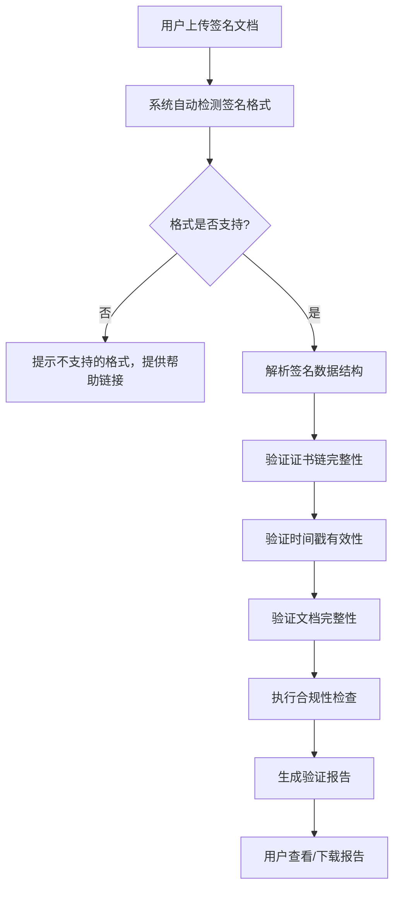

## 1. 产品概述

Web端电子签名法律效力验证工具，旨在为企业和个人提供便捷、专业的电子签名合法性验证服务。通过验证电子签名的证书链、时间戳和文档完整性，输出具备法律效力的验证报告，支持PAdES、XAdES、CAdES等主流签名格式。

- **核心价值**：解决电子签名法律效力认定难题，提供合规性检查，降低法律风险
- **目标用户**：企业法务、金融机构、政府部门、合同签署方
- **市场定位**：专业级电子签名验证SaaS工具，符合《电子签名法》等相关法规要求

## 2. 核心功能

### 2.1 用户角色

| 角色 | 注册方式 | 核心权限 |
|------|----------|----------|
| 普通用户 | 无需注册 | 上传文件、执行验证、查看报告、下载报告 |
| 企业用户 | 邮箱/手机号注册 | 批量验证、历史记录、API调用、定制化合规规则 |

### 2.2 功能模块

1. **验证首页**：文件上传区、签名格式说明、验证操作入口
2. **验证结果页**：证书链验证详情、时间戳验证详情、文档完整性验证结果、合规性检查报告
3. **报告导出页**：PDF格式验证报告生成与下载、报告分享链接生成
4. **历史记录页**：验证历史查询、报告复用、批量操作
5. **帮助中心**：签名格式说明、法规依据、常见问题

### 2.3 页面详情

| 页面名称 | 模块名称 | 功能描述 |
|---------|----------|----------|
| 验证首页 | 文件上传模块 | 支持拖拽上传、点击上传，支持PDF、XML、PKCS#7等格式 |
| 验证首页 | 格式检测模块 | 自动识别签名格式（PAdES/XAdES/CAdES），显示文件基本信息 |
| 验证首页 | 验证配置模块 | 选择验证级别、自定义信任根证书、合规标准选择 |
| 验证结果页 | 证书链验证模块 | 显示证书层级结构、证书状态、颁发者信息、有效期验证 |
| 验证结果页 | 时间戳验证模块 | 显示时间戳来源、签发时间、时间戳证书链、时间戳有效性 |
| 验证结果页 | 完整性验证模块 | 文档哈希比对、签名值验证、篡改检测结果 |
| 验证结果页 | 合规性检查模块 | 基于《电子签名法》等法规的合规性评估、风险提示 |
| 验证结果页 | 报告预览模块 | 可视化验证报告、验证结论汇总、详细技术参数 |
| 报告导出页 | 报告生成模块 | 生成带法律效力的PDF报告，包含验证结论和技术细节 |
| 历史记录页 | 历史查询模块 | 按时间、文件名、验证结果筛选历史记录 |

## 3. 核心流程

用户上传待验证的电子签名文档，系统自动识别签名格式，依次执行证书链验证、时间戳验证、文档完整性验证，然后进行合规性检查，最终生成验证报告并提供下载。

## 4. 用户界面设计

### 4.1 设计风格

- **主色调**：深蓝(#165DFF) - 代表专业、信任、安全
- **辅助色**：成功绿(#00B42A)、警告橙(#FF7D00)、危险红(#F53F3F)
- **中性色**：深灰(#1D2129)、中灰(#4E5969)、浅灰(#86909C)、背景灰(#F2F3F5)
- **按钮风格**：圆角6px，悬停微放大效果，点击反馈动画
- **字体**：标题使用"Noto Sans SC" 700，正文使用"Noto Sans SC" 400
- **布局风格**：卡片式布局，清晰的视觉层级，专业数据可视化
- **图标风格**：线性图标，统一2px线条，科技感设计

### 4.2 页面设计概述

| 页面名称 | 模块名称 | UI元素 |
|---------|----------|--------|
| 验证首页 | Hero区域 | 大标题、副标题、渐变背景、信任标识展示 |
| 验证首页 | 上传区域 | 虚线边框、拖拽动画、文件图标、格式提示 |
| 验证首页 | 功能说明 | 三栏卡片布局、图标+标题+描述 |
| 验证首页 | 支持格式 | 徽章展示、格式说明、Logo展示 |
| 验证结果页 | 概览卡片 | 验证状态徽章、总分、验证时间、文件信息 |
| 验证结果页 | 验证详情 | 折叠面板、证书链树形结构、时间轴展示 |
| 验证结果页 | 合规报告 | 进度条、合规项清单、风险等级标识 |
| 验证结果页 | 操作区域 | 下载按钮、分享按钮、重新验证按钮 |

### 4.3 响应式设计

- **桌面优先**：1200px以上为最佳体验，支持1920px大屏优化
- **平板适配**：768px-1200px，双栏变单栏，侧边栏收起
- **移动端**：375px-768px，卡片堆叠，简化操作，触控优化
- **触控优化**：最小点击区域44x44px，关键按钮独立区域

### 4.4 交互动效

- **页面加载**：骨架屏加载，内容渐入，顶部进度条
- **上传交互**：拖拽进入时边框高亮+背景变化，文件上传进度条
- **验证过程**：步骤指示器动画，实时状态更新，进度百分比
- **结果展示**：验证结果从下往上滑入，证书链展开/折叠动画
- **状态反馈**：成功时绿色脉冲动画，失败时红色抖动提示
