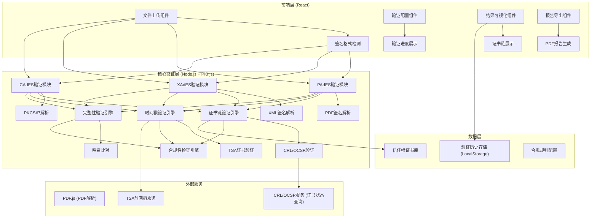
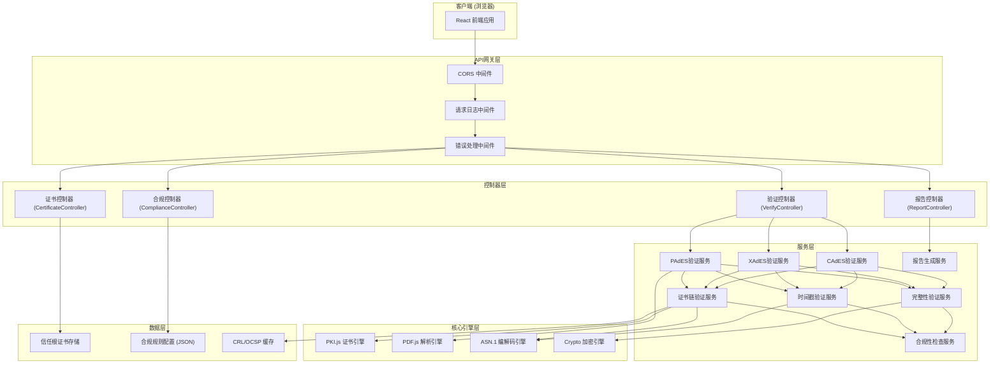
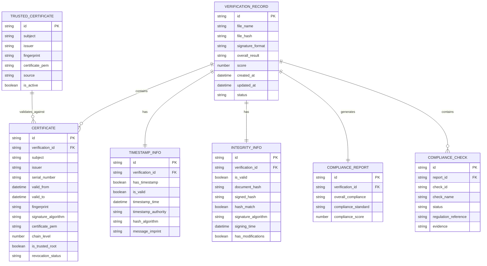

## 1. 架构设计



## 2. 技术描述

### 2.1 技术栈选型

| 层级 | 技术选型 | 版本 | 用途 |
|------|----------|------|------|
| 前端框架 | React | 18.2.0 | 构建用户界面 |
| 构建工具 | Vite | 5.0.0 | 项目构建与开发服务器 |
| 样式方案 | TailwindCSS | 3.4.0 | 原子化CSS样式 |
| 状态管理 | React Context + useReducer | 内置 | 验证状态管理 |
| UI组件库 | Headless UI | 1.7.0 | 无样式UI组件 |
| 图标库 | Lucide React | 0.294.0 | 图标组件 |
| PDF解析 | pdfjs-dist | 4.0.0 | PDF文档解析 |
| PKI处理 | pkijs | 3.0.0 | PKI证书和签名处理 |
| ASN.1解析 | asn1js | 3.0.0 | ASN.1编解码 |
| 加密工具 | crypto-js | 4.2.0 | 哈希和加密操作 |
| HTTP客户端 | axios | 1.6.0 | HTTP请求 |
| 后端框架 | Express | 4.18.0 | Node.js后端服务 |
| 后端语言 | TypeScript | 5.3.0 | 类型安全的JavaScript |
| 跨域处理 | cors | 2.8.5 | CORS中间件 |
| 文件上传 | multer | 1.4.5 | 文件上传处理 |

### 2.2 核心依赖说明

- **PKI.js**：纯JavaScript实现的PKI库，支持X.509证书、CRL、OCSP、CMS、PKCS#10等标准
- **PDF.js**：Mozilla开发的PDF解析库，用于提取PDF中的数字签名
- **ASN1.js**：ASN.1编解码库，用于解析DER编码的证书和签名数据
- **Node.js crypto**：Node.js内置加密模块，提供签名验证、哈希计算等功能

## 3. 路由定义

### 3.1 前端路由

| 路由路径 | 页面名称 | 核心功能 |
|---------|----------|----------|
| / | 验证首页 | 文件上传、格式检测、验证启动 |
| /verify/:id | 验证结果页 | 证书链、时间戳、完整性、合规性展示 |
| /report/:id | 报告导出页 | 验证报告预览、PDF下载 |
| /history | 历史记录页 | 验证历史查询、报告复用 |
| /help | 帮助中心 | 签名格式说明、法规依据 |

### 3.2 后端API路由

| 路由路径 | HTTP方法 | 功能描述 |
|---------|----------|----------|
| /api/verify | POST | 上传文件并执行验证 |
| /api/verify/:id | GET | 获取指定验证ID的详细结果 |
| /api/report/:id | GET | 下载PDF格式验证报告 |
| /api/certificates/trusted | GET | 获取信任根证书列表 |
| /api/formats | GET | 获取支持的签名格式列表 |
| /api/compliance/rules | GET | 获取合规性检查规则 |

## 4. API类型定义

### 4.1 请求类型定义

```typescript
// 验证请求
interface VerifyRequest {
  file: File;
  options: VerifyOptions;
}

interface VerifyOptions {
  verifyLevel: 'basic' | 'standard' | 'strict';
  customTrustCerts?: string[];
  complianceStandard: 'cn-es' | 'eu-eidas' | 'us-esign';
  checkRevocation: boolean;
  checkTimestamp: boolean;
}

// 时间戳验证请求
interface TimestampVerifyRequest {
  timestampToken: ArrayBuffer;
  messageImprint: ArrayBuffer;
  hashAlgorithm: string;
}

// 证书链验证请求
interface CertChainVerifyRequest {
  certificate: string;
  intermediateCerts?: string[];
  trustAnchors: string[];
  validationTime?: Date;
  checkRevocation: boolean;
}
```

### 4.2 响应类型定义

```typescript
// 验证响应
interface VerifyResponse {
  id: string;
  status: 'pending' | 'processing' | 'completed' | 'failed';
  overallResult: 'valid' | 'invalid' | 'warning' | 'error';
  score: number;
  fileInfo: FileInfo;
  signatureFormat: 'PAdES' | 'XAdES' | 'CAdES';
  timestamp: number;
  results: VerificationResults;
}

interface FileInfo {
  name: string;
  size: number;
  type: string;
  hash: string;
}

interface VerificationResults {
  certificateChain: CertificateChainResult;
  timestamp: TimestampResult;
  integrity: IntegrityResult;
  compliance: ComplianceResult;
}

// 证书链验证结果
interface CertificateChainResult {
  isValid: boolean;
  certificates: CertificateInfo[];
  trustPath: string[];
  revocationStatus: 'valid' | 'revoked' | 'unknown';
  errors: string[];
  warnings: string[];
}

interface CertificateInfo {
  subject: string;
  issuer: string;
  serialNumber: string;
  validFrom: string;
  validTo: string;
  fingerprint: string;
  signatureAlgorithm: string;
  keyUsage: string[];
  isCA: boolean;
  isSelfSigned: boolean;
  isTrustedRoot: boolean;
}

// 时间戳验证结果
interface TimestampResult {
  hasTimestamp: boolean;
  isValid: boolean;
  timestampTime: string;
  timestampAuthority: string;
  certificateChain: CertificateInfo[];
  hashAlgorithm: string;
  messageImprint: string;
  errors: string[];
  warnings: string[];
}

// 完整性验证结果
interface IntegrityResult {
  isValid: boolean;
  documentHash: string;
  signedHash: string;
  hashMatch: boolean;
  signatureAlgorithm: string;
  signingTime: string;
  hasModifications: boolean;
  errors: string[];
  warnings: string[];
}

// 合规性检查结果
interface ComplianceResult {
  overallCompliance: 'compliant' | 'partially-compliant' | 'non-compliant';
  standard: string;
  checks: ComplianceCheck[];
  score: number;
}

interface ComplianceCheck {
  id: string;
  name: string;
  description: string;
  status: 'pass' | 'fail' | 'warning' | 'not-applicable';
  regulation: string;
  evidence: string;
}
```

## 5. 服务器架构图



## 6. 数据模型

### 6.1 数据模型定义



### 6.2 存储方案

由于本工具主要在浏览器端运行，数据存储采用以下方案：

- **信任根证书库**：内置在项目资源中，定期更新
- **验证历史记录**：存储在浏览器 LocalStorage，最多保留100条
- **临时文件**：后端仅在验证过程中缓存，验证完成后立即删除
- **报告数据**：可选择导出PDF保存到本地

### 6.3 后端关键目录结构

```
server/
├── src/
│   ├── controllers/
│   │   ├── verify.controller.ts
│   │   ├── report.controller.ts
│   │   ├── certificate.controller.ts
│   │   └── compliance.controller.ts
│   ├── services/
│   │   ├── pades.service.ts
│   │   ├── xades.service.ts
│   │   ├── cades.service.ts
│   │   ├── certificate-chain.service.ts
│   │   ├── timestamp.service.ts
│   │   ├── integrity.service.ts
│   │   ├── compliance.service.ts
│   │   └── report.service.ts
│   ├── core/
│   │   ├── pki-engine.ts
│   │   ├── pdf-parser.ts
│   │   ├── asn1-parser.ts
│   │   └── crypto-utils.ts
│   ├── data/
│   │   ├── trusted-certs/
│   │   └── compliance-rules.json
│   ├── types/
│   │   └── index.ts
│   ├── middleware/
│   ├── routes/
│   ├── utils/
│   └── server.ts
├── uploads/
└── package.json
```

### 6.4 前端关键目录结构

```
client/
├── src/
│   ├── components/
│   │   ├── FileUpload/
│   │   ├── CertificateChain/
│   │   ├── TimestampDisplay/
│   │   ├── IntegrityDisplay/
│   │   ├── ComplianceReport/
│   │   ├── VerificationProgress/
│   │   └── ReportExport/
│   ├── pages/
│   │   ├── HomePage.tsx
│   │   ├── VerifyResultPage.tsx
│   │   ├── ReportPage.tsx
│   │   ├── HistoryPage.tsx
│   │   └── HelpPage.tsx
│   ├── context/
│   │   └── VerificationContext.tsx
│   ├── services/
│   │   ├── api.ts
│   │   └── verificationService.ts
│   ├── types/
│   │   └── index.ts
│   ├── utils/
│   ├── App.tsx
│   └── main.tsx
├── public/
└── package.json
```
