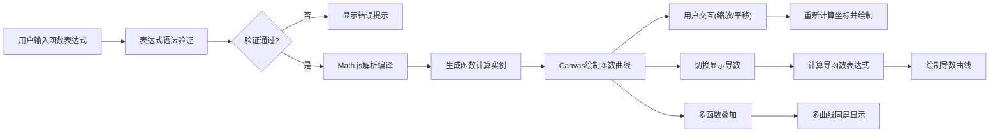

## 1. 产品概述

Web端数学函数绘图工具，支持输入数学函数表达式（三角函数、对数、指数等），实时绘制函数曲线。面向学生、教师和科研人员，提供直观的函数可视化能力，支持多函数叠加比较、坐标轴缩放平移、导数曲线显示等高级功能。

## 2. 核心功能

### 2.1 用户角色
| 角色 | 注册方式 | 核心权限 |
|------|----------|----------|
| 普通用户 | 无需注册 | 使用所有绘图功能，支持本地保存函数列表 |

### 2.2 功能模块
1. **主绘图页面**：函数输入区、Canvas绘图区、控制面板、函数管理列表
2. **函数表达式解析**：支持三角函数(sin/cos/tan)、对数(log/ln)、指数(e^x)、多项式等
3. **多函数管理**：添加/删除/显示/隐藏函数，自定义颜色
4. **坐标轴交互**：鼠标滚轮缩放、拖拽平移、坐标显示
5. **导数曲线**：一键显示函数的导数曲线
6. **导出功能**：导出图像为PNG格式

### 2.3 页面详情
| 页面名称 | 模块名称 | 功能描述 |
|----------|----------|----------|
| 主绘图页面 | 函数输入区 | 表达式输入框、颜色选择器、添加按钮、语法验证提示 |
| 主绘图页面 | Canvas绘图区 | 实时渲染函数曲线、网格背景、坐标轴、坐标刻度 |
| 主绘图页面 | 函数管理列表 | 显示已添加的函数，支持切换显示/隐藏、删除、显示导数 |
| 主绘图页面 | 控制面板 | 缩放控制、重置视图、导出图像、显示网格开关 |
| 主绘图页面 | 坐标信息 | 鼠标位置实时显示对应的x/y坐标值 |

## 3. 核心流程

用户输入函数表达式 → 系统验证语法正确性 → 通过Math.js解析编译 → 在Canvas上绘制曲线 → 用户可进行缩放、平移、查看导数等交互操作 → 实时更新绘图结果。

## 4. 用户界面设计

### 4.1 设计风格
- **主色调**：深空蓝 (#0f172a) 作为背景色，配合科技蓝 (#3b82f6) 作为强调色
- **辅助色**：函数曲线使用差异化高对比度配色（青色 #06b6d4、紫色 #8b5cf6、粉红 #ec4899、绿色 #10b981）
- **按钮风格**：扁平化设计，轻微圆角，hover时有淡入动画和发光效果
- **字体**：显示字体使用 'JetBrains Mono' 等宽字体（表达式输入），正文字体使用 'Inter'
- **布局风格**：三栏布局，左侧函数管理列表，中间大面积绘图区，右侧控制面板
- **视觉效果**：暗色主题，网格线使用半透明白色，曲线带有柔和发光效果

### 4.2 页面设计概述
| 页面名称 | 模块名称 | UI元素 |
|----------|----------|--------|
| 主绘图页面 | 函数输入区 | 深色输入框、语法高亮、错误提示动画、颜色选择器圆形按钮 |
| 主绘图页面 | Canvas绘图区 | 黑色背景、细网格线、坐标轴带箭头、曲线平滑抗锯齿 |
| 主绘图页面 | 函数管理列表 | 卡片式设计，每个函数卡片显示颜色标签、表达式、操作按钮 |
| 主绘图页面 | 控制面板 | 图标按钮组、缩放滑块、开关组件 |
| 主绘图页面 | 坐标信息 | 悬浮式信息框，半透明背景，实时更新 |

### 4.3 响应式
- 桌面端（>1200px）：三栏完整布局，绘图区占60%宽度
- 平板端（768px-1200px）：两栏布局，控制面板折叠为图标
- 移动端（<768px）：单栏布局，函数列表和控制面板改为底部抽屉式
- 触摸优化：支持双指缩放、单指拖拽
