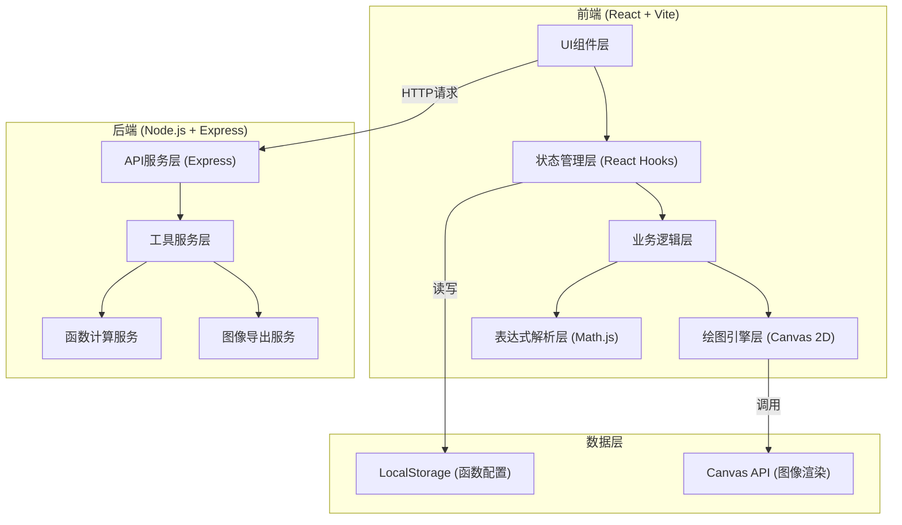
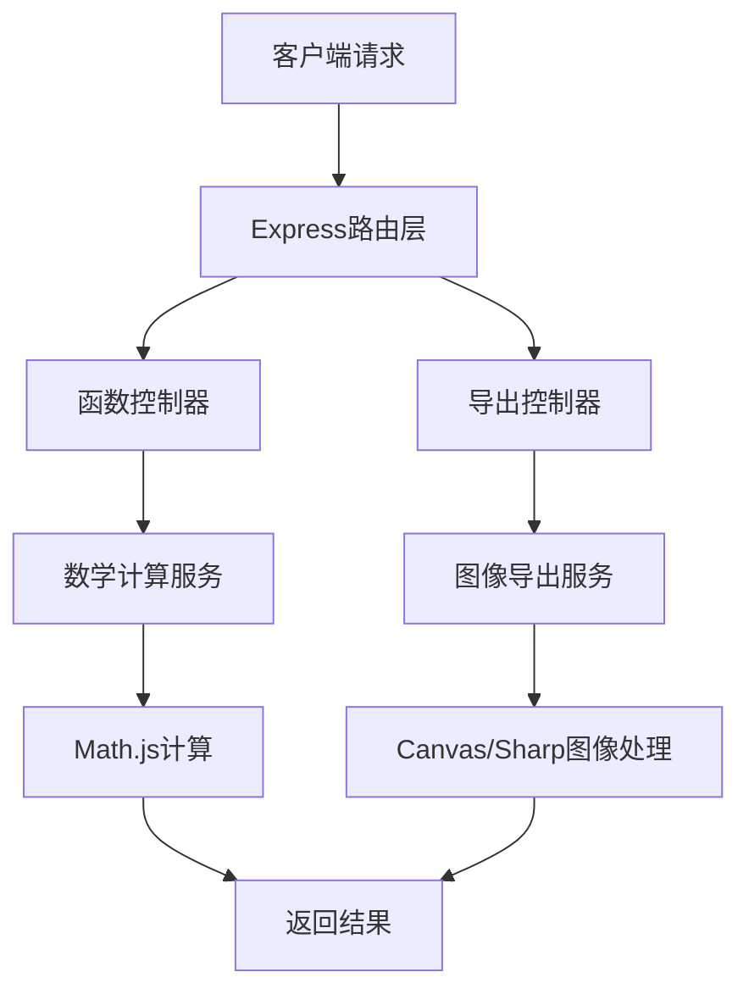

## 1. 架构设计



前端采用分层架构：UI组件负责展示，状态管理负责数据流转，业务逻辑层协调绘图和解析，绘图引擎和表达式解析作为底层能力。后端提供可选的函数计算和图像导出服务。

## 2. 技术描述

- **前端框架**：React@18 + TypeScript + Vite
- **样式方案**：TailwindCSS@3 + CSS Variables
- **数学库**：mathjs@11（表达式解析、符号求导、函数计算）
- **绘图技术**：Canvas 2D API（原生实现，高性能）
- **状态管理**：React Hooks (useState, useReducer, useCallback)
- **后端**：Node.js + Express@4（提供函数验证、批量计算、图像导出API）
- **构建工具**：Vite@5
- **开发语言**：TypeScript

## 3. 目录结构

```
├── client/                    # 前端代码
│   ├── src/
│   │   ├── components/        # React组件
│   │   │   ├── FunctionInput.tsx      # 函数输入组件
│   │   │   ├── FunctionList.tsx       # 函数列表组件
│   │   │   ├── GraphCanvas.tsx        # 绘图Canvas组件
│   │   │   ├── ControlPanel.tsx       # 控制面板组件
│   │   │   ├── ColorPicker.tsx        # 颜色选择器组件
│   │   │   └── CoordinateInfo.tsx     # 坐标信息组件
│   │   ├── hooks/             # 自定义Hooks
│   │   │   ├── useCanvas.ts           # Canvas操作Hook
│   │   │   ├── useFunction.ts         # 函数管理Hook
│   │   │   └── useZoomPan.ts          # 缩放平移Hook
│   │   ├── services/          # 服务层
│   │   │   ├── mathService.ts         # 数学计算服务
│   │   │   └── apiService.ts          # API调用服务
│   │   ├── utils/             # 工具函数
│   │   │   ├── expressionParser.ts    # 表达式解析工具
│   │   │   ├── coordinate.ts          # 坐标转换工具
│   │   │   └── colors.ts              # 颜色工具
│   │   ├── types/             # 类型定义
│   │   │   └── index.ts
│   │   ├── App.tsx
│   │   └── main.tsx
│   ├── package.json
│   └── vite.config.ts
├── server/                    # 后端代码
│   ├── src/
│   │   ├── controllers/       # 控制器
│   │   │   ├── functionController.ts
│   │   │   └── exportController.ts
│   │   ├── services/          # 服务层
│   │   │   ├── mathService.ts
│   │   │   └── exportService.ts
│   │   ├── routes/            # 路由
│   │   │   ├── functionRoutes.ts
│   │   │   └── exportRoutes.ts
│   │   └── index.ts
│   └── package.json
└── package.json               # 根package.json
```

## 4. 核心数据类型定义

```typescript
// 函数项
interface FunctionItem {
  id: string;
  expression: string;       // 原表达式，如 "sin(x) + x^2"
  compiledFunction: any;    // Math.js编译后的函数
  color: string;            // 曲线颜色
  visible: boolean;         // 是否显示
  showDerivative: boolean;  // 是否显示导数
  derivativeExpression?: string;  // 导数表达式
  derivativeCompiled?: any;       // 编译后的导数函数
}

// 视图状态
interface ViewState {
  xMin: number;             // X轴最小值
  xMax: number;             // X轴最大值
  yMin: number;             // Y轴最小值
  yMax: number;             // Y轴最大值
  gridVisible: boolean;     // 是否显示网格
  axisVisible: boolean;     // 是否显示坐标轴
}

// 绘图配置
interface DrawConfig {
  lineWidth: number;        // 曲线线宽
  gridColor: string;        // 网格颜色
  axisColor: string;        // 坐标轴颜色
  backgroundColor: string;  // 背景颜色
}

// 鼠标状态
interface MouseState {
  x: number;                // 屏幕坐标X
  y: number;                // 屏幕坐标Y
  mathX: number;            // 数学坐标X
  mathY: number;            // 数学坐标Y
  isDragging: boolean;      // 是否正在拖拽
}
```

## 5. 路由定义

| 路由 | 页面/组件 | 用途 |
|------|----------|------|
| / | App.tsx | 主绘图页面 |
| /api/function/validate | POST | 验证函数表达式 |
| /api/function/derivative | POST | 计算导函数 |
| /api/function/evaluate | POST | 批量计算函数值 |
| /api/export/png | POST | 导出图像为PNG |

## 6. API定义

```typescript
// 验证表达式
interface ValidateRequest {
  expression: string;
}
interface ValidateResponse {
  valid: boolean;
  error?: string;
}

// 计算导函数
interface DerivativeRequest {
  expression: string;
  variable?: string;  // 默认 'x'
}
interface DerivativeResponse {
  success: boolean;
  derivative?: string;
  error?: string;
}

// 批量计算函数值
interface EvaluateRequest {
  expression: string;
  xValues: number[];
}
interface EvaluateResponse {
  success: boolean;
  yValues: number[];
  error?: string;
}

// 导出图像
interface ExportRequest {
  imageData: string;  // base64编码的图像数据
  width: number;
  height: number;
}
interface ExportResponse {
  success: boolean;
  downloadUrl?: string;
  error?: string;
}
```

## 7. 服务端架构



## 8. 核心算法流程

### 8.1 表达式解析流程
1. 用户输入表达式字符串
2. 预处理：替换 'ln' → 'log', '^' → '^', 补全隐式乘法
3. Math.js.parse() 解析表达式为AST
4. 检查变量使用，确保只使用 'x' 作为自变量
5. Math.js.compile() 编译为可执行函数
6. 存储编译后的函数实例

### 8.2 导数计算流程
1. 获取原表达式的AST
2. Math.js.derivative(expression, 'x') 符号求导
3. 化简导数表达式
4. 编译导数函数
5. 可选：后端验证导数正确性

### 8.3 绘图流程
1. 根据视图范围计算X轴采样点（每像素至少1个点）
2. 遍历采样点，调用编译函数计算Y值
3. 处理不连续点（如tan函数的渐近线）
4. 坐标转换：数学坐标 → 屏幕坐标
5. Canvas.beginPath() + lineTo() 绘制路径
6. 应用发光效果（shadowBlur）和描边

### 8.4 缩放平移流程
1. 鼠标滚轮事件：计算缩放中心（鼠标位置）
2. 新范围 = 旧范围 × 缩放因子，以鼠标位置为中心
3. 鼠标拖拽：记录拖拽偏移量
4. 新范围 = 旧范围 + 拖拽偏移量（坐标转换后）
5. 限制最小/最大缩放级别
6. 触发重绘
