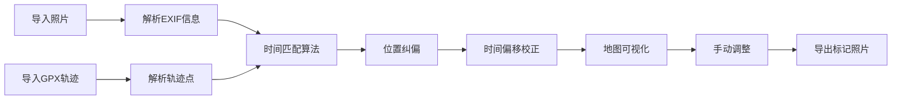

# 照片地理标记工具 - 产品需求文档

## 1. 产品概述

Web端照片地理标记工具，用于批量为照片添加地理标记。通过解析照片EXIF信息与GPX轨迹匹配，自动为照片标注地理位置，支持位置纠偏和时间偏移校正。

- 主要用途：为无GPS信息的照片批量添加地理标记
- 解决问题：相机照片缺少地理位置信息缺失，手动标记效率低下
- 目标用户：摄影爱好者、旅行摄影师、户外爱好者
- 产品价值：提升照片地理标记效率，支持轨迹与照片自动匹配

## 2. 核心功能

### 2.1 用户角色

| 角色 | 注册方式 | 核心权限 |
|------|----------|----------|
| 普通用户 | 无需注册 | 本地处理照片，导入GPX轨迹，导出标记后导出地理标记 |

### 2.2 功能模块

1. **主工作台**：地图展示、照片列表、轨迹列表
2. **照片导入模块**：批量导入、EXIF解析、预览
3. **轨迹导入模块**：GPX文件解析、轨迹可视化
4. **匹配模块**：时间匹配、位置纠偏、时间偏移校正
5. **导出模块**：批量导出带GPS信息的照片

### 2.3 页面详情

| 页面名称 | 模块名称 | 功能描述 |
|-----------|----------|----------|
| 主工作台 | 地图展示 | Leaflet地图，显示照片位置和轨迹线 |
| 主工作台 | 照片管理 | 照片列表、选中状态、GPS信息展示 |
| 主工作台 | 轨迹管理 | GPX导入、轨迹列表、时间范围显示 |
| 主工作台 | 匹配控制面板 | 自动匹配、手动调整、时间偏移设置 |
| 主工作台 | 导出功能 | 批量导出照片、导出GPX/KML |

## 3. 核心流程

用户操作流程：
1. 用户批量导入照片文件
2. 系统自动解析EXIF获取拍摄时间和现有GPS
3. 用户导入GPX轨迹文件
4. 系统根据拍摄时间自动匹配照片位置
5. 用户可进行位置纠偏和时间偏移校正
6. 在地图上预览标记结果
7. 手动调整个别照片位置
8. 批量导出带GPS信息的照片

## 4. 用户界面设计

### 4.1 设计风格

- 主色调：深蓝色 (#1e3a5f) 搭配 青色 (#00d4ff)
- 辅助色：橙色 (#ff6b35)
- 按钮风格：圆角6px，悬停渐变效果
- 字体：Inter 作为主要字体，清晰现代
- 布局风格：三栏布局（左侧面板 + 地图 + 右侧面板）
- 图标风格：线性简约风格，使用 Lucide React

### 4.2 页面设计概览

| 页面名称 | 模块名称 | UI元素 |
|---------|----------|--------|
| 主工作台 | 地图区域 | 全屏Leaflet地图、照片标记点、轨迹线、缩放控件 |
| 主工作台 | 左侧面板 | 照片列表、缩略图、导入按钮、搜索筛选 |
| 主工作台 | 右侧面板 | 轨迹列表、匹配设置、时间偏移滑块 |
| 主工作台 | 底部状态栏 | 统计信息、导出按钮、进度条 |

### 4.3 响应式设计

- 桌面端优先设计
- 平板端：左右面板可折叠
- 移动端：上下布局，面板可切换

### 4.4 交互细节

- 照片悬停效果：照片标记放大效果
- 地图标记交互：点击显示照片预览
- 拖拽调整：支持拖拽标记点可拖拽调整
- 动画过渡：面板切换平滑过渡
