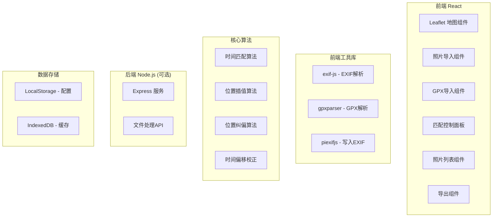

# 照片地理标记工具 - 技术架构文档

## 1. 架构设计



## 2. 技术栈描述

- **前端框架**: React@18 + TypeScript + Vite
- **样式方案**: TailwindCSS@3
- **地图组件**: Leaflet@1.9 + react-leaflet@4.2
- **图标库**: lucide-react
- **EXIF处理**: exif-js + piexifjs
- **GPX解析**: @tmcw/togeojson + @mapbox/geo-viewport
- **后端**: Express@4 (用于文件处理)
- **构建工具**: Vite@5

## 3. 目录结构

```
project/
├── frontend/
│   ├── src/
│   │   ├── components/
│   │   │   ├── Map/
│   │   │   ├── PhotoPanel/
│   │   │   ├── TrackPanel/
│   │   │   └── ExportPanel/
│   │   ├── hooks/
│   │   ├── utils/
│   │   │   ├── exif.ts
│   │   │   ├── gpx.ts
│   │   │   ├── matching.ts
│   │   │   └── geo.ts
│   │   ├── types/
│   │   ├── store/
│   │   └── App.tsx
│   └── package.json
├── backend/
│   ├── src/
│   │   ├── routes/
│   │   └── index.ts
│   └── package.json
└── package.json
```

## 4. 数据类型定义

```typescript
// 照片数据
interface Photo {
  id: string;
  name: string;
  file: File;
  thumbnail: string;
  originalUrl: string;
  exifData: ExifData;
  gps?: GPSPoint;
  matchedGps?: GPSPoint;
  manualGps?: GPSPoint;
  matched: boolean;
  selected: boolean;
}

// 轨迹点
interface TrackPoint {
  lat: number;
  lng: number;
  time: Date;
  elevation?: number;
}

// 轨迹
interface Track {
  id: string;
  name: string;
  points: TrackPoint[];
  startTime: Date;
  endTime: Date;
}

// 匹配配置
interface MatchConfig {
  timeOffset: number;
  maxTimeDiff: number;
  interpolation: 'linear' | 'nearest';
}
```

## 5. 核心算法说明

### 5.1 时间匹配算法
1. 根据照片拍摄时间在轨迹点中查找前后两个最近的点
2. 使用线性插值计算精确位置
3. 支持时间偏移校正

### 5.2 位置纠偏算法
1. 计算照片拍摄时间与轨迹点的时间差
2. 使用卡尔曼滤波或加权平均进行平滑
3. 支持手动拖拽调整

### 5.3 GPX解析流程
1. 读取GPX文件内容
2. 解析XML提取trkpt节点
3. 转换为标准TrackPoint格式
4. 按时间排序

## 6. API接口定义

```typescript
// 导出API (后端)
POST /api/export/photos
Request: { photos: Photo[], format: 'jpeg' | 'png' }
Response: { downloadUrl: string }

POST /api/export/gpx
Request: { photos: Photo[] }
Response: { gpxContent: string }
```

## 7. 性能优化策略

1. 照片缩略图生成使用Canvas
2. 大数据量照片使用虚拟滚动
3. 轨迹匹配使用二分查找优化
4. 地图标记使用Canvas渲染优化
