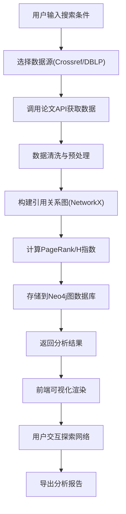

## 1. 产品概述
学术论文引用网络分析平台，旨在帮助研究人员、学者和学生分析学术论文之间的引用关系，发现高影响力论文和研究热点，洞察学术领域的发展趋势。平台集成多源学术数据，提供直观的网络可视化和深度分析功能。

- 核心价值：将复杂的学术引用关系转化为可交互的可视化图谱，帮助用户快速识别核心论文和研究脉络
- 目标用户：科研人员、研究生、学术机构管理者、文献情报分析人员
- 市场价值：填补学术引用分析工具的易用性和可视化体验的空白，提升学术研究效率

## 2. 核心功能

### 2.1 用户角色
| 角色 | 注册方式 | 核心权限 |
|------|----------|----------|
| 普通用户 | 无需注册，直接使用 | 搜索论文、查看引用网络、分析影响力、导出分析报告 |

### 2.2 功能模块
1. **搜索页面**：论文搜索、数据源选择、搜索结果展示
2. **引用网络可视化页面**：交互式引用图谱、节点筛选、关系浏览
3. **影响力分析页面**：PageRank排名、H指数计算、核心论文发现
4. **研究趋势页面**：时间序列分析、热点关键词、领域发展趋势

### 2.3 页面详情
| 页面名称 | 模块名称 | 功能描述 |
|---------|----------|----------|
| 首页/搜索页 | 搜索栏 | 支持按标题、作者、DOI、关键词搜索，选择数据源（Crossref/DBLP） |
| 首页/搜索页 | 结果列表 | 展示论文基本信息、引用次数、可跳转详情 |
| 引用网络可视化页 | 图谱画布 | 力导向图展示引用关系，支持缩放、拖拽、节点点击高亮 |
| 引用网络可视化页 | 控制面板 | 节点大小/颜色映射、显示筛选、布局切换 |
| 影响力分析页 | 排名列表 | PageRank、H指数、引用次数多维度排名 |
| 影响力分析页 | 核心论文发现 | 自动化识别领域核心论文，展示分析依据 |
| 研究趋势页 | 时间趋势图 | 论文发表数量、引用数量随时间变化曲线 |
| 研究趋势页 | 关键词云 | 高频关键词可视化，领域热点识别 |
| 论文详情页 | 基本信息 | 完整元数据展示 |
| 论文详情页 | 引用关系 | 引用文献和被引用文献列表 |
| 论文详情页 | 影响力指标 | 各项指标详细展示和说明 |

## 3. 核心流程

用户搜索论文 → 选择数据源 → 系统从Crossref/DBLP获取数据 → 构建引用关系图 → 计算PageRank、H指数等指标 → 存储到Neo4j图数据库 → 前端可视化展示 → 用户交互探索 → 导出分析结果

## 4. 用户界面设计

### 4.1 设计风格
- **主色调**：深蓝 #1e3a5f（学术严谨感），辅以科技蓝 #3b82f6
- **辅助色**：翠绿 #10b981（增长/正向），琥珀 #f59e0b（警告/高亮）
- **背景**：深灰蓝渐变 #0f172a → #1e293b，营造专业数据可视化氛围
- **字体**：展示字体 - Playfair Display（学术感衬线体），正文字体 - Noto Sans SC（清晰易读）
- **布局**：卡片式+侧边栏，左侧导航，右侧内容区，顶部全局搜索
- **视觉元素**：网格背景、微妙噪点、玻璃态效果、平滑过渡动画
- **按钮风格**：圆角8px，悬停上浮阴影，点击微缩反馈

### 4.2 页面设计概述
| 页面名称 | 模块名称 | UI元素 |
|---------|----------|--------|
| 搜索页 | Hero区域 | 大幅标题、搜索框、数据源切换、背景学术图案 |
| 搜索页 | 结果列表 | 卡片式展示、悬停高亮、引用数徽标、快速操作按钮 |
| 网络可视化页 | 画布区 | 全屏力导向图、节点发光效果、连线渐变、tooltip信息 |
| 网络可视化页 | 侧边面板 | 图例说明、筛选控件、指标切换、导出按钮 |
| 影响力分析页 | 排名区 | 表格+柱状图混合展示、排序切换、前10名高亮 |
| 研究趋势页 | 图表区 | 多折线图、面积图、时间轴滑块、关键词云 |
| 论文详情页 | 信息区 | 分栏布局、关键指标卡片、引用树状图 |

### 4.3 响应式设计
- 桌面端优先（1200px+），三栏布局
- 平板端（768px-1199px）：两栏布局，侧边栏可折叠
- 移动端（<768px）：单栏流式布局，底部tab导航
- 可视化画布自适应容器大小，触摸手势支持双指缩放

### 4.4 动效设计
- 页面加载：元素淡入+上移动画，stagger延迟
- 节点悬停：节点放大+发光，相邻节点高亮
- 数据更新：平滑过渡动画，数值变化缓动
- 画布缩放：阻尼缓动效果
- 导航切换：滑动过渡，内容淡入淡出
