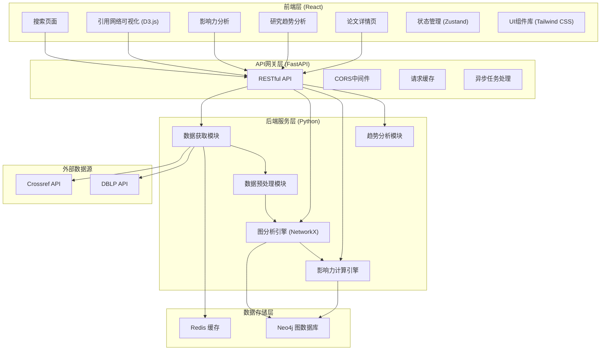
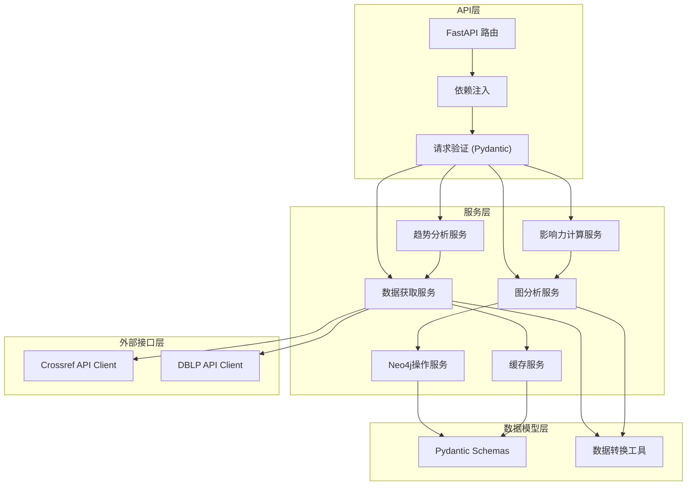
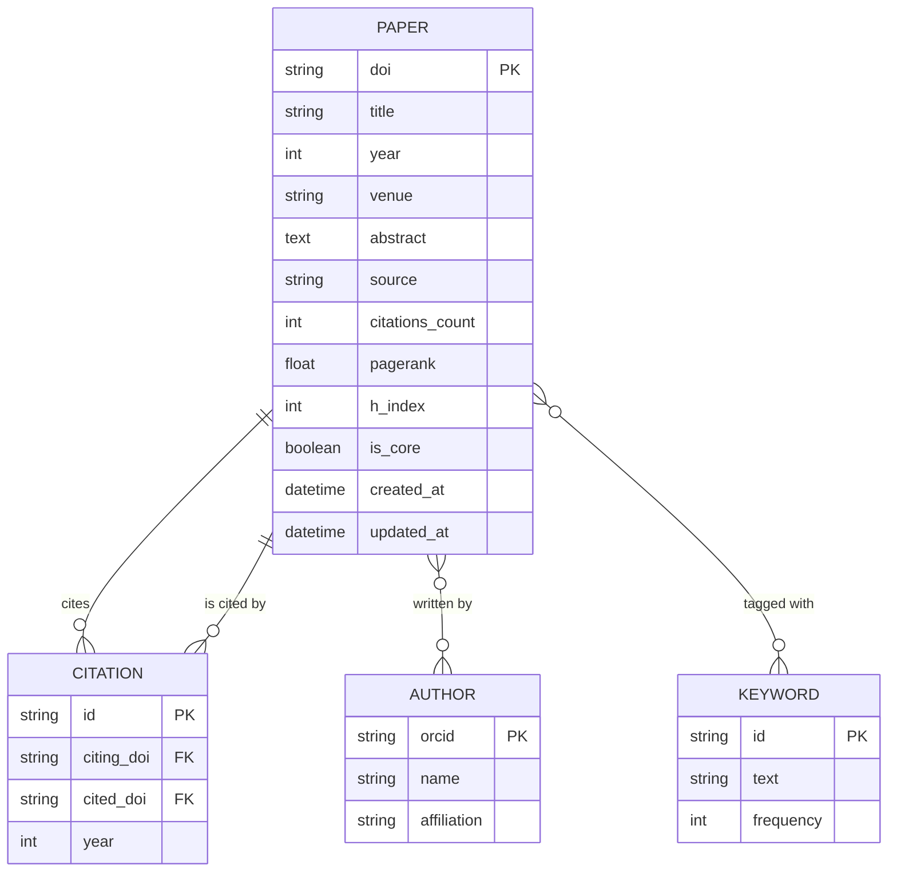

## 1. 架构设计



## 2. 技术描述

### 2.1 前端技术栈
- **框架**: React 18 + TypeScript
- **构建工具**: Vite 5
- **样式**: Tailwind CSS 3
- **状态管理**: Zustand
- **路由**: React Router DOM 6
- **可视化**: 
  - D3.js v7（力导向图、网络可视化）
  - Recharts（趋势图表）
  - react-wordcloud（词云）
- **HTTP客户端**: Axios
- **图标**: Lucide React

### 2.2 后端技术栈
- **Web框架**: FastAPI（高性能异步支持）
- **Python版本**: 3.11+
- **图分析**: NetworkX 3.2+
- **图数据库驱动**: neo4j 5.16+
- **HTTP请求**: httpx（异步）、requests
- **数据处理**: pandas、numpy
- **缓存**: redis-py
- **异步任务**: asyncio

### 2.3 数据存储
- **图数据库**: Neo4j 5.x（存储论文节点和引用关系）
- **缓存**: Redis 7.x（缓存API响应和计算结果）

### 2.4 外部数据源API
- **Crossref API**: https://api.crossref.org/（学术文献元数据和引用关系）
- **DBLP API**: https://dblp.org/search/publ/api（计算机科学文献）

## 3. 路由定义

| 路由路径 | 页面组件 | 功能描述 |
|---------|----------|----------|
| `/` | SearchPage | 首页搜索页面 |
| `/network` | NetworkPage | 引用网络可视化 |
| `/influence` | InfluencePage | 影响力分析 |
| `/trends` | TrendsPage | 研究趋势分析 |
| `/paper/:doi` | PaperDetailPage | 论文详情页 |

## 4. API 定义

### 4.1 TypeScript 类型定义

```typescript
// 论文基本信息
interface Paper {
  doi: string;
  title: string;
  authors: Author[];
  year: number;
  venue: string;
  abstract?: string;
  keywords?: string[];
  references: string[];  // 引用的论文DOI列表
  citations: number;     // 被引用次数
  url?: string;
  source: 'crossref' | 'dblp';
}

interface Author {
  name: string;
  orcid?: string;
  affiliation?: string;
}

// 图节点
interface GraphNode {
  id: string;           // DOI
  label: string;        // 论文标题缩写
  title: string;
  year: number;
  citations: number;
  pagerank: number;
  h_index: number;
  group: number;        // 社区分组
  x?: number;
  y?: number;
}

// 图边（引用关系）
interface GraphEdge {
  source: string;       // 引用者DOI
  target: string;       // 被引用者DOI
  value: number;        // 边权重
}

// 图数据
interface GraphData {
  nodes: GraphNode[];
  edges: GraphEdge[];
  stats: GraphStats;
}

interface GraphStats {
  totalNodes: number;
  totalEdges: number;
  avgDegree: number;
  density: number;
  communities: number;
}

// 影响力分析结果
interface InfluenceMetrics {
  doi: string;
  title: string;
  pagerank: number;
  pagerank_rank: number;
  h_index: number;
  h_index_rank: number;
  citations: number;
  citations_rank: number;
  betweenness_centrality?: number;
  closeness_centrality?: number;
  is_core: boolean;
  core_reason?: string;
}

// 趋势数据
interface TrendData {
  year: number;
  paper_count: number;
  citation_count: number;
  avg_citations: number;
}

interface KeywordTrend {
  keyword: string;
  count: number;
  trend: 'rising' | 'stable' | 'declining';
  growth_rate: number;
}

// API响应包装
interface ApiResponse<T> {
  success: boolean;
  data?: T;
  error?: string;
  message?: string;
}
```

### 4.2 后端API端点

| HTTP方法 | 路径 | 功能描述 | 请求参数 | 响应类型 |
|---------|------|----------|----------|----------|
| GET | `/api/search` | 搜索论文 | `q`: 关键词, `source`: crossref/dblp, `limit`: 数量 | `ApiResponse<Paper[]>` |
| GET | `/api/paper/:doi` | 获取论文详情 | `doi`: 论文DOI | `ApiResponse<Paper>` |
| POST | `/api/graph/build` | 构建引用网络图 | `dois`: 起点DOI列表, `depth`: 遍历深度 | `ApiResponse<GraphData>` |
| GET | `/api/graph/:graphId` | 获取已构建的图数据 | `graphId`: 图ID | `ApiResponse<GraphData>` |
| GET | `/api/influence/ranking` | 获取影响力排名 | `metric`: pagerank/h_index/citations, `limit`: 数量 | `ApiResponse<InfluenceMetrics[]>` |
| GET | `/api/influence/core-papers` | 发现核心论文 | `method`: pagerank/community, `threshold`: 阈值 | `ApiResponse<InfluenceMetrics[]>` |
| GET | `/api/trends/over-time` | 获取时间趋势数据 | `keywords`: 关键词列表, `start_year`, `end_year` | `ApiResponse<TrendData[]>` |
| GET | `/api/trends/keywords` | 获取关键词趋势 | `limit`: 关键词数量 | `ApiResponse<KeywordTrend[]>` |
| GET | `/api/paper/:doi/references` | 获取引用文献 | `doi`: 论文DOI | `ApiResponse<Paper[]>` |
| GET | `/api/paper/:doi/citations` | 获取被引文献 | `doi`: 论文DOI | `ApiResponse<Paper[]>` |

## 5. 后端架构图



## 6. 数据模型

### 6.1 实体关系图



### 6.2 Neo4j Cypher 数据定义

```cypher
// 创建Paper节点索引
CREATE INDEX paper_doi IF NOT EXISTS FOR (p:Paper) ON (p.doi);
CREATE INDEX paper_title IF NOT EXISTS FOR (p:Paper) ON (p.title);
CREATE INDEX paper_year IF NOT EXISTS FOR (p:Paper) ON (p.year);

// 创建Author节点索引
CREATE INDEX author_orcid IF NOT EXISTS FOR (a:Author) ON (a.orcid);
CREATE INDEX author_name IF NOT EXISTS FOR (a:Author) ON (a.name);

// 创建CITATION关系索引
CREATE INDEX citation_year IF NOT EXISTS FOR ()-[r:CITES]->() ON (r.year);

// 创建领域标签索引
CREATE INDEX paper_field IF NOT EXISTS FOR (p:Paper) ON (p.field);
```

### 6.3 示例数据初始化

```cypher
// 创建示例论文节点
MERGE (p1:Paper {doi: '10.1038/nature12345'})
SET p1.title = 'Deep Learning',
    p1.year = 2015,
    p1.venue = 'Nature',
    p1.citations_count = 50000,
    p1.source = 'crossref'

MERGE (p2:Paper {doi: '10.1109/TPAMI.2015.2484313'})
SET p2.title = 'Faster R-CNN: Towards Real-Time Object Detection',
    p2.year = 2015,
    p2.venue = 'TPAMI',
    p2.citations_count = 30000,
    p2.source = 'crossref'

// 创建引用关系
MERGE (p2)-[:CITES {year: 2015}]->(p1)

// 计算PageRank示例
CALL gds.pageRank.stream('Paper', {
  relationshipProjection: {
    CITES: {
      type: 'CITES',
      orientation: 'NATURAL'
    }
  }
})
YIELD nodeId, score
MATCH (p:Paper) WHERE id(p) = nodeId
SET p.pagerank = score;
```
