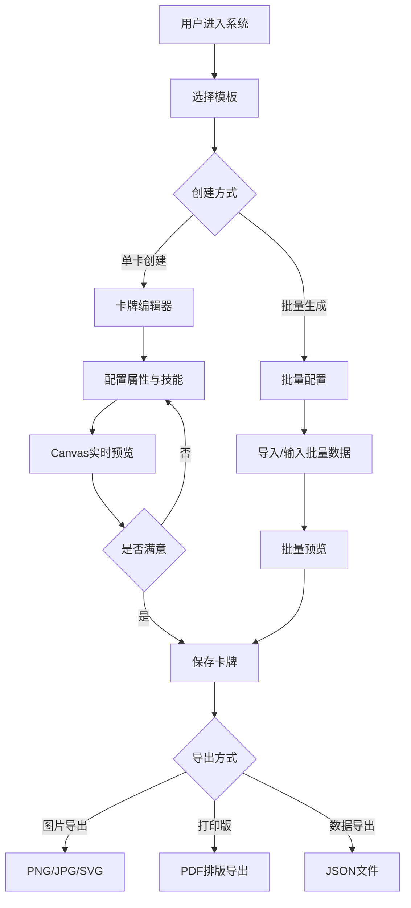

## 1. 产品概述

Web端卡牌游戏生成器——一款面向独立游戏开发者、桌游设计师和卡牌爱好者的专业卡牌创作工具。用户通过可视化界面配置卡牌属性（攻击力、防御力、技能描述等），选择或自定义卡牌模板，即可实时生成精美卡牌图片和结构化JSON数据。支持批量生成与打印版导出，让卡牌制作从繁琐的PS操作变为高效的配置化流程。

- 解决核心问题：降低卡牌游戏制作门槛，将卡牌设计从手工绘图转变为配置化、模板化、自动化流程
- 目标用户：独立游戏开发者、桌游设计师、TRPG玩家、卡牌收藏爱好者

## 2. 核心功能

### 2.1 用户角色

| 角色 | 注册方式 | 核心权限 |
|------|----------|----------|
| 普通用户 | 无需注册 | 使用内置模板创建卡牌、导出图片和JSON |
| 高级用户 | 邮箱注册 | 创建自定义模板、批量生成、打印版导出 |

### 2.2 功能模块

1. **卡牌编辑器页面**：卡牌属性配置面板、Canvas实时预览、技能编辑器、稀有度与类型选择
2. **模板管理页面**：模板库浏览、模板编辑器、模板预览
3. **批量生成页面**：批量配置表格、批量预览、批量导出
4. **导出中心页面**：单卡导出、打印版排版、JSON数据导出

### 2.3 页面详情

| 页面名称 | 模块名称 | 功能描述 |
|----------|----------|----------|
| 卡牌编辑器 | 属性配置面板 | 配置卡牌名称、攻击力、防御力、生命值、费用等数值属性，支持拖拽调节 |
| 卡牌编辑器 | 技能编辑器 | 添加/编辑技能名称、技能描述、技能效果标签，支持富文本描述 |
| 卡牌编辑器 | Canvas实时预览 | 左侧配置右侧实时渲染卡牌外观，所见即所得 |
| 卡牌编辑器 | 卡牌元信息 | 选择卡牌类型（攻击/防御/魔法/辅助）、稀有度（普通/稀有/史诗/传说）、元素属性 |
| 卡牌编辑器 | 图片资源 | 上传卡牌背景图、角色立绘，调整位置和缩放 |
| 模板管理 | 模板库浏览 | 展示所有内置模板和用户自定义模板，支持按风格/类型筛选 |
| 模板管理 | 模板编辑器 | 可视化编辑模板布局：拖拽调整属性区域位置、字体样式、配色方案、装饰元素 |
| 模板管理 | 模板预览 | 使用示例数据渲染模板效果，支持多数据切换预览 |
| 批量生成 | 批量配置表格 | 表格式批量输入卡牌属性，支持CSV/JSON导入、Excel粘贴 |
| 批量生成 | 批量预览 | 网格展示所有生成卡牌缩略图，点击可查看大图 |
| 批量生成 | 批量导出 | 一键导出所有卡牌为图片包或JSON数据文件 |
| 导出中心 | 单卡导出 | 导出PNG/JPG/SVG格式，选择分辨率（1x/2x/4x） |
| 导出中心 | 打印版排版 | A4/A3纸张排版，设置边距、裁切线、出血区域，生成PDF |
| 导出中心 | JSON数据导出 | 导出完整卡牌数据为JSON格式，包含所有属性和模板引用 |

## 3. 核心流程

**卡牌创建流程**：用户进入编辑器 → 选择/创建模板 → 配置卡牌属性 → Canvas实时预览 → 满意后保存/导出

**批量生成流程**：用户进入批量生成 → 选择模板 → 批量输入数据（CSV/JSON/手动） → 批量预览 → 确认导出

**打印导出流程**：选择已生成的卡牌 → 进入导出中心 → 设置打印参数（纸张/排列/边距） → 生成打印版PDF

## 4. 用户界面设计

### 4.1 设计风格

- **设计方向**：暗黑奇幻风格，融合中世纪手稿质感与现代UI设计，像打开一本古老的魔法书
- **主色调**：深色背景（#0a0a0f）+ 金色强调色（#d4a853）+ 暗红色辅助色（#8b2252）
- **辅助色**：羊皮纸色（#f5e6c8）用于内容区域，墨绿色（#2d5016）用于成功状态
- **按钮风格**：金属质感按钮，带有微妙的3D凸起效果和光泽
- **字体**：标题使用 Cinzel（中世纪风格），正文使用 Crimson Text（优雅衬线体），数值使用 Rajdhani（科技感）
- **布局风格**：左侧面板+中间画布+右侧属性面板的经典三栏编辑器布局
- **装饰风格**：卡牌边框带有凯尔特纹饰，页面角落有花纹装饰，分隔线使用装饰性分割线
- **图标风格**：lucide图标搭配自定义装饰

### 4.2 页面设计概览

| 页面名称 | 模块名称 | UI元素 |
|----------|----------|--------|
| 卡牌编辑器 | 属性配置面板 | 深色半透明面板，金色标签文字，金属质感滑块，暗色输入框带金色边框 |
| 卡牌编辑器 | Canvas预览区 | 中央大画布，卡牌带阴影浮起效果，背景有魔法光效粒子 |
| 卡牌编辑器 | 技能编辑器 | 折叠式技能卡片，每个技能带图标和颜色标记，展开显示详细编辑 |
| 卡牌编辑器 | 卡牌元信息 | 稀有度选择用不同颜色宝石图标，类型选择用图标按钮组 |
| 模板管理 | 模板库浏览 | 卡片式网格布局，模板卡片悬浮时发光边框，选中时金色高亮 |
| 模板管理 | 模板编辑器 | 分区画布编辑器，可拖拽区域标记，属性面板浮窗 |
| 批量生成 | 批量配置表格 | 暗色表格，交替行微弱亮度差，可编辑单元格带金色聚焦边框 |
| 批量生成 | 批量预览 | 网格缩略图布局，悬浮放大，滚动加载 |
| 导出中心 | 打印排版预览 | A4纸张白色预览区，蓝色裁切线，灰色出血区域标记 |
| 导出中心 | 导出设置面板 | 紧凑设置面板，选项卡切换格式/尺寸/排列 |

### 4.3 响应式设计

- 桌面优先设计，编辑器三栏布局在≥1280px宽度下完整展示
- 1024-1280px：属性面板折叠为抽屉式侧边栏
- <1024px：切换为单栏模式，预览区和配置区切换显示
- 移动端：简化为只读预览+基本属性编辑

### 4.4 动效设计

- 页面加载：卡牌翻转入场动画，金色粒子飘散效果
- 卡牌预览：属性变更时平滑过渡动画，数值变化有滚动计数器效果
- 稀有度：传说卡牌带金色边框呼吸光效
- 按钮：金属光泽滑动效果
- 页面切换：书本翻页式过渡动画
