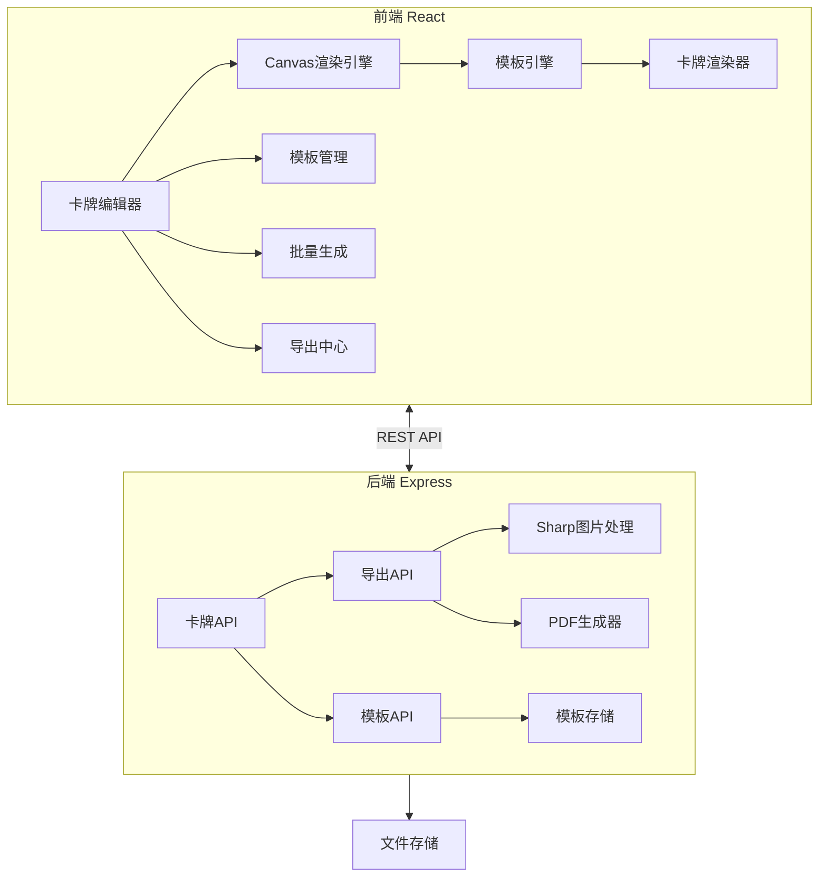
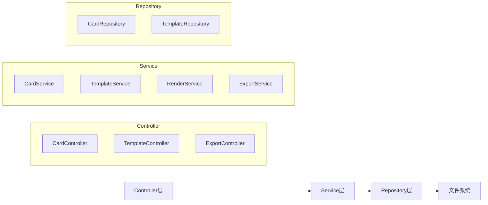
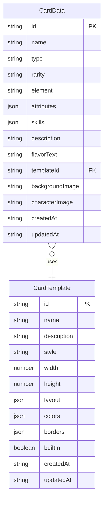

## 1. 架构设计



## 2. 技术说明

- **前端**：React@18 + TypeScript + TailwindCSS@3 + Vite
- **状态管理**：Zustand
- **画布渲染**：HTML5 Canvas API（前端实时预览）+ Sharp（后端高清渲染）
- **模板引擎**：自定义模板引擎，基于JSON Schema定义模板布局
- **初始化工具**：vite-init
- **后端**：Express@4 + TypeScript（ESM格式）
- **图片处理**：Sharp（服务端高清图片生成、PDF排版）
- **PDF生成**：PDFKit（打印版PDF生成）
- **数据存储**：文件系统存储（JSON文件 + 图片文件），无需数据库
- **路由**：React Router DOM

## 3. 路由定义

| 路由 | 用途 |
|------|------|
| / | 首页，展示项目介绍和快速入口 |
| /editor | 卡牌编辑器，单卡创建与编辑 |
| /templates | 模板管理，浏览和编辑模板 |
| /batch | 批量生成，批量配置和预览 |
| /export | 导出中心，单卡和打印版导出 |

## 4. API定义

### 4.1 卡牌相关API

```typescript
interface CardAttribute {
  attack: number;
  defense: number;
  health: number;
  cost: number;
}

interface CardSkill {
  name: string;
  description: string;
  tags: string[];
  icon?: string;
}

interface CardData {
  id: string;
  name: string;
  type: 'attack' | 'defense' | 'magic' | 'support';
  rarity: 'common' | 'rare' | 'epic' | 'legendary';
  element?: 'fire' | 'water' | 'earth' | 'wind' | 'light' | 'dark';
  attributes: CardAttribute;
  skills: CardSkill[];
  description: string;
  flavorText?: string;
  templateId: string;
  backgroundImage?: string;
  characterImage?: string;
  createdAt: string;
  updatedAt: string;
}

// POST /api/cards - 创建卡牌
// GET /api/cards - 获取卡牌列表
// GET /api/cards/:id - 获取卡牌详情
// PUT /api/cards/:id - 更新卡牌
// DELETE /api/cards/:id - 删除卡牌
```

### 4.2 模板相关API

```typescript
interface TemplateLayout {
  name: { x: number; y: number; fontSize: number; color: string; fontFamily: string };
  type: { x: number; y: number; fontSize: number; color: string };
  rarity: { x: number; y: number; iconSize: number };
  attributes: {
    attack: { x: number; y: number; fontSize: number; color: string };
    defense: { x: number; y: number; fontSize: number; color: string };
    health: { x: number; y: number; fontSize: number; color: string };
    cost: { x: number; y: number; fontSize: number; color: string };
  };
  skills: { x: number; y: number; maxWidth: number; fontSize: number; lineHeight: number };
  description: { x: number; y: number; maxWidth: number; fontSize: number; lineHeight: number };
  flavorText: { x: number; y: number; maxWidth: number; fontSize: number; fontStyle: string };
  backgroundImage: { x: number; y: number; width: number; height: number };
  characterImage: { x: number; y: number; width: number; height: number };
}

interface CardTemplate {
  id: string;
  name: string;
  description: string;
  style: 'fantasy' | 'sci-fi' | 'minimal' | 'classic' | 'custom';
  width: number;
  height: number;
  layout: TemplateLayout;
  colors: {
    primary: string;
    secondary: string;
    background: string;
    text: string;
    accent: string;
    [key: string]: string;
  };
  borders: {
    width: number;
    color: string;
    radius: number;
    style: 'solid' | 'ornate' | 'double';
  };
  builtIn: boolean;
  createdAt: string;
  updatedAt: string;
}

// POST /api/templates - 创建模板
// GET /api/templates - 获取模板列表
// GET /api/templates/:id - 获取模板详情
// PUT /api/templates/:id - 更新模板
// DELETE /api/templates/:id - 删除模板
```

### 4.3 导出相关API

```typescript
interface ExportOptions {
  format: 'png' | 'jpg' | 'svg' | 'pdf';
  resolution: 1 | 2 | 4;
  quality?: number;
}

interface PrintLayoutOptions {
  paperSize: 'A4' | 'A3' | 'Letter';
  orientation: 'portrait' | 'landscape';
  columns: number;
  rows: number;
  margin: number;
  bleed: number;
  cropMarks: boolean;
  cardIds: string[];
}

// POST /api/export/card/:id - 导出单张卡牌图片
// POST /api/export/batch - 批量导出卡牌图片（zip包）
// POST /api/export/print - 生成打印版PDF
// POST /api/export/json - 导出卡牌JSON数据
// POST /api/generate/batch - 批量生成卡牌
```

## 5. 服务端架构图



## 6. 数据模型

### 6.1 数据模型定义



### 6.2 文件存储结构

```
data/
  templates/
    {templateId}.json
  cards/
    {cardId}.json
  images/
    backgrounds/
      {imageId}.{ext}
    characters/
      {imageId}.{ext}
  exports/
    {exportId}/
      card_{index}.{ext}
```

## 7. Canvas渲染引擎设计

### 7.1 前端渲染流程

1. 根据模板ID加载模板JSON配置
2. 解析模板的layout定义，获取各元素位置和样式
3. 在Canvas上按层级绘制：背景图 → 边框装饰 → 属性区域 → 技能区域 → 文字
4. 属性变更时触发局部重绘，保持流畅交互

### 7.2 后端高清渲染

1. 前端提交卡牌数据到后端
2. 后端使用Sharp创建高分辨率画布
3. 按模板配置绘制各元素（Sharp SVG/composite操作）
4. 输出目标分辨率和格式的图片

### 7.3 内置模板预设

- **暗黑奇幻**：深色底+金色边框+哥特字体，适合中世纪/奇幻类卡牌
- **未来科幻**：深蓝底+霓虹边框+等宽字体，适合科幻类卡牌
- **极简风格**：白底+细线边框+无衬线字体，适合现代/策略类卡牌
- **经典风格**：米色底+复古边框+衬线字体，适合传统集换式卡牌
