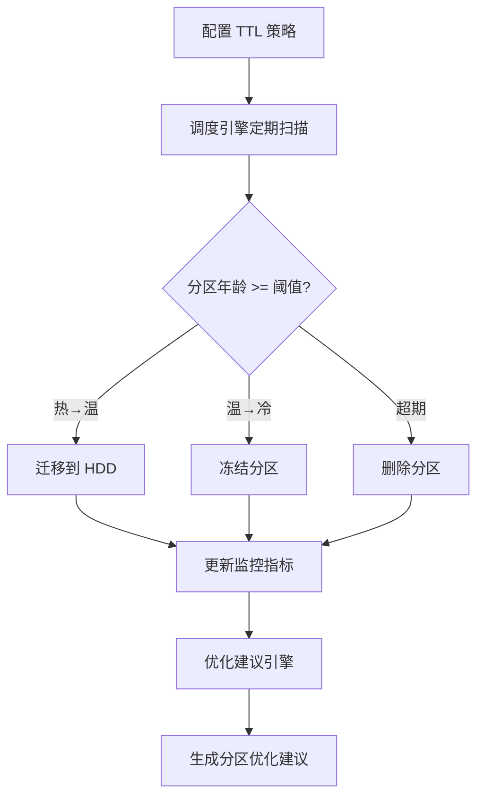

## 1. 产品概述

ClickHouse 数据生命周期管理工具 —— 面向数据工程师和 DBA，提供自动化的数据分区管理、TTL 策略配置、冷热数据分层存储（SSD→HDD）及分区优化建议，降低运维成本，提升存储效率。

## 2. 核心功能

### 2.1 功能模块

1. **仪表盘页**: 集群概览、磁盘使用率、分区统计、调度任务状态
2. **策略管理页**: TTL 策略 CRUD、规则配置（年龄阈值+动作）、启用/禁用
3. **分区管理页**: 分区浏览、生命周期评估、手动执行迁移/删除
4. **存储分层页**: SSD/HDD 层级状态、迁移计划、执行迁移
5. **优化建议页**: 表分析、分区健康度、优化建议与 SQL 生成
6. **监控页**: 历史快照、磁盘趋势、调度任务日志

### 2.2 页面详情

| 页面名称 | 模块名称 | 功能描述 |
|----------|----------|----------|
| 仪表盘 | 集群状态卡片 | 显示数据库数、表数、总分区数、总数据量 |
| 仪表盘 | 磁盘使用概览 | SSD/HDD 使用率进度条和容量信息 |
| 仪表盘 | 调度状态 | 四种调度任务（TTL/Tiering/Cleanup/Optimize）的运行状态 |
| 仪表盘 | 最近操作 | 最近执行的生命周期操作记录 |
| 策略管理 | 策略列表 | 显示所有 TTL 策略，支持搜索、筛选、启用/禁用 |
| 策略管理 | 策略编辑 | 创建/编辑策略表单，支持多规则配置 |
| 策略管理 | 规则配置 | 每条规则：年龄天数、动作类型、目标磁盘、优先级 |
| 分区管理 | 分区浏览 | 按数据库/表浏览分区，显示行数、大小、年龄 |
| 分区管理 | 生命周期评估 | 评估当前分区对应的 TTL 动作，支持 dry-run |
| 分区管理 | 过期分区 | 查询超出保留天数的分区列表 |
| 存储分层 | 层级状态 | SSD/HDD 容量、使用率、优先级 |
| 存储分层 | 迁移计划 | 展示待迁移分区计划，支持 dry-run |
| 存储分层 | 执行迁移 | 一键执行迁移，显示执行结果 |
| 优化建议 | 表分析 | 按表展示分区数量、倾斜比、碎片率 |
| 优化建议 | 建议列表 | 分级展示优化建议（high/medium/low） |
| 优化建议 | SQL 生成 | 生成 OPTIMIZE 等 SQL 语句 |
| 监控 | 磁盘趋势 | 磁盘使用量时间序列图表 |
| 监控 | 快照历史 | 历史监控快照列表 |
| 监控 | 调度日志 | 调度任务执行历史和错误日志 |

## 3. 核心流程

用户配置 TTL 策略 → 调度引擎定期评估分区年龄 → 热数据自动迁移至冷存储（SSD→HDD） → 过期分区自动删除 → 优化建议持续监控分区健康度

## 4. 用户界面设计

### 4.1 设计风格

- 主色调: 深海蓝 (#0F172A) 背景 + 冰蓝 (#38BDF8) 强调色 + 琥珀色 (#F59E0B) 警告
- 按钮风格: 圆角 8px，轻微阴影，hover 发光效果
- 字体: JetBrains Mono (数据) + Noto Sans SC (UI)
- 布局: 侧边栏导航 + 内容区卡片布局
- 图标: lucide-react 线条图标

### 4.2 页面设计概览

| 页面名称 | 模块名称 | UI 元素 |
|----------|----------|---------|
| 仪表盘 | 集群状态卡片 | 4 列网格，每卡片含图标+数字+标签，玻璃拟态背景 |
| 仪表盘 | 磁盘概览 | 横向进度条，蓝→黄→红渐变 |
| 仪表盘 | 调度状态 | 4 个状态胶囊，绿色=success/红色=error/灰色=idle |
| 策略管理 | 策略列表 | 表格布局，行 hover 高亮，状态开关 |
| 策略管理 | 编辑表单 | 侧边抽屉式，分步引导 |
| 分区管理 | 分区表格 | 可排序表格，年龄列带色阶标记 |
| 存储分层 | 层级卡片 | SSD/HDD 双卡片对比，环形进度图 |
| 优化建议 | 建议列表 | 严重程度标签（红/橙/蓝）+ 代码块展示 SQL |
| 监控 | 趋势图 | 折线图，深色主题，网格线淡化 |

### 4.3 响应式

- 桌面优先，侧边栏常驻
- 平板: 侧边栏折叠为图标模式
- 手机: 底部导航栏，卡片单列
