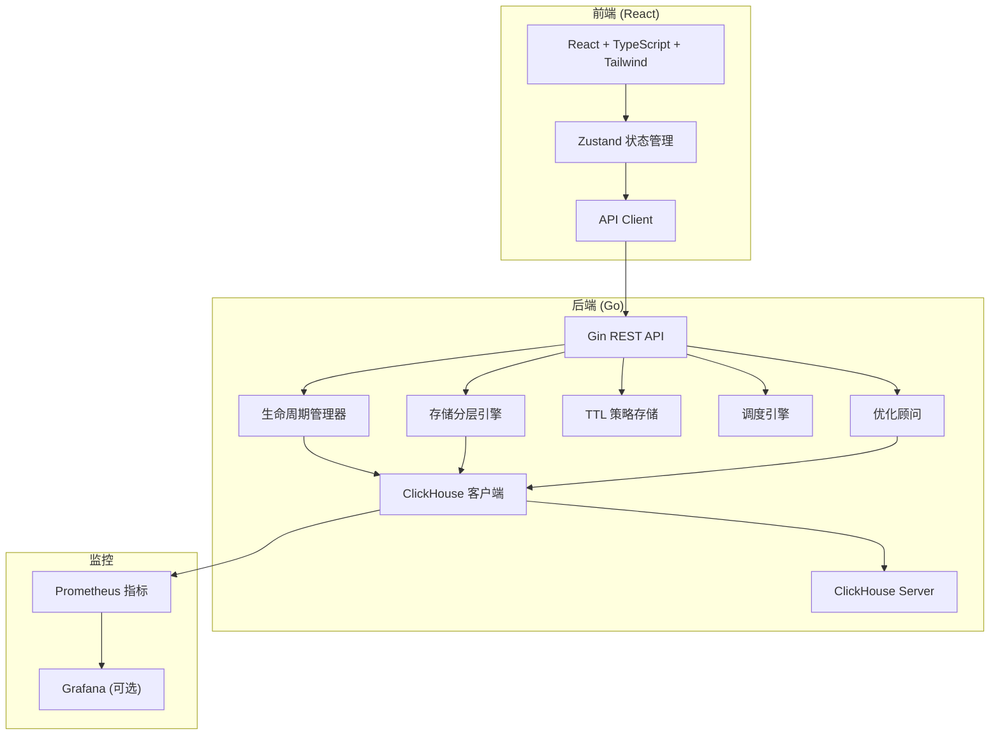

## 1. 架构设计



## 2. 技术说明

- 前端: React@18 + TypeScript + TailwindCSS@3 + Vite + Zustand
- 初始化工具: vite-init
- 后端: Go + Gin (已实现)
- 数据库: ClickHouse + JSON 文件 (策略存储)
- 监控: Prometheus metrics (已实现)

## 3. 路由定义

| 路由 | 用途 |
|------|------|
| / | 仪表盘 - 集群概览 |
| /policies | 策略管理 - TTL 策略 CRUD |
| /partitions | 分区管理 - 浏览和操作分区 |
| /tiering | 存储分层 - SSD/HDD 迁移管理 |
| /advisor | 优化建议 - 分区健康分析 |
| /monitor | 监控 - 指标和趋势 |

## 4. API 定义

### 4.1 策略 API

```typescript
interface TTLPolicy {
  id: string;
  name: string;
  database: string;
  table: string;
  description: string;
  enabled: boolean;
  rules: TTLRule[];
  created_at: string;
  updated_at: string;
}

interface TTLRule {
  id: string;
  age_days: number;
  action: 'move_to_disk' | 'drop' | 'freeze' | 'optimize';
  target_disk?: string;
  target_policy?: string;
  description?: string;
  priority: number;
}

// GET    /api/v1/policies          → { policies: TTLPolicy[] }
// GET    /api/v1/policies/:id      → TTLPolicy
// POST   /api/v1/policies          → TTLPolicy (created)
// PUT    /api/v1/policies/:id      → TTLPolicy (updated)
// DELETE /api/v1/policies/:id      → { status: "deleted" }
```

### 4.2 生命周期 API

```typescript
interface ExecutionResult {
  total_evaluated: number;
  actions: PartitionAction[];
  errors: ActionError[];
  duration: number;
}

interface PartitionAction {
  database: string;
  table: string;
  partition: string;
  action: string;
  target_disk?: string;
  reason: string;
  age_days: number;
  size_bytes: number;
  rows: number;
}

// GET  /api/v1/lifecycle/evaluate?dry_run=true  → ExecutionResult
// POST /api/v1/lifecycle/execute?dry_run=true   → ExecutionResult
// GET  /api/v1/lifecycle/expired?database=x&table=y&retention_days=90 → { expired, count }
```

### 4.3 存储分层 API

```typescript
interface TierStatus {
  name: string;
  type: string;
  path: string;
  priority: number;
  free_space: number;
  total_space: number;
  used_percent: number;
}

// GET  /api/v1/tiering/plan    → { plans: MigrationPlan[], count }
// POST /api/v1/tiering/execute → MigrationResult
// GET  /api/v1/tiering/status  → { tiers: TierStatus[] }
```

### 4.4 调度 API

```typescript
// GET  /api/v1/scheduler/status           → { jobs: Record<JobType, JobStatus> }
// POST /api/v1/scheduler/trigger/:jobType → { status: "triggered", job: string }
```

### 4.5 顾问 API

```typescript
interface TableAnalysis {
  database: string;
  table: string;
  engine: string;
  total_rows: number;
  total_bytes: number;
  partition_count: number;
  avg_partition_size: number;
  skew_ratio: number;
  fragmentation: number;
  suggestions: OptimizationSuggestion[];
}

// GET /api/v1/advisor/analyze/:database/:table → TableAnalysis
// GET /api/v1/advisor/analyze/:database        → { analyses: TableAnalysis[] }
```

### 4.6 集群 API

```typescript
// GET /api/v1/cluster/tables?database=x                   → { tables: TableInfo[] }
// GET /api/v1/cluster/tables/:database/:table/partitions  → { partitions: PartitionInfo[], count }
// GET /api/v1/cluster/disks                               → { disks: DiskInfo[] }
// GET /api/v1/cluster/storage-policies                     → { policies: StoragePolicyInfo[] }
```

### 4.7 监控 API

```typescript
interface ClusterSnapshot {
  timestamp: string;
  disks: DiskSnapshot[];
  tables: TableSnapshot[];
}

// GET /api/v1/monitor/snapshots         → { snapshots: ClusterSnapshot[] }
// GET /api/v1/monitor/snapshot/current  → ClusterSnapshot
```
