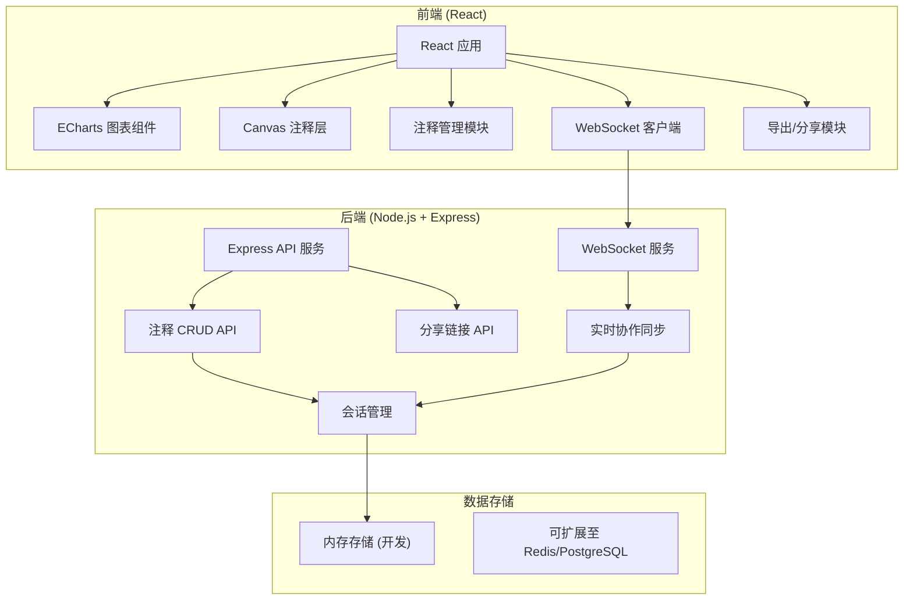
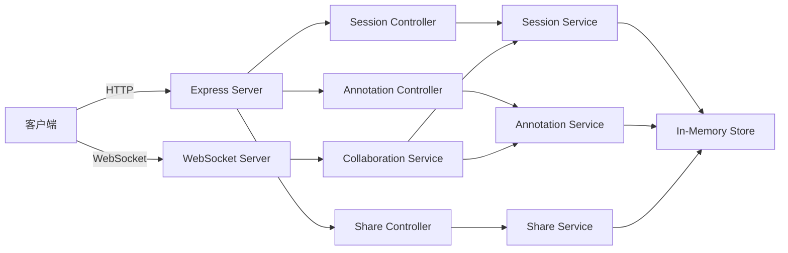
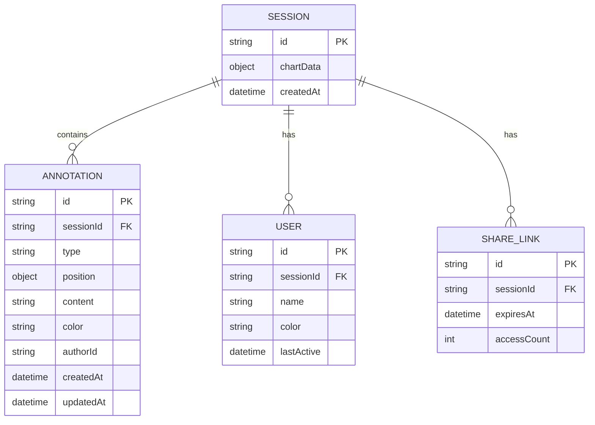

## 1. 架构设计



## 2. 技术描述

- **前端**: React@18 + TypeScript + Vite + TailwindCSS@3 + Zustand + ECharts + lucide-react
- **后端**: Node.js + Express@4 + TypeScript + ws (WebSocket库)
- **初始化工具**: vite-init (react-express-ts模板)
- **通信**: REST API + WebSocket 双工通信
- **图标库**: lucide-react

## 3. 路由定义

| 路由 | 目的 |
|-------|---------|
| / | 主页面，图表展示和注释编辑器 |
| /share/:sessionId | 分享链接访问页面 |
| /api/annotations | 注释CRUD API |
| /api/share | 分享链接生成API |
| /ws | WebSocket连接端点 |

## 4. API 定义

### 4.1 TypeScript 类型定义

```typescript
// 注释类型
export type AnnotationType = 'text' | 'arrow' | 'highlight';

export interface Point {
  x: number;
  y: number;
  dataIndex?: number;
  seriesIndex?: number;
}

export interface Annotation {
  id: string;
  type: AnnotationType;
  position: Point;
  endPosition?: Point;
  content?: string;
  color: string;
  authorId: string;
  authorName: string;
  createdAt: number;
  updatedAt: number;
}

export interface User {
  id: string;
  name: string;
  color: string;
  cursor?: Point;
}

export interface Session {
  id: string;
  annotations: Annotation[];
  users: User[];
  chartData: any;
}

// WebSocket 消息
export interface WSMessage {
  type: 'user_join' | 'user_leave' | 'cursor_update' | 'annotation_add' | 'annotation_update' | 'annotation_delete';
  payload: any;
  userId: string;
  timestamp: number;
}
```

### 4.2 API 端点

| 方法 | 路径 | 请求 | 响应 |
|------|------|------|------|
| GET | /api/sessions/:id | - | Session |
| POST | /api/sessions | { chartData } | { sessionId } |
| GET | /api/sessions/:id/annotations | - | Annotation[] |
| POST | /api/sessions/:id/annotations | Annotation | Annotation |
| PUT | /api/sessions/:id/annotations/:aid | Partial<Annotation> | Annotation |
| DELETE | /api/sessions/:id/annotations/:aid | - | { success } |
| POST | /api/share | { sessionId, expiresIn } | { shareUrl, shareId } |

## 5. 服务器架构图



## 6. 数据模型

### 6.1 数据模型定义



### 6.2 内存存储结构

开发阶段使用内存存储，生产环境可迁移至数据库：

```typescript
interface Store {
  sessions: Map<string, Session>;
  shareLinks: Map<string, { sessionId: string; expiresAt: number }>;
}
```
