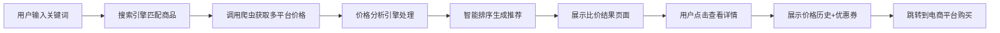
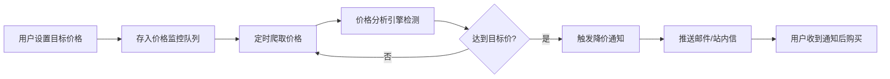

## 1. 产品概述

商品比价导购平台是一个智能电商价格对比系统，聚合多平台商品信息，帮助用户快速找到最优购买渠道，实现省钱购物。

- **核心价值**：通过智能比价、价格历史追踪、降价提醒等功能，帮助用户在海量电商信息中做出最优购买决策
- **目标用户**：追求性价比的网购消费者、价格敏感型用户、精明购物者
- **解决痛点**：多平台价格对比繁琐、错过最佳购买时机、不知道优惠券如何使用

## 2. 核心功能

### 2.1 用户角色

| 角色 | 注册方式 | 核心权限 |
|------|----------|----------|
| 普通用户 | 邮箱/手机号注册 | 商品搜索、比价浏览、价格图表查看、设置降价提醒、优惠券匹配 |
| 管理员 | 后台账号登录 | 爬虫管理、数据维护、系统配置、用户管理 |

### 2.2 功能模块

1. **首页**：搜索框、热门商品推荐、平台分类导航、价格趋势统计
2. **商品搜索结果页**：多平台商品列表、智能比价排序、筛选条件、价格区间选择
3. **商品详情页**：多平台价格对比、价格历史图表、优惠券信息、最优购买推荐、降价提醒设置
4. **个人中心**：关注商品列表、降价提醒管理、浏览历史、通知设置
5. **平台管理页**：电商平台配置、爬虫状态监控、数据统计概览（管理员）

### 2.3 页面详情

| 页面名称 | 模块名称 | 功能描述 |
|---------|----------|----------|
| 首页 | 搜索模块 | 支持关键词搜索、历史搜索记录、热门搜索词推荐 |
| 首页 | 商品推荐 | 展示今日低价商品、热门降价商品、精选推荐 |
| 首页 | 平台导航 | 快速切换查看不同电商平台的商品 |
| 搜索结果页 | 商品列表 | 展示多平台同款商品，显示当前价格、平台、优惠券 |
| 搜索结果页 | 智能排序 | 支持按价格、评分、销量、性价比综合排序 |
| 搜索结果页 | 筛选过滤 | 按价格区间、平台、商品类型、是否有券筛选 |
| 商品详情页 | 价格对比 | 横向对比各平台当前价格、历史最低价、预计节省金额 |
| 商品详情页 | 价格图表 | 可视化展示30天/90天/全年价格走势，标注历史高低点 |
| 商品详情页 | 降价提醒 | 设置目标价格，到价自动推送通知（邮件/站内信） |
| 商品详情页 | 优惠券匹配 | 自动匹配可用优惠券，计算最终到手价 |
| 商品详情页 | 购买跳转 | 一键跳转到对应平台购买页，自动应用优惠券 |
| 个人中心 | 我的关注 | 管理关注的商品，查看当前价格状态 |
| 个人中心 | 提醒设置 | 管理降价提醒规则，设置通知方式 |

## 3. 核心流程

### 3.1 用户搜索比价流程

### 3.2 降价提醒流程

## 4. 用户界面设计

### 4.1 设计风格

- **主色调**：深蓝 #1e3a8a（专业可靠），橙色 #f97316（优惠醒目）
- **辅助色**：绿色 #10b981（低价标识），红色 #ef4444（降价标识）
- **按钮风格**：圆角8px，悬停有微缩放动效，主按钮采用渐变背景
- **字体**：标题使用 Noto Sans SC 700，正文使用 Noto Sans SC 400
- **布局风格**：卡片式布局，阴影层次分明，顶部导航固定
- **图标风格**：线性简约风格，统一使用 Phosphor Icons 图标库

### 4.2 页面设计概览

| 页面名称 | 模块名称 | UI元素 |
|---------|----------|--------|
| 首页 | 搜索区 | 大尺寸搜索框，自动聚焦，搜索历史下拉，热门标签云 |
| 首页 | 推荐区 | 横向滚动商品卡片，价格标签醒目，"史低"角标动画 |
| 搜索结果页 | 筛选栏 | 粘性顶部，多维度筛选条件，价格滑块组件 |
| 搜索结果页 | 商品卡片 | 平台Logo标识，价格闪烁动效（降价商品），优惠券标签 |
| 商品详情页 | 价格对比表 | 各平台价格横向排列，最优价格高亮闪烁，节省金额醒目 |
| 商品详情页 | 价格图表 | 可交互折线图，支持缩放查看，鼠标悬停显示具体价格 |
| 商品详情页 | 提醒设置 | 滑动条设置目标价格，一键开启提醒，实时预估优惠 |

### 4.3 响应式设计

- 采用 Desktop-first 设计，断点设置为 1280px、1024px、768px、480px
- 移动端导航切换为底部Tab栏，商品卡片改为单列布局
- 触摸交互优化：增大点击区域，支持滑动删除、下拉刷新
- 表格类内容在移动端自动转换为卡片式展示

### 4.4 动效设计

- 页面加载：元素依次淡入，搜索结果卡片错落动画
- 价格更新：数字滚动过渡，降价时红色闪烁提示
- 图表交互：线条绘制动画，数据点悬停放大效果
- 按钮交互：点击时缩放反馈，成功操作绿色波纹
- 通知推送：右上角滑入动画，轻微震动反馈
