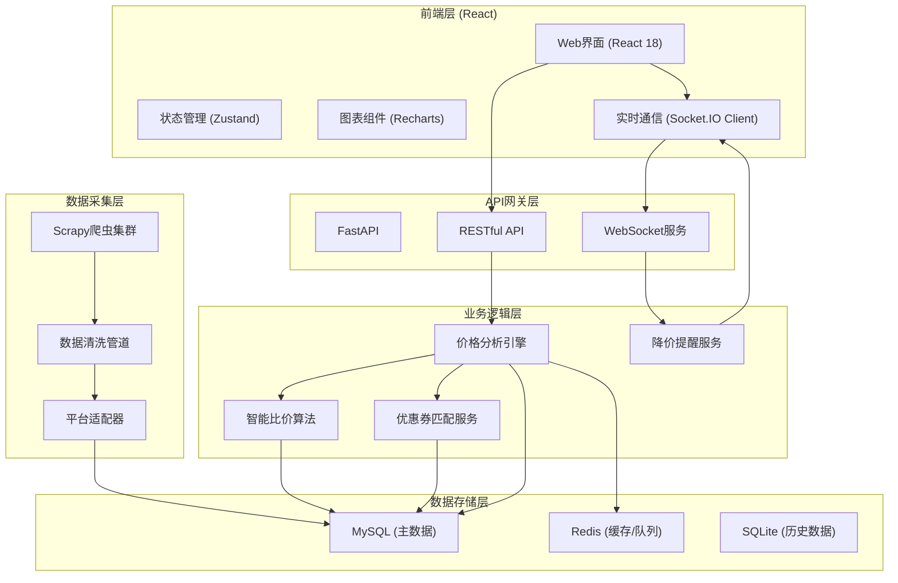
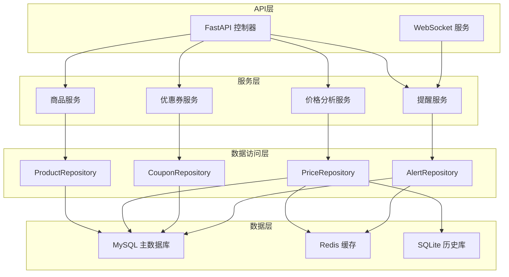
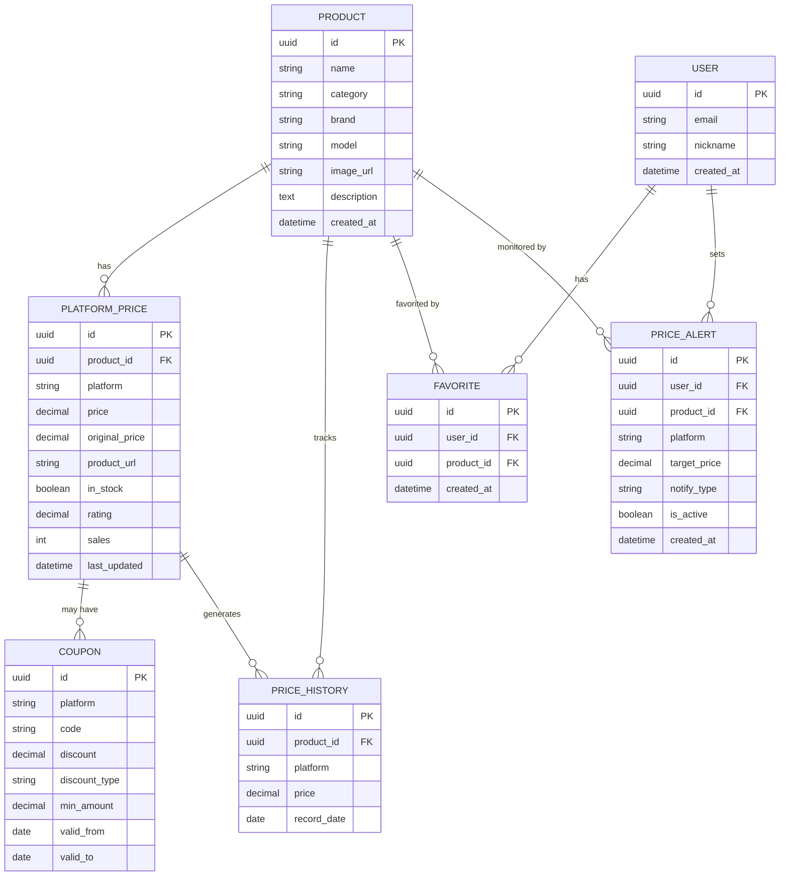

## 1. 架构设计



## 2. 技术描述

### 2.1 技术栈选型

| 层级 | 技术选型 | 版本 | 用途 |
|------|----------|------|------|
| 前端 | React | 18.x | 用户界面框架 |
| 前端 | Vite | 5.x | 构建工具 |
| 前端 | TypeScript | 5.x | 类型安全 |
| 前端 | Tailwind CSS | 3.x | 样式框架 |
| 前端 | Zustand | 4.x | 状态管理 |
| 前端 | Recharts | 2.x | 价格历史图表 |
| 前端 | Socket.IO Client | 4.x | WebSocket客户端 |
| 前端 | React Router | 6.x | 路由管理 |
| 后端 | Python | 3.11 | 开发语言 |
| 后端 | FastAPI | 0.109.x | Web API框架 |
| 后端 | Scrapy | 2.11.x | 爬虫框架 |
| 后端 | SQLAlchemy | 2.x | ORM框架 |
| 后端 | Pydantic | 2.x | 数据验证 |
| 后端 | Socket.IO | 5.x | WebSocket服务 |
| 后端 | APScheduler | 3.x | 定时任务 |
| 数据库 | MySQL | 8.0+ | 主数据库 |
| 数据库 | Redis | 7.x | 缓存和消息队列 |
| 数据库 | SQLite | 3.x | 历史价格数据 |

### 2.2 项目结构

```
price-comparison/
├── backend/                    # Python后端
│   ├── app/                    # FastAPI应用
│   │   ├── main.py             # 应用入口
│   │   ├── api/                # API路由
│   │   │   ├── products.py     # 商品接口
│   │   │   ├── price.py        # 价格接口
│   │   │   ├── coupon.py       # 优惠券接口
│   │   │   └── alert.py        # 提醒接口
│   │   ├── services/           # 业务逻辑
│   │   │   ├── price_analyzer.py   # 价格分析引擎
│   │   │   ├── comparator.py       # 智能比价算法
│   │   │   ├── coupon_matcher.py   # 优惠券匹配
│   │   │   └── alert_service.py    # 降价提醒服务
│   │   ├── models/             # 数据模型
│   │   │   ├── product.py      # 商品模型
│   │   │   ├── price.py        # 价格模型
│   │   │   ├── coupon.py       # 优惠券模型
│   │   │   └── alert.py        # 提醒模型
│   │   ├── schemas/            # Pydantic模式
│   │   ├── websocket/          # WebSocket服务
│   │   │   └── server.py       # 实时推送服务
│   │   └── database.py         # 数据库连接
│   ├── crawler/                # Scrapy爬虫
│   │   ├── spiders/            # 爬虫文件
│   │   │   ├── taobao.py       # 淘宝爬虫
│   │   │   ├── jd.py           # 京东爬虫
│   │   │   ├── pdd.py          # 拼多多爬虫
│   │   │   └── suning.py       # 苏宁爬虫
│   │   ├── pipelines.py        # 数据管道
│   │   ├── middlewares.py      # 中间件
│   │   └── settings.py         # 爬虫配置
│   ├── scripts/                # 脚本工具
│   │   ├── init_db.py          # 初始化数据库
│   │   ├── run_crawler.py      # 运行爬虫
│   │   └── mock_data.py        # 生成模拟数据
│   └── requirements.txt        # Python依赖
├── frontend/                   # React前端
│   ├── src/
│   │   ├── components/         # 组件
│   │   ├── pages/              # 页面
│   │   ├── store/              # 状态管理
│   │   ├── services/           # API服务
│   │   ├── types/              # TypeScript类型
│   │   └── utils/              # 工具函数
│   ├── package.json
│   └── vite.config.ts
└── docker-compose.yml          # Docker部署配置
```

## 3. 路由定义

| 路由 | 页面 | 用途 |
|------|------|------|
| `/` | 首页 | 搜索、推荐商品展示 |
| `/search` | 搜索结果页 | 商品列表、筛选、比价 |
| `/product/:id` | 商品详情页 | 价格对比、历史图表、提醒设置 |
| `/products/hot` | 热门降价 | 热门降价商品榜单 |
| `/products/coupons` | 优惠券专区 | 可用优惠券列表 |
| `/user/favorites` | 我的关注 | 用户关注的商品 |
| `/user/alerts` | 降价提醒 | 提醒设置管理 |
| `/user/history` | 浏览历史 | 用户浏览记录 |
| `/admin/dashboard` | 管理后台 | 数据统计、爬虫管理 |

## 4. API 定义

### 4.1 TypeScript 类型定义

```typescript
// 商品信息
interface Product {
  id: string;
  name: string;
  description: string;
  category: string;
  imageUrl: string;
  brand: string;
  model: string;
  createdAt: string;
}

// 平台价格信息
interface PlatformPrice {
  id: string;
  productId: string;
  platform: 'taobao' | 'jd' | 'pdd' | 'suning';
  platformName: string;
  price: number;
  originalPrice: number;
  couponPrice: number;
  url: string;
  inStock: boolean;
  rating: number;
  sales: number;
  coupons: Coupon[];
  lastUpdated: string;
}

// 价格历史记录
interface PriceHistory {
  date: string;
  price: number;
  platform: string;
}

// 优惠券信息
interface Coupon {
  id: string;
  platform: string;
  code: string;
  discount: number;
  discountType: 'percentage' | 'fixed';
  minAmount: number;
  maxDiscount: number;
  validFrom: string;
  validTo: string;
}

// 降价提醒
interface PriceAlert {
  id: string;
  userId: string;
  productId: string;
  targetPrice: number;
  currentPrice: number;
  platform: string;
  notifyType: 'email' | 'push' | 'sms';
  isActive: boolean;
  createdAt: string;
}

// 比价结果
interface ComparisonResult {
  product: Product;
  prices: PlatformPrice[];
  bestDeal: PlatformPrice;
  lowestEver: number;
  priceHistory: PriceHistory[];
  potentialSavings: number;
}
```

### 4.2 API 端点

| 方法 | 路径 | 描述 | 请求参数 | 返回 |
|------|------|------|----------|------|
| GET | `/api/products/search` | 搜索商品 | `q: string, page: number, size: number` | `{ items: Product[], total: number }` |
| GET | `/api/products/:id` | 获取商品详情 | `id: string` | `Product` |
| GET | `/api/products/:id/prices` | 获取多平台价格 | `id: string` | `ComparisonResult` |
| GET | `/api/products/:id/history` | 价格历史 | `id: string, days: number` | `PriceHistory[]` |
| GET | `/api/products/hot` | 热门降价商品 | `limit: number` | `PlatformPrice[]` |
| POST | `/api/alerts` | 创建降价提醒 | `{ productId, targetPrice, notifyType }` | `PriceAlert` |
| GET | `/api/alerts` | 获取用户提醒列表 | - | `PriceAlert[]` |
| DELETE | `/api/alerts/:id` | 删除提醒 | `id: string` | `{ success: boolean }` |
| GET | `/api/coupons` | 获取可用优惠券 | `productId?: string` | `Coupon[]` |
| POST | `/api/coupons/match` | 自动匹配优惠券 | `{ productId, platform }` | `Coupon[]` |
| GET | `/api/user/favorites` | 获取关注列表 | - | `Product[]` |
| POST | `/api/user/favorites` | 添加关注 | `{ productId }` | `{ success: boolean }` |
| DELETE | `/api/user/favorites/:id` | 取消关注 | `id: string` | `{ success: boolean }` |

## 5. 服务端架构



## 6. 数据模型

### 6.1 ER 图



### 6.2 DDL 语句

```sql
-- 创建数据库
CREATE DATABASE price_comparison CHARACTER SET utf8mb4 COLLATE utf8mb4_unicode_ci;

USE price_comparison;

-- 商品表
CREATE TABLE products (
    id CHAR(36) PRIMARY KEY,
    name VARCHAR(255) NOT NULL,
    category VARCHAR(100) NOT NULL,
    brand VARCHAR(100),
    model VARCHAR(100),
    image_url VARCHAR(500),
    description TEXT,
    created_at DATETIME DEFAULT CURRENT_TIMESTAMP,
    INDEX idx_category (category),
    INDEX idx_name (name),
    FULLTEXT KEY ft_name_desc (name, description)
) ENGINE=InnoDB DEFAULT CHARSET=utf8mb4;

-- 平台价格表
CREATE TABLE platform_prices (
    id CHAR(36) PRIMARY KEY,
    product_id CHAR(36) NOT NULL,
    platform VARCHAR(50) NOT NULL,
    platform_name VARCHAR(50) NOT NULL,
    price DECIMAL(10,2) NOT NULL,
    original_price DECIMAL(10,2),
    product_url VARCHAR(1000) NOT NULL,
    in_stock BOOLEAN DEFAULT TRUE,
    rating DECIMAL(3,1),
    sales INT DEFAULT 0,
    last_updated DATETIME DEFAULT CURRENT_TIMESTAMP ON UPDATE CURRENT_TIMESTAMP,
    FOREIGN KEY (product_id) REFERENCES products(id) ON DELETE CASCADE,
    INDEX idx_product (product_id),
    INDEX idx_platform (platform),
    INDEX idx_price (price),
    INDEX idx_updated (last_updated)
) ENGINE=InnoDB DEFAULT CHARSET=utf8mb4;

-- 价格历史表 (SQLite)
CREATE TABLE price_history (
    id CHAR(36) PRIMARY KEY,
    product_id CHAR(36) NOT NULL,
    platform VARCHAR(50) NOT NULL,
    price DECIMAL(10,2) NOT NULL,
    record_date DATE NOT NULL,
    INDEX idx_product_date (product_id, record_date),
    INDEX idx_platform_date (platform, record_date)
);

-- 优惠券表
CREATE TABLE coupons (
    id CHAR(36) PRIMARY KEY,
    platform VARCHAR(50) NOT NULL,
    code VARCHAR(100),
    discount DECIMAL(10,2) NOT NULL,
    discount_type ENUM('percentage', 'fixed') NOT NULL,
    min_amount DECIMAL(10,2) DEFAULT 0,
    max_discount DECIMAL(10,2),
    valid_from DATE NOT NULL,
    valid_to DATE NOT NULL,
    is_active BOOLEAN DEFAULT TRUE,
    INDEX idx_platform (platform),
    INDEX idx_valid (valid_from, valid_to)
) ENGINE=InnoDB DEFAULT CHARSET=utf8mb4;

-- 用户表
CREATE TABLE users (
    id CHAR(36) PRIMARY KEY,
    email VARCHAR(100) UNIQUE NOT NULL,
    password_hash VARCHAR(255) NOT NULL,
    nickname VARCHAR(50),
    created_at DATETIME DEFAULT CURRENT_TIMESTAMP
) ENGINE=InnoDB DEFAULT CHARSET=utf8mb4;

-- 用户关注表
CREATE TABLE favorites (
    id CHAR(36) PRIMARY KEY,
    user_id CHAR(36) NOT NULL,
    product_id CHAR(36) NOT NULL,
    created_at DATETIME DEFAULT CURRENT_TIMESTAMP,
    FOREIGN KEY (user_id) REFERENCES users(id) ON DELETE CASCADE,
    FOREIGN KEY (product_id) REFERENCES products(id) ON DELETE CASCADE,
    UNIQUE KEY uk_user_product (user_id, product_id)
) ENGINE=InnoDB DEFAULT CHARSET=utf8mb4;

-- 降价提醒表
CREATE TABLE price_alerts (
    id CHAR(36) PRIMARY KEY,
    user_id CHAR(36) NOT NULL,
    product_id CHAR(36) NOT NULL,
    platform VARCHAR(50) NOT NULL,
    target_price DECIMAL(10,2) NOT NULL,
    notify_type ENUM('email', 'push', 'sms') DEFAULT 'email',
    is_active BOOLEAN DEFAULT TRUE,
    triggered BOOLEAN DEFAULT FALSE,
    created_at DATETIME DEFAULT CURRENT_TIMESTAMP,
    FOREIGN KEY (user_id) REFERENCES users(id) ON DELETE CASCADE,
    FOREIGN KEY (product_id) REFERENCES products(id) ON DELETE CASCADE,
    INDEX idx_active (is_active),
    INDEX idx_target (target_price)
) ENGINE=InnoDB DEFAULT CHARSET=utf8mb4;
```
