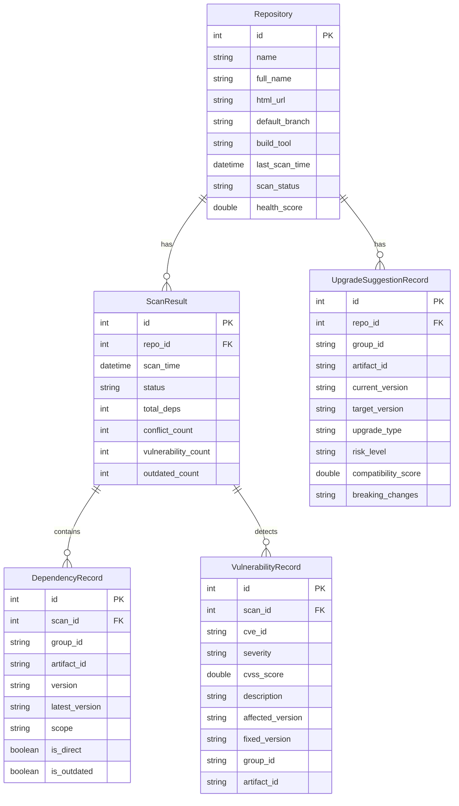

## 1. 架构设计

```mermaid
flowchart TB
    subgraph "前端层"
        "React SPA"
    end
    subgraph "后端层"
        "Spring Boot API"
        "依赖解析引擎"
        "安全漏洞扫描器"
        "兼容性评估引擎"
        "GitHub集成服务"
    end
    subgraph "数据层"
        "H2数据库"
        "Redis缓存"
    end
    subgraph "外部服务"
        "Maven Central API"
        "NVD CVE数据库"
        "GitHub API"
    end
    "React SPA" --> "Spring Boot API"
    "Spring Boot API" --> "依赖解析引擎"
    "Spring Boot API" --> "安全漏洞扫描器"
    "Spring Boot API" --> "兼容性评估引擎"
    "Spring Boot API" --> "GitHub集成服务"
    "依赖解析引擎" --> "Maven Central API"
    "安全漏洞扫描器" --> "NVD CVE数据库"
    "GitHub集成服务" --> "GitHub API"
    "Spring Boot API" --> "H2数据库"
    "Spring Boot API" --> "Redis缓存"
```

## 2. 技术说明

- 前端: React@18 + TypeScript + TailwindCSS@3 + Vite + Recharts + React Router@6
- 初始化工具: Vite (create-vite)
- 后端: Java 17 + Spring Boot 3.2 + Maven
- 数据库: H2 (嵌入式，开发阶段) + 可切换至PostgreSQL
- 缓存: Caffeine本地缓存(替代Redis，简化部署)
- 依赖解析: Maven Resolver + 自定义Gradle解析器
- 安全数据源: NVD CVE API + OSS Index
- GitHub集成: GitHub REST API (org.kohsuke:github-api)
- 构建工具: Maven (后端) + Vite (前端)

## 3. 路由定义

| 路由 | 用途 |
|------|------|
| / | 仪表盘 - 全局风险概览与统计 |
| /services/:id | 服务详情 - 依赖树与冲突检测 |
| /vulnerabilities | 漏洞报告 - 全量CVE漏洞列表 |
| /vulnerabilities/:cveId | CVE详情 - 漏洞详细信息与影响范围 |
| /upgrades | 升级建议 - 智能推荐与批量操作 |
| /repositories | 仓库管理 - 仓库接入与扫描调度 |

## 4. API定义

### 4.1 仓库管理API

```typescript
interface Repository {
  id: number;
  name: string;
  fullName: string;
  htmlUrl: string;
  defaultBranch: string;
  buildTool: "MAVEN" | "GRADLE";
  lastScanTime: string | null;
  scanStatus: "IDLE" | "SCANNING" | "COMPLETED" | "FAILED";
  healthScore: number;
}

// POST /api/repositories - 添加仓库
// GET /api/repositories - 获取仓库列表
// DELETE /api/repositories/{id} - 移除仓库
// POST /api/repositories/{id}/scan - 触发扫描
// GET /api/repositories/{id}/scans - 获取扫描历史
```

### 4.2 依赖分析API

```typescript
interface Dependency {
  groupId: string;
  artifactId: string;
  version: string;
  latestVersion: string;
  scope: string;
  isOutdated: boolean;
  isDirect: boolean;
  transitiveDependencies: Dependency[];
}

interface VersionConflict {
  groupId: string;
  artifactId: string;
  versions: { service: string; version: string }[];
  recommendedVersion: string;
  severity: "HIGH" | "MEDIUM" | "LOW";
}

// GET /api/services/{repoId}/dependencies - 获取服务依赖树
// GET /api/conflicts - 获取全局版本冲突列表
// GET /api/services/{repoId}/conflicts - 获取服务版本冲突
```

### 4.3 漏洞报告API

```typescript
interface Vulnerability {
  cveId: string;
  severity: "CRITICAL" | "HIGH" | "MEDIUM" | "LOW";
  cvssScore: number;
  description: string;
  affectedVersions: string;
  fixedVersion: string;
  publishedDate: string;
  affectedServices: { repoId: number; repoName: string; dependency: string; version: string }[];
}

// GET /api/vulnerabilities - 获取漏洞列表
// GET /api/vulnerabilities/{cveId} - 获取CVE详情
// GET /api/vulnerabilities/stats - 获取漏洞统计
```

### 4.4 升级建议API

```typescript
interface UpgradeSuggestion {
  id: number;
  repoId: number;
  repoName: string;
  groupId: string;
  artifactId: string;
  currentVersion: string;
  targetVersion: string;
  upgradeType: "PATCH" | "MINOR" | "MAJOR";
  riskLevel: "SAFE" | "LOW_RISK" | "MEDIUM_RISK" | "HIGH_RISK";
  compatibilityScore: number;
  breakingChanges: string[];
  releaseNotes: string;
  selected: boolean;
}

interface BatchPRRequest {
  upgrades: { suggestionId: number }[];
  branchName: string;
  prTitle: string;
  prBody: string;
}

interface BatchPRResponse {
  pullRequestUrl: string;
  pullRequestNumber: number;
  branchName: string;
  modifiedFiles: string[];
}

// GET /api/upgrades - 获取升级建议列表
// POST /api/upgrades/batch-pr - 创建批量升级PR
// GET /api/upgrades/compatibility/{groupId}/{artifactId} - 获取兼容性矩阵
```

### 4.5 仪表盘API

```typescript
interface DashboardStats {
  totalServices: number;
  totalDependencies: number;
  conflictCount: number;
  vulnerabilityCount: number;
  outdatedCount: number;
  healthScore: number;
  recentScans: { repoName: string; time: string; status: string; findings: number }[];
  topVulnerabilities: Vulnerability[];
}

// GET /api/dashboard/stats - 获取仪表盘统计数据
```

## 5. 服务端架构图

```mermaid
flowchart LR
    subgraph "Controller层"
        "RepositoryController"
        "DependencyController"
        "VulnerabilityController"
        "UpgradeController"
        "DashboardController"
    end
    subgraph "Service层"
        "RepositoryService"
        "DependencyParserService"
        "VulnerabilityScanService"
        "UpgradeSuggestionService"
        "GitHubIntegrationService"
    end
    subgraph "引擎层"
        "MavenParserEngine"
        "GradleParserEngine"
        "VersionComparator"
        "CompatibilityEvaluator"
    end
    subgraph "数据层"
        "RepositoryRepository"
        "DependencyRepository"
        "VulnerabilityRepository"
        "ScanResultRepository"
    end
    "RepositoryController" --> "RepositoryService"
    "DependencyController" --> "DependencyParserService"
    "VulnerabilityController" --> "VulnerabilityScanService"
    "UpgradeController" --> "UpgradeSuggestionService"
    "DashboardController" --> "RepositoryService"
    "DependencyParserService" --> "MavenParserEngine"
    "DependencyParserService" --> "GradleParserEngine"
    "VulnerabilityScanService" --> "VersionComparator"
    "UpgradeSuggestionService" --> "CompatibilityEvaluator"
    "RepositoryService" --> "GitHubIntegrationService"
    "RepositoryService" --> "RepositoryRepository"
    "DependencyParserService" --> "DependencyRepository"
    "VulnerabilityScanService" --> "VulnerabilityRepository"
```

## 6. 数据模型

### 6.1 数据模型定义



### 6.2 数据定义语言

```sql
CREATE TABLE repository (
    id INT AUTO_INCREMENT PRIMARY KEY,
    name VARCHAR(255) NOT NULL,
    full_name VARCHAR(512) NOT NULL,
    html_url VARCHAR(1024) NOT NULL,
    default_branch VARCHAR(255) DEFAULT 'main',
    build_tool VARCHAR(20) DEFAULT 'MAVEN',
    last_scan_time TIMESTAMP,
    scan_status VARCHAR(20) DEFAULT 'IDLE',
    health_score DOUBLE DEFAULT 100.0,
    created_at TIMESTAMP DEFAULT CURRENT_TIMESTAMP,
    updated_at TIMESTAMP DEFAULT CURRENT_TIMESTAMP
);

CREATE TABLE scan_result (
    id INT AUTO_INCREMENT PRIMARY KEY,
    repo_id INT NOT NULL,
    scan_time TIMESTAMP DEFAULT CURRENT_TIMESTAMP,
    status VARCHAR(20) NOT NULL,
    total_deps INT DEFAULT 0,
    conflict_count INT DEFAULT 0,
    vulnerability_count INT DEFAULT 0,
    outdated_count INT DEFAULT 0,
    FOREIGN KEY (repo_id) REFERENCES repository(id)
);

CREATE TABLE dependency_record (
    id INT AUTO_INCREMENT PRIMARY KEY,
    scan_id INT NOT NULL,
    group_id VARCHAR(255) NOT NULL,
    artifact_id VARCHAR(255) NOT NULL,
    version VARCHAR(100) NOT NULL,
    latest_version VARCHAR(100),
    scope VARCHAR(50),
    is_direct BOOLEAN DEFAULT TRUE,
    is_outdated BOOLEAN DEFAULT FALSE,
    FOREIGN KEY (scan_id) REFERENCES scan_result(id)
);

CREATE TABLE vulnerability_record (
    id INT AUTO_INCREMENT PRIMARY KEY,
    scan_id INT NOT NULL,
    cve_id VARCHAR(20) NOT NULL,
    severity VARCHAR(20) NOT NULL,
    cvss_score DOUBLE DEFAULT 0.0,
    description TEXT,
    affected_version VARCHAR(255),
    fixed_version VARCHAR(100),
    group_id VARCHAR(255),
    artifact_id VARCHAR(255),
    FOREIGN KEY (scan_id) REFERENCES scan_result(id)
);

CREATE TABLE upgrade_suggestion_record (
    id INT AUTO_INCREMENT PRIMARY KEY,
    repo_id INT NOT NULL,
    group_id VARCHAR(255) NOT NULL,
    artifact_id VARCHAR(255) NOT NULL,
    current_version VARCHAR(100) NOT NULL,
    target_version VARCHAR(100) NOT NULL,
    upgrade_type VARCHAR(20) NOT NULL,
    risk_level VARCHAR(20) NOT NULL,
    compatibility_score DOUBLE DEFAULT 0.0,
    breaking_changes TEXT,
    FOREIGN KEY (repo_id) REFERENCES repository(id)
);

CREATE INDEX idx_dep_group_artifact ON dependency_record(group_id, artifact_id);
CREATE INDEX idx_vuln_cve ON vulnerability_record(cve_id);
CREATE INDEX idx_vuln_severity ON vulnerability_record(severity);
CREATE INDEX idx_upgrade_repo ON upgrade_suggestion_record(repo_id);
```
