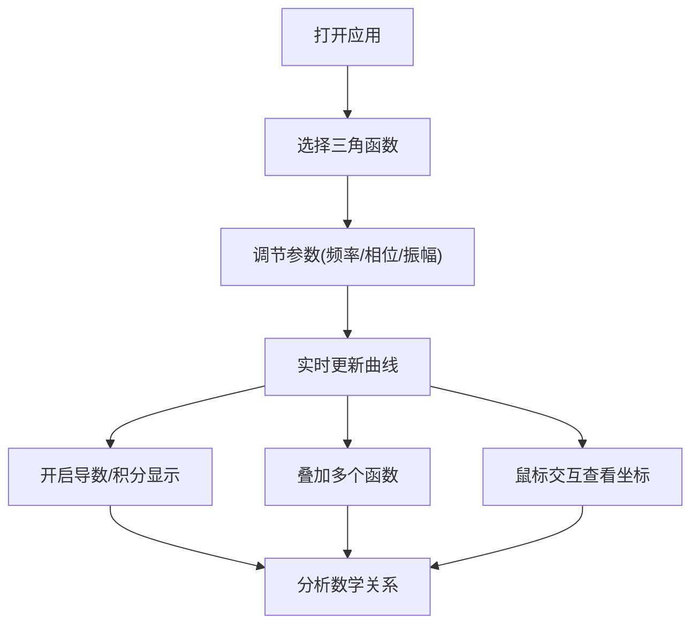

## 1. 产品概述

三角函数可视化工具是一个交互式Web应用，用于帮助用户理解和探索三角函数的数学特性。通过实时绘制函数曲线、调整参数、叠加函数、显示导数积分等功能，为学生、教师和数学爱好者提供直观的学习体验。

## 2. 核心功能

### 2.1 用户角色
| 角色 | 注册方式 | 核心权限 |
|------|----------|----------|
| 普通用户 | 无需注册 | 使用所有可视化功能，调节参数，保存截图 |

### 2.2 功能模块
1. **主界面**：函数曲线图展示、参数控制面板、坐标信息显示
2. **函数选择模块**：sin、cos、tan、cot、sec、csc等基础函数选择
3. **参数调节模块**：频率、相位、振幅的实时调节滑块
4. **函数叠加模块**：多个函数叠加显示，支持自定义表达式
5. **导数积分模块**：显示函数的导数和积分曲线
6. **坐标交互模块**：鼠标悬停显示坐标值，点击标记关键点

### 2.3 页面详情
| 页面名称 | 模块名称 | 功能描述 |
|---------|----------|----------|
| 主页面 | 图表区域 | 实时渲染三角函数曲线，支持缩放和平移 |
| 主页面 | 参数控制面板 | 滑块调节频率、相位、振幅，实时更新曲线 |
| 主页面 | 函数选择器 | 切换不同三角函数类型，支持多选叠加 |
| 主页面 | 数学工具面板 | 开关导数、积分曲线显示 |
| 主页面 | 坐标信息栏 | 显示鼠标位置的x、y坐标和函数值 |

## 3. 核心流程

用户打开应用 → 选择三角函数类型 → 调节频率、相位、振幅参数 → 观察曲线变化 → 开启导数/积分显示 → 叠加多个函数 → 鼠标悬停查看坐标值 → 导出或截图保存

## 4. 用户界面设计

### 4.1 设计风格
- **主色调**：深蓝色 (#165DFF) 作为主色，代表科学与精确
- **辅助色**：青色 (#0FC6C2)、紫色 (#722ED1) 用于区分不同函数曲线
- **背景**：深色主题 (#0E1116)，突出数学曲线的视觉效果
- **按钮风格**：圆角矩形，带有微妙的发光效果
- **字体**：使用 JetBrains Mono 作为数字和代码显示，Inter 作为界面文字
- **布局风格**：左右分栏布局，左侧控制面板，右侧图表区域
- **图标风格**：线性简约图标，与数学工具主题一致

### 4.2 页面设计概述
| 页面名称 | 模块名称 | UI 元素 |
|---------|----------|---------|
| 主页面 | 顶部导航 | Logo、标题、主题切换按钮 |
| 主页面 | 左侧控制区 | 参数滑块、函数选择复选框、功能开关 |
| 主页面 | 右侧图表区 | Canvas/Chart.js 渲染区域、缩放控制 |
| 主页面 | 底部信息栏 | 鼠标坐标显示、当前函数值、关键点标记 |
| 主页面 | 表达式输入 | 自定义数学表达式输入框 |

### 4.3 响应式设计
- 桌面端：左右分栏布局，左侧占30%宽度，右侧占70%
- 平板端：上下布局，控制区在上，图表区在下
- 移动端：垂直滚动布局，优化触摸交互，滑块增大触控区域

### 4.4 交互效果
- 曲线绘制动画：函数变化时使用平滑过渡动画
- 滑块交互：拖动时实时预览，释放时完成更新
- 悬停效果：参数标签悬停显示数学公式说明
- 坐标点高亮：鼠标悬停时显示十字准线和数值标签
