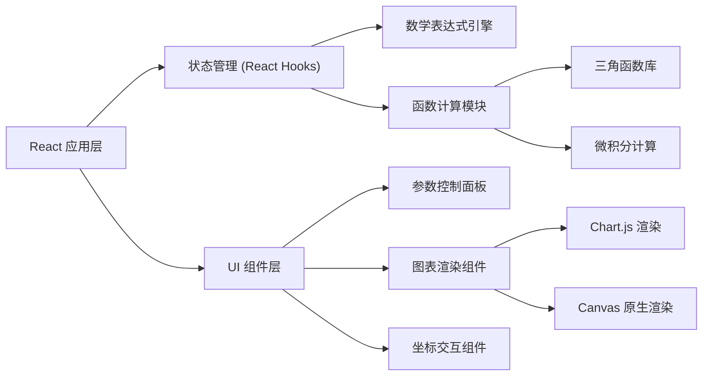

## 1. 架构设计



## 2. 技术描述

- **前端框架**: React@18 + TypeScript + Vite
- **图表库**: Chart.js + react-chartjs-2
- **样式方案**: TailwindCSS@3
- **数学表达式引擎**: mathjs
- **状态管理**: React useState / useReducer
- **构建工具**: Vite@5

## 3. 目录结构

```
src/
├── components/
│   ├── ChartCanvas.tsx        # 图表画布组件
│   ├── ControlPanel.tsx       # 参数控制面板
│   ├── FunctionSelector.tsx   # 函数选择器
│   ├── CoordinateInfo.tsx     # 坐标信息显示
│   ├── ExpressionInput.tsx    # 表达式输入框
│   └── MathToolsPanel.tsx     # 数学工具面板
├── hooks/
│   ├── useTrigonometric.ts    # 三角函数计算Hook
│   ├── useCalculus.ts         # 微积分计算Hook
│   └── useChartInteraction.ts # 图表交互Hook
├── utils/
│   ├── mathEngine.ts          # 数学表达式引擎
│   ├── trigonometric.ts       # 三角函数工具
│   └── calculus.ts            # 微积分计算工具
├── types/
│   └── index.ts               # 类型定义
├── App.tsx
├── main.tsx
└── index.css
```

## 4. 核心类型定义

```typescript
interface FunctionConfig {
  id: string;
  type: 'sin' | 'cos' | 'tan' | 'cot' | 'sec' | 'csc' | 'custom';
  expression?: string;
  frequency: number;
  phase: number;
  amplitude: number;
  color: string;
  visible: boolean;
  showDerivative: boolean;
  showIntegral: boolean;
}

interface Point {
  x: number;
  y: number;
}

interface ChartState {
  functions: FunctionConfig[];
  xRange: [number, number];
  yRange: [number, number];
  mousePosition: Point | null;
  markedPoints: Point[];
  zoom: number;
}
```

## 5. 核心功能实现方案

### 5.1 三角函数计算
- 使用 mathjs 库解析和计算数学表达式
- 支持参数化函数: A * sin(f * x + φ)
- 实时计算函数值数组用于图表渲染

### 5.2 导数与积分
- 数值微分: 使用有限差分法计算导数
- 数值积分: 使用梯形法或辛普森法计算定积分
- 积分曲线使用累积积分计算

### 5.3 图表渲染
- 主图表使用 Chart.js 的 Line Chart
- 叠加层使用 Canvas 原生渲染十字准线和标记点
- 支持缩放和平移交互

### 5.4 函数叠加
- 多个函数配置独立管理
- 支持自定义表达式输入
- 每条曲线使用不同颜色区分

## 6. 性能优化

- 使用 useMemo 缓存计算结果
- 节流处理参数调节时的重绘
- Canvas 分层渲染提高性能
- Web Worker 处理复杂数学计算
