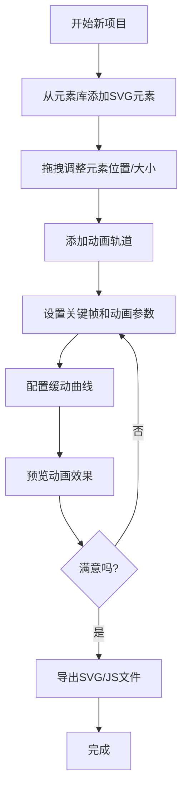
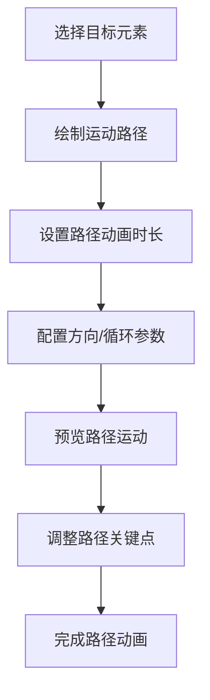

# SVG动画编辑器 - 产品需求文档

## 1. 产品概述

SVG动画编辑器是一款Web端专业动画制作工具，支持用户通过可视化方式创建、编辑SVG元素并添加丰富的动画效果。解决了传统SVG动画编写门槛高、调试困难的问题，为设计师和开发者提供直观的动画创作体验。

- **核心目标**：降低SVG动画制作门槛，提供专业级动画编辑能力
- **目标用户**：UI设计师、前端开发者、动效设计师
- **市场价值**：填补Web端专业SVG动画编辑器的空白，支持导出独立可运行文件

## 2. 核心功能

### 2.1 功能模块

1. **SVG画布编辑器**：元素拖拽、缩放、旋转、属性编辑
2. **时间轴编辑器**：关键帧管理、动画轨道、播放控制
3. **动画类型系统**：关键帧动画、路径动画、变形动画
4. **缓动曲线编辑器**：可视化贝塞尔曲线编辑
5. **导出系统**：独立SVG文件、可执行JS代码

### 2.2 页面详情

| 页面名称 | 模块名称 | 功能描述 |
|-----------|-------------|---------------------|
| 主编辑器 | 顶部工具栏 | 新建/打开/保存项目、导出功能、视图控制 |
| 主编辑器 | 左侧元素面板 | SVG元素库（矩形、圆形、路径、文字等）、图层面板 |
| 主编辑器 | 中央画布区 | SVG编辑画布、元素选择/拖拽/变换、预览模式 |
| 主编辑器 | 右侧属性面板 | 元素属性编辑、动画参数配置、缓动曲线选择 |
| 主编辑器 | 底部时间轴 | 多轨道时间轴、关键帧编辑、播放控制条、缩放控制 |

## 3. 核心流程

### 3.1 动画创作流程

### 3.2 路径动画流程

## 4. 用户界面设计

### 4.1 设计风格

- **主色调**：深色主题，#1a1a2e 深蓝黑色背景，#16213e 次级面板
- **强调色**：#0f3460 操作按钮，#e94560 关键帧/动画标记
- **辅助色**：#00d9ff 选中状态，#00ff88 播放指示器
- **按钮风格**：微圆角(4px)、悬浮高亮、点击反馈
- **字体**：JetBrains Mono 等宽字体用于代码/数值，Inter 用于界面文本
- **布局风格**：多面板Dock布局、可拖动分割线、专业软件风格

### 4.2 页面设计概述

| 页面名称 | 模块名称 | UI元素 |
|-----------|-------------|-------------|
| 主编辑器 | 工具栏 | 图标按钮、下拉菜单、分割线分隔功能组 |
| 主编辑器 | 元素面板 | 分类折叠面板、SVG图标预览、拖拽手柄 |
| 主编辑器 | 画布区 | 网格背景、选中框控制点、变换辅助线 |
| 主编辑器 | 属性面板 | 分组表单、数值输入器、颜色选择器、下拉选择 |
| 主编辑器 | 时间轴 | 轨道列表、关键帧圆点、时间刻度、播放头、缩放滑块 |

### 4.3 响应式设计

- 桌面端优先设计，支持1280px及以上屏幕
- 各面板支持最小宽度约束
- 画布区域自适应剩余空间
- 时间轴高度可拖动调整

### 4.4 交互细节

- 元素拖拽：实时位置预览、智能对齐辅助线
- 关键帧操作：拖拽调整时间点、双击编辑参数
- 缓动曲线：可视化贝塞尔手柄拖拽、预设曲线库
- 播放控制：空格播放/暂停、方向键逐帧
