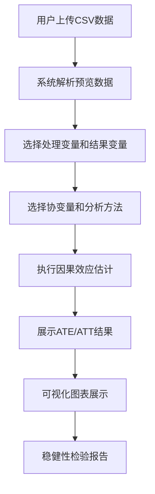

## 1. 产品概述

因果推断分析工具是一个面向数据科学家、研究员和分析师的Web应用，帮助用户从观测数据中估计因果效应。用户可以上传CSV格式的观测数据，选择处理变量和结果变量，系统自动执行倾向性匹配（PSM）和双重差分（DID）等因果推断方法，输出平均处理效应（ATE）、处理组平均处理效应（ATT）及稳健性检验结果。

- 核心价值：降低因果推断的技术门槛，提供可视化的分析结果
- 目标用户：数据分析师、研究员、政策评估人员
- 解决问题：从观测数据中识别因果关系，而非仅相关性

## 2. 核心功能

### 2.1 用户角色

| 角色 | 注册方式 | 核心权限 |
|------|----------|----------|
| 普通用户 | 无需注册，直接使用 | 上传数据、执行分析、查看结果 |

### 2.2 功能模块

1. **数据上传页面**：CSV文件上传、数据预览、数据清洗提示
2. **变量配置页面**：处理变量选择、结果变量选择、协变量选择、方法选择
3. **分析结果页面**：ATE/ATT结果展示、图表可视化、稳健性检验报告

### 2.3 页面详情

| 页面名称 | 模块名称 | 功能描述 |
|---------|----------|----------|
| 数据上传页面 | 文件上传区 | 拖拽或点击上传CSV文件，支持最大50MB |
| 数据上传页面 | 数据预览区 | 显示数据前10行、列名、数据类型、缺失值统计 |
| 变量配置页面 | 处理变量选择 | 下拉选择二元处理变量（0/1） |
| 变量配置页面 | 结果变量选择 | 下拉选择连续或二元结果变量 |
| 变量配置页面 | 协变量选择 | 多选框选择需要控制的混淆变量 |
| 变量配置页面 | 方法选择 | 倾向性匹配（PSM）、双重差分（DID） |
| 分析结果页面 | 效应估计区 | 展示ATE、ATT、标准误、p值、置信区间 |
| 分析结果页面 | 图表可视化 | 倾向得分分布图、平衡性检验图、平行趋势检验图 |
| 分析结果页面 | 稳健性检验区 | 展示安慰剂检验、剔除异常值、不同匹配方法的结果 |

## 3. 核心流程

用户上传CSV数据文件 → 系统解析并预览数据 → 用户选择处理变量、结果变量和协变量 → 选择因果推断方法 → 系统执行分析 → 展示效应估计结果和可视化图表 → 展示稳健性检验报告

## 4. 用户界面设计

### 4.1 设计风格

- 主色调：深蓝科技感（#1e3a5f）搭配铜金色点缀（#d4a855）
- 辅助色：数据可视化蓝绿色系
- 按钮风格：圆角矩形，悬停时有微妙的光影变化
- 字体：展示字体用 Cormorant Garamond，正文字体用 Inter
- 布局风格：卡片式布局，清晰的信息层级
- 视觉元素：细微的网格背景、数据流动效果

### 4.2 页面设计概述

| 页面名称 | 模块名称 | UI元素 |
|---------|----------|--------|
| 数据上传页面 | 上传区 | 拖拽虚线框、图标动画、上传进度条 |
| 数据上传页面 | 预览区 | 数据表格、统计卡片、缺失值热力图 |
| 变量配置页面 | 变量选择 | 下拉选择器、标签式多选、方法切换卡片 |
| 分析结果页面 | 结果展示 | 指标卡片、置信区间条形图、统计显著性标记 |
| 分析结果页面 | 图表区 | 交互式图表、悬停提示、图例筛选 |
| 分析结果页面 | 稳健性检验 | 森林图、表格对比、方法切换标签 |

### 4.3 响应式设计

- 桌面端优先设计（1200px+）
- 平板端：侧边栏收缩，图表自适应
- 移动端：单列布局，图表可横滑查看

## 5. 功能约束

- 仅支持CSV格式文件上传
- 处理变量必须为二元变量（0/1）
- 双重差分方法需要时间维度变量
- 分析耗时根据数据量而定，提供进度提示
- 数据仅在内存中处理，不持久化存储
