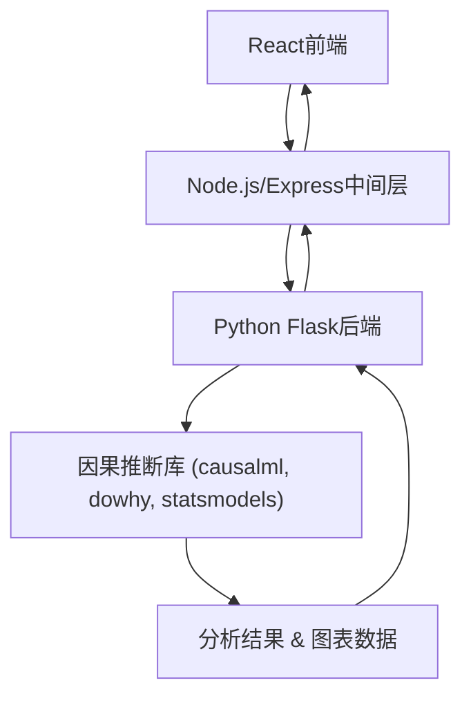
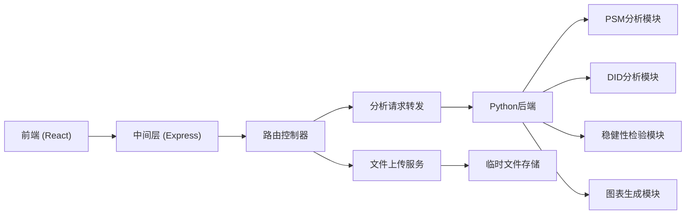

## 1. 架构设计

整体采用三层架构：React前端负责交互与可视化，Node.js/Express作为中间层处理请求路由和数据转发，Python后端执行因果推断算法。



## 2. 技术描述

### 前端技术栈
- React@18 + TypeScript
- Vite 构建工具
- TailwindCSS@3 样式框架
- Zustand 状态管理
- React Router DOM 路由
- Recharts 图表库
- lucide-react 图标库
- PapaParse CSV解析

### 中间层技术栈
- Node.js + Express@4
- TypeScript
- Multer 文件上传处理
- Axios HTTP客户端

### Python后端技术栈
- Python 3.9+
- Flask API框架
- pandas 数据处理
- numpy 数值计算
- scikit-learn 机器学习
- statsmodels 统计模型
- causalml 因果推断
- DoWhy 因果推断
- matplotlib/seaborn 图表生成

## 3. 路由定义

| 路由 | 页面 | 用途 |
|------|------|------|
| / | 数据上传页面 | 上传CSV文件，预览数据 |
| /configure | 变量配置页面 | 选择处理变量、结果变量、协变量和分析方法 |
| /results | 分析结果页面 | 展示ATE/ATT、图表、稳健性检验 |

## 4. API定义

### 4.1 中间层API（Node.js/Express）

```typescript
// 上传数据
interface UploadResponse {
  fileId: string;
  columns: string[];
  preview: Record<string, any>[];
  stats: {
    rowCount: number;
    columnCount: number;
    missingValues: Record<string, number>;
    dtypes: Record<string, string>;
  };
}

// 获取列信息
interface ColumnInfo {
  name: string;
  type: 'numeric' | 'categorical' | 'binary';
  uniqueValues: number;
  sampleValues: any[];
}

// 执行分析请求
interface AnalysisRequest {
  fileId: string;
  treatment: string;
  outcome: string;
  covariates: string[];
  method: 'psm' | 'did';
  timeVariable?: string;  // DID需要
  postTreatmentIndicator?: string;  // DID需要
}

// 分析结果响应
interface AnalysisResult {
  method: string;
  ate: {
    estimate: number;
    stdError: number;
    pValue: number;
    confidenceInterval: [number, number];
  };
  att: {
    estimate: number;
    stdError: number;
    pValue: number;
    confidenceInterval: [number, number];
  };
  balanceCheck?: {
    before: Record<string, { stdDiff: number }>;
    after: Record<string, { stdDiff: number }>;
  };
  propensityScores?: {
    treated: number[];
    control: number[];
  };
  parallelTrend?: {
    timePoints: string[];
    treatedMeans: number[];
    controlMeans: number[];
  };
  robustnessTests: {
    placeboTest?: {
      estimate: number;
      pValue: number;
    };
    sensitivityAnalysis?: {
      rhoValues: number[];
      estimateBounds: [number, number][];
    };
    differentMethods?: Array<{
      method: string;
      estimate: number;
      stdError: number;
    }>;
  };
  charts: {
    propensityDistribution: any;
    balancePlot: any;
    parallelTrendPlot?: any;
    robustnessPlot: any;
  };
}
```

### 4.2 Python后端API

| 端点 | 方法 | 用途 |
|------|------|------|
| /api/analyze/psm | POST | 执行倾向性匹配分析 |
| /api/analyze/did | POST | 执行双重差分分析 |
| /api/preview | POST | 预览数据并返回统计信息 |

## 5. 服务器架构



## 6. 项目结构

```
.
├── src/                    # React前端
│   ├── components/         # 可复用组件
│   ├── pages/             # 页面组件
│   ├── store/             # Zustand状态管理
│   ├── utils/             # 工具函数
│   ├── types/             # TypeScript类型定义
│   └── App.tsx            # 主应用组件
├── api/                    # Node.js中间层
│   ├── routes/            # API路由
│   ├── controllers/       # 控制器
│   ├── services/          # 业务逻辑
│   └── server.ts          # 服务器入口
├── python/                 # Python后端
│   ├── app.py             # Flask应用入口
│   ├── analysis/          # 因果推断模块
│   │   ├── psm.py         # 倾向性匹配
│   │   ├── did.py         # 双重差分
│   │   └── robustness.py  # 稳健性检验
│   └── requirements.txt   # Python依赖
└── shared/                 # 共享类型定义
    └── types.ts
```

## 7. 开发环境要求

- Node.js >= 18.0.0
- Python >= 3.9
- npm 或 pnpm 包管理器

## 8. 关键技术决策

1. **三层架构**：React负责交互，Node.js处理Web请求，Python执行统计计算，充分发挥各语言优势
2. **数据处理**：CSV在前端解析预览，后端使用pandas进行数据清洗和转换
3. **因果推断库**：结合使用causalml（Uber开源）和DoWhy（微软开源）确保方法的准确性
4. **图表可视化**：前端使用Recharts绘制交互式图表，Python后端也可生成静态图表数据
5. **数据安全**：所有数据仅在内存中处理，分析完成后立即清理，不持久化存储
