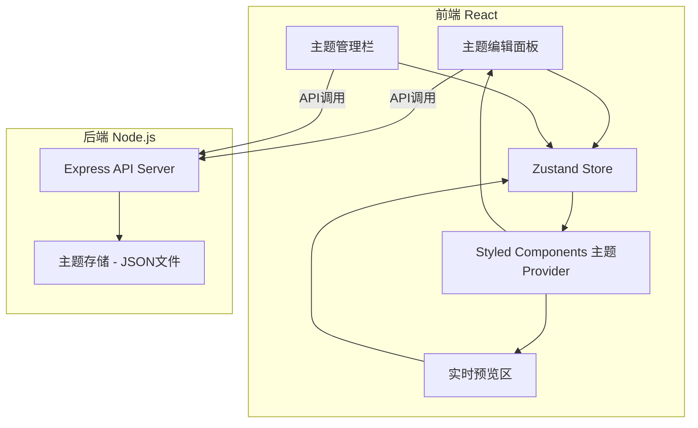
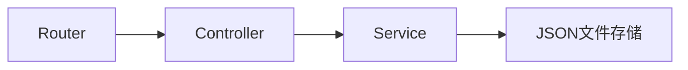
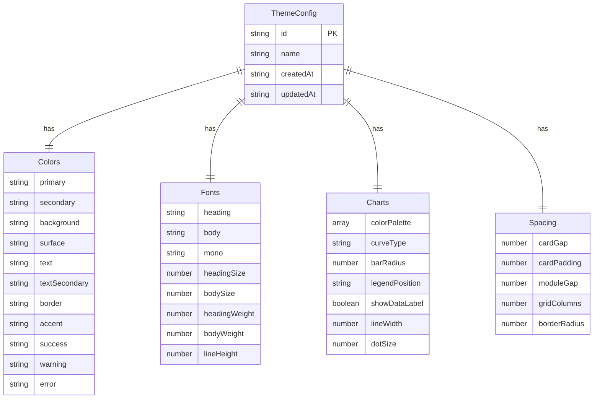

## 1. 架构设计



## 2. 技术说明

- 前端：React@18 + TypeScript + Styled Components + Less + Zustand + Recharts
- 初始化工具：vite-init（react-express-ts模板）
- 后端：Express@4 + TypeScript (ESM)
- 数据库：JSON文件存储（轻量级，无需额外数据库服务）
- 图表库：Recharts（React原生图表库，支持主题定制）

### 技术栈选型理由

| 技术 | 用途 | 选型理由 |
|------|------|----------|
| React 18 | UI框架 | 用户指定，支持Concurrent特性 |
| Styled Components | CSS-in-JS | 用户指定，支持动态主题注入 |
| Less | CSS预处理 | 用户指定，用于全局样式和变量 |
| Zustand | 状态管理 | 轻量级，适合主题状态管理 |
| Recharts | 图表渲染 | React原生，高度可定制，支持主题色 |
| Express | 后端服务 | 用户指定，RESTful API |

## 3. 路由定义

| 路由 | 用途 |
|------|------|
| / | 主题编辑器主页（编辑面板+预览+管理） |

## 4. API定义

### 4.1 主题管理API

```typescript
interface ThemeConfig {
  id: string
  name: string
  createdAt: string
  updatedAt: string
  colors: {
    primary: string
    secondary: string
    background: string
    surface: string
    text: string
    textSecondary: string
    border: string
    accent: string
    success: string
    warning: string
    error: string
  }
  fonts: {
    heading: string
    body: string
    mono: string
    headingSize: number
    bodySize: number
    headingWeight: number
    bodyWeight: number
    lineHeight: number
  }
  charts: {
    colorPalette: string[]
    curveType: 'linear' | 'monotone' | 'natural'
    barRadius: number
    legendPosition: 'top' | 'bottom' | 'left' | 'right'
    showDataLabel: boolean
    lineWidth: number
    dotSize: number
  }
  spacing: {
    cardGap: number
    cardPadding: number
    moduleGap: number
    gridColumns: number
    borderRadius: number
  }
}

// GET /api/themes - 获取所有主题
// Response: ThemeConfig[]

// GET /api/themes/:id - 获取单个主题
// Response: ThemeConfig

// POST /api/themes - 创建主题
// Body: Omit<ThemeConfig, 'id' | 'createdAt' | 'updatedAt'>
// Response: ThemeConfig

// PUT /api/themes/:id - 更新主题
// Body: Partial<ThemeConfig>
// Response: ThemeConfig

// DELETE /api/themes/:id - 删除主题
// Response: { success: boolean }
```

## 5. 服务端架构图



## 6. 数据模型

### 6.1 数据模型定义



### 6.2 数据定义

主题数据以JSON文件存储在 `api/data/themes.json`，启动时自动创建默认主题。

```json
{
  "themes": [
    {
      "id": "default-dark",
      "name": "深空暗夜",
      "createdAt": "2026-01-01T00:00:00.000Z",
      "updatedAt": "2026-01-01T00:00:00.000Z",
      "colors": {
        "primary": "#00E5A0",
        "secondary": "#6366F1",
        "background": "#0F1117",
        "surface": "#1A1D2E",
        "text": "#E2E8F0",
        "textSecondary": "#94A3B8",
        "border": "#2D3348",
        "accent": "#F59E0B",
        "success": "#10B981",
        "warning": "#F59E0B",
        "error": "#EF4444"
      },
      "fonts": {
        "heading": "Outfit",
        "body": "DM Sans",
        "mono": "JetBrains Mono",
        "headingSize": 20,
        "bodySize": 14,
        "headingWeight": 600,
        "bodyWeight": 400,
        "lineHeight": 1.6
      },
      "charts": {
        "colorPalette": ["#00E5A0", "#6366F1", "#F59E0B", "#EF4444", "#06B6D4", "#8B5CF6"],
        "curveType": "monotone",
        "barRadius": 4,
        "legendPosition": "bottom",
        "showDataLabel": false,
        "lineWidth": 2,
        "dotSize": 4
      },
      "spacing": {
        "cardGap": 16,
        "cardPadding": 20,
        "moduleGap": 24,
        "gridColumns": 12,
        "borderRadius": 8
      }
    }
  ]
}
```
