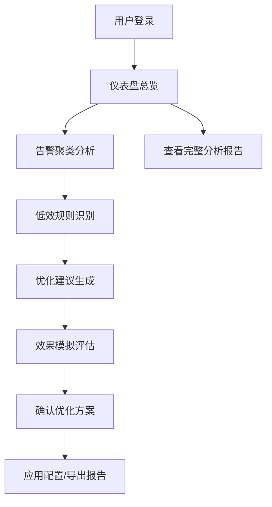

## 1. 产品概述

SkyWalking告警规则优化工具是一款面向SRE和运维团队的智能分析平台，通过分析告警历史数据，识别低效告警规则，提供数据驱动的优化建议。帮助团队减少告警噪声、提升告警质量、降低运维人员告警疲劳。

- 核心价值：将机器学习和统计分析应用于SkyWalking告警数据，自动识别频繁触发但非关键的低效规则
- 目标用户：SRE工程师、运维团队、系统架构师
- 解决问题：告警风暴、噪声告警、规则配置不合理导致的运维效率低下

## 2. 核心功能

### 2.1 用户角色

| 角色 | 注册方式 | 核心权限 |
|------|---------|---------|
| 运维管理员 | 系统集成 | 查看分析报告、应用优化建议、管理规则配置 |
| SRE工程师 | 系统集成 | 查看告警聚类、分析低效规则、模拟优化效果 |
| 只读用户 | 系统集成 | 查看仪表盘、分析报告和优化建议 |

### 2.2 功能模块

1. **仪表盘总览**：告警统计概览、低效规则分布、优化效果趋势
2. **告警聚类分析**：时间序列聚类展示、相似告警分组、周期性模式识别
3. **低效规则识别**：多维度评分展示、规则低效度排名、问题根因分析
4. **规则优化建议**：阈值敏感性分析、参数优化推荐、预期收益评估
5. **效果评估中心**：优化前后对比、模拟验证、配置对比分析
6. **完整分析报告**：一键生成综合报告、导出功能

### 2.3 页面详情

| 页面名称 | 模块名称 | 功能描述 |
|---------|---------|---------|
| 仪表盘 | 统计概览卡片 | 展示总告警数、低效规则数、预计优化收益等关键指标 |
| 仪表盘 | 趋势图表 | 告警数量趋势、优先级分布、规则活跃度排名 |
| 告警聚类 | 聚类列表 | 展示识别出的告警集群，包含规模、时间跨度、服务分布 |
| 告警聚类 | 时间轴可视化 | 告警在时间轴上的分布，聚类边界标注 |
| 告警聚类 | 热力图 | 按小时/天的告警密度热力图 |
| 低效规则 | 评分雷达图 | 展示每个规则的频率、关键度、噪声等多维度评分 |
| 低效规则 | 规则列表 | 低效规则排名，支持筛选和排序 |
| 优化建议 | 阈值敏感性曲线 | 阈值变化对告警数量的影响曲线 |
| 优化建议 | 配置对比 | 原始配置与推荐配置的参数对比 |
| 效果评估 | 模拟运行结果 | 基于历史数据模拟优化后的告警触发情况 |
| 效果评估 | 多维度对比 | 告警数量、噪声率、关键告警覆盖率等指标对比 |
| 分析报告 | 报告生成 | 一键生成完整的分析报告，支持PDF导出 |

## 3. 核心流程

用户进入系统后，首先在仪表盘查看整体告警健康度概览。发现问题后，进入告警聚类页面分析告警模式，识别周期性或爆发式告警。接着在低效规则页面查看具体规则的评分和问题分析。然后在优化建议页面查看系统推荐的参数调整方案，并通过效果评估模块模拟验证优化效果。确认优化方案后，可一键应用或导出分析报告。

## 4. 用户界面设计

### 4.1 设计风格

- **主色调**：深空蓝 (#0F172A) 作为背景，科技感蓝 (#3B82F6) 作为主色，警示橙 (#F59E0B) 用于告警提示，成功绿 (#10B981) 用于优化标识
- **设计风格**：现代科技感仪表盘风格，深色主题，强调数据可视化
- **卡片设计**：圆角12px，微妙边框，玻璃态半透明效果，分层阴影
- **字体**：主标题使用 Space Grotesk，正文字体使用 Inter，等宽数据展示使用 JetBrains Mono
- **图标**：使用 Phosphor Icons 线性图标，保持简洁科技感
- **动效**：数据加载渐变动画、卡片悬停微交互、图表数据渐入效果

### 4.2 页面设计概述

| 页面名称 | 模块名称 | UI元素 |
|---------|---------|--------|
| 仪表盘 | 统计概览卡片 | 渐变背景、大号数据字体、趋势箭头指示、图标装饰 |
| 仪表盘 | 趋势图表 | ECharts 面积图、多维度切换、时间范围选择器 |
| 告警聚类 | 聚类卡片网格 | 悬停放大效果、彩色标识、进度条展示占比 |
| 告警聚类 | 时间轴可视化 | 交互式时间轴、可缩放、聚类色块叠加 |
| 低效规则 | 评分雷达图 | 交互式ECharts雷达图、多规则对比切换 |
| 低效规则 | 规则数据表 | 可排序、可筛选、支持分页、行展开详情 |
| 优化建议 | 敏感性曲线 | 平滑曲线图、当前阈值标记、最优阈值高亮 |
| 优化建议 | 参数配置器 | 滑块调节、实时预览效果、应用按钮 |
| 效果评估 | 对比仪表盘 | 左右分栏对比、指标卡并排、差异高亮 |
| 效果评估 | 配置对比表格 | 多配置方案横向对比、推荐方案标识 |

### 4.3 响应式设计

- 采用桌面优先设计，适配1920px、1440px、1024px主流分辨率
- 平板设备：侧边栏收起为图标导航，卡片自适应网格布局
- 移动设备：单列流式布局，图表简化为核心数据展示，交互适配触摸操作
- 关键数据始终保持可见，次要信息可折叠隐藏

### 4.4 数据可视化指导

- 图表类型选择：趋势用面积图，占比用环形图，分布用热力图，对比用柱状图，多维度用雷达图
- 颜色一致性：CRITICAL用红色系，WARNING用橙色系，INFO用蓝色系，优化改进用绿色系
- 交互细节：图表支持tooltip详情、数据点高亮、区域缩放、图例开关
- 性能优化：数据虚拟滚动、图表按需渲染、大数据量采样展示
