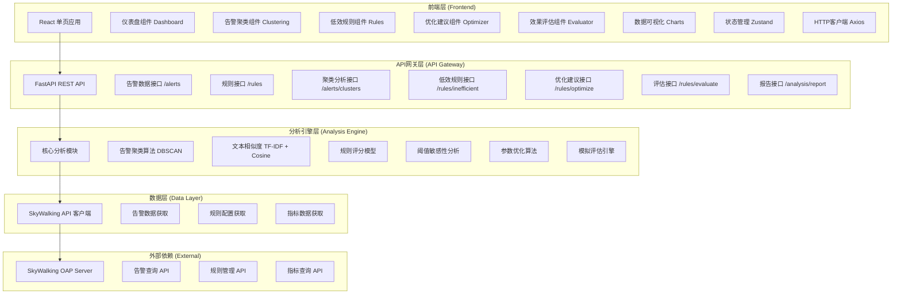
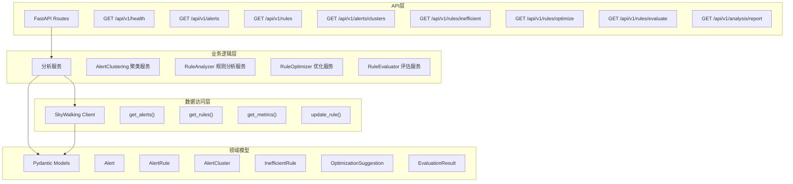

## 1. 架构设计



## 2. 技术描述

### 2.1 前端技术栈
- **核心框架**：React@18 + TypeScript@5
- **构建工具**：Vite@5
- **样式方案**：Tailwind CSS@3 + CSS Variables
- **状态管理**：Zustand@4
- **HTTP客户端**：Axios@1.6
- **数据可视化**：ECharts@5 + echarts-for-react
- **UI组件库**：Ant Design@5
- **图标库**：@phosphor-icons/react
- **日期处理**：dayjs@1.11
- **路由**：react-router-dom@6

### 2.2 后端技术栈
- **Web框架**：FastAPI@0.109
- **ASGI服务器**：Uvicorn@0.27
- **数据模型**：Pydantic@2.5
- **HTTP客户端**：httpx@0.26
- **数值计算**：NumPy@1.26 + Pandas@2.1
- **机器学习**：Scikit-learn@1.3
- **科学计算**：SciPy@1.11
- **配置管理**：pydantic-settings@2.1

### 2.3 初始化方式
- 前端：`npm create vite@latest frontend -- --template react-ts`
- 后端：手动创建Python包结构，pip安装依赖

### 2.4 数据源
- 主数据源：SkyWalking OAP Server REST API (v3)
- 备选方案：内置Mock数据生成器，支持无SkyWalking环境下的演示和测试

## 3. 路由定义

| 路由路径 | 页面名称 | 核心功能 |
|---------|---------|---------|
| `/` | 仪表盘总览 | 告警统计、趋势图表、健康度评分 |
| `/clustering` | 告警聚类分析 | 聚类列表、时间轴可视化、热力图 |
| `/rules` | 低效规则识别 | 规则评分、排名列表、详情分析 |
| `/optimizer` | 优化建议中心 | 阈值分析、参数推荐、配置对比 |
| `/evaluator` | 效果评估中心 | 模拟验证、多维度对比、优化收益 |
| `/report` | 分析报告 | 完整报告生成、数据导出 |
| `/settings` | 系统设置 | SkyWalking连接配置、分析参数调整 |

## 4. API 类型定义

```typescript
// 告警数据模型
interface Alert {
  id: string;
  ruleName: string;
  alarmMessage: string;
  scope: string;
  service: string;
  serviceInstance?: string;
  endpointName?: string;
  startTime: number;
  priority: 'CRITICAL' | 'WARNING' | 'INFO';
  tags: Array<{ key: string; value: string }>;
}

// 告警规则模型
interface AlertRule {
  id: number;
  name: string;
  metricsName: string;
  threshold: number | number[];
  op: string;
  period: number;
  count: number;
  silencePeriod: number;
  message: string;
  enabled: boolean;
  priority: string;
}

// 告警聚类
interface AlertCluster {
  clusterId: string;
  ruleName: string;
  alertCount: number;
  services: string[];
  timeSpan: { start: number; end: number };
  priorityDistribution: Record<string, number>;
  sampleAlerts: Alert[];
  patternFeatures: Record<string, any>;
}

// 低效规则
interface InefficientRule {
  ruleName: string;
  totalAlerts: number;
  frequencyScore: number;
  criticalityScore: number;
  noiseScore: number;
  inefficiencyScore: number;
  recommendation: string;
  severity: 'HIGH' | 'MEDIUM' | 'LOW';
  metricsData: Record<string, any>;
}

// 优化建议
interface OptimizationSuggestion {
  ruleName: string;
  originalConfig: Record<string, any>;
  suggestedConfig: Record<string, any>;
  expectedImprovement: {
    alertReduction: number;
    reductionPercent: number;
    noiseReductionScore: number;
  };
  confidence: number;
  reasoning: string;
}

// 评估结果
interface EvaluationResult {
  metricName: string;
  originalValue: number;
  optimizedValue: number;
  improvementPercent: number;
}

interface RuleOptimizationResult {
  ruleName: string;
  optimizationApplied: boolean;
  originalConfig: Record<string, any>;
  optimizedConfig: Record<string, any>;
  evaluation: EvaluationResult[];
  simulationResults: Record<string, any>;
}

// API响应
interface ApiResponse<T> {
  data: T;
  success: boolean;
  message?: string;
}

// API请求参数
interface AnalysisParams {
  lookbackHours?: number;
  minInefficiencyScore?: number;
  minConfidence?: number;
}
```

## 5. 后端架构图



## 6. 前端状态管理

### 6.1 Store 定义

```typescript
// stores/analysisStore.ts
import { create } from 'zustand';

interface AnalysisState {
  // 数据
  alerts: Alert[];
  rules: AlertRule[];
  clusters: AlertCluster[];
  inefficientRules: InefficientRule[];
  suggestions: OptimizationSuggestion[];
  evaluationResults: RuleOptimizationResult[];
  
  // 加载状态
  loading: Record<string, boolean>;
  error: string | null;
  
  // 筛选参数
  filters: {
    lookbackHours: number;
    minInefficiencyScore: number;
    minConfidence: number;
    selectedServices: string[];
    selectedPriorities: string[];
  };
  
  // Actions
  fetchAlerts: () => Promise<void>;
  fetchRules: () => Promise<void>;
  fetchClusters: () => Promise<void>;
  fetchInefficientRules: () => Promise<void>;
  fetchSuggestions: () => Promise<void>;
  fetchEvaluation: () => Promise<void>;
  fetchFullReport: () => Promise<void>;
  setFilters: (filters: Partial<AnalysisState['filters']>) => void;
  resetFilters: () => void;
}

export const useAnalysisStore = create<AnalysisState>((set, get) => ({
  // ... 实现
}));
```

### 6.2 目录结构

```
frontend/
├── src/
│   ├── components/          # 公共组件
│   │   ├── charts/         # 图表组件
│   │   ├── layout/         # 布局组件
│   │   └── ui/             # 基础UI组件
│   ├── pages/              # 页面组件
│   │   ├── Dashboard.tsx
│   │   ├── Clustering.tsx
│   │   ├── Rules.tsx
│   │   ├── Optimizer.tsx
│   │   ├── Evaluator.tsx
│   │   └── Report.tsx
│   ├── stores/             # 状态管理
│   ├── services/           # API服务
│   ├── types/              # TypeScript类型定义
│   ├── utils/              # 工具函数
│   ├── hooks/              # 自定义Hooks
│   ├── styles/             # 全局样式
│   ├── App.tsx
│   ├── main.tsx
│   └── router.tsx
├── public/
├── package.json
├── tsconfig.json
├── vite.config.ts
└── tailwind.config.js
```
