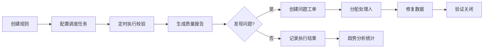

## 1. 产品概述

数据质量管理平台是一个面向数据工程师、数据分析师和数据治理人员的Web端应用，用于定义和执行数据质量校验规则，监控数据质量趋势，跟踪并解决数据质量问题。

- **核心目标**：通过自动化的规则校验、定时调度和可视化报告，帮助企业提升数据可靠性和决策准确性
- **目标用户**：数据工程师、数据分析师、数据治理专员、数据仓库管理员

## 2. 核心功能

### 2.1 用户角色

| 角色 | 登录方式 | 核心权限 |
|------|----------|----------|
| 管理员 | 账号密码登录 | 完整权限：规则管理、任务调度、用户管理、系统配置 |
| 数据工程师 | 账号密码登录 | 规则定义与执行、报告查看、问题跟踪 |
| 数据分析师 | 账号密码登录 | 质量报告查看、趋势分析、问题查看 |

### 2.2 功能模块

1. **仪表盘**：质量概览统计、最近执行任务、质量趋势图表
2. **规则管理**：规则定义、规则模板、规则列表、规则测试
3. **任务调度**：定时任务配置、任务执行记录、手动触发执行
4. **质量报告**：校验结果详情、问题分类统计、导出报告
5. **问题跟踪**：质量问题列表、问题状态管理、问题分配与解决
6. **趋势分析**：多维度趋势图表、质量评分趋势、问题趋势对比

### 2.3 页面详情

| 页面名称 | 模块名称 | 功能描述 |
|----------|----------|----------|
| 仪表盘 | 统计卡片 | 展示规则总数、任务执行数、问题总数、质量评分 |
| 仪表盘 | 最近任务 | 展示最近执行的任务列表及状态 |
| 仪表盘 | 趋势图表 | 展示近7/30天的质量评分趋势线图 |
| 规则列表 | 规则表格 | 展示所有规则，支持筛选、搜索、分页 |
| 规则列表 | 规则操作 | 新建、编辑、删除、测试、启用/禁用规则 |
| 规则编辑 | 规则表单 | 规则基本信息、规则类型配置（空值/唯一性/值域/依赖） |
| 规则编辑 | 模板选择 | 从规则模板快速创建规则 |
| 任务调度 | 任务列表 | 展示定时任务，支持CRON表达式配置 |
| 任务调度 | 执行记录 | 任务执行历史、执行时长、成功/失败状态 |
| 质量报告 | 报告概览 | 按数据源/表维度的质量统计 |
| 质量报告 | 问题详情 | 校验失败数据详情、问题定位 |
| 问题跟踪 | 问题看板 | 按状态分类展示问题（待处理/处理中/已解决） |
| 问题跟踪 | 问题详情 | 问题描述、分配人员、处理记录、附件 |
| 趋势分析 | 趋势图表 | 质量评分趋势、问题数量趋势、各维度对比分析 |
| 趋势分析 | 维度筛选 | 按时间范围、数据源、规则类型筛选 |

## 3. 核心流程

用户创建数据质量规则，配置定时调度任务，系统按计划自动执行校验，生成质量报告。发现的数据质量问题进入问题跟踪流程，由相关人员处理解决。

## 4. 用户界面设计

### 4.1 设计风格

- **主色调**：深青色 #0F766E（专业、可靠），辅助色：橙色 #F59E0B（警示）、绿色 #10B981（成功）
- **按钮风格**：圆角8px，悬停有轻微缩放和阴影变化
- **字体**：主标题使用 Space Grotesk，正文使用 Inter，营造现代科技感
- **布局风格**：左侧导航 + 顶部状态栏 + 内容卡片式布局
- **图标风格**：使用 lucide-react 线性图标，保持简洁统一

### 4.2 页面设计概览

| 页面名称 | 模块名称 | UI 元素 |
|----------|----------|----------|
| 仪表盘 | 统计卡片 | 渐变背景、图标动画、数字滚动效果 |
| 仪表盘 | 趋势图表 | Recharts 折线图，渐变填充，悬停提示 |
| 规则列表 | 数据表格 | 斑马纹、行悬停高亮、状态标签 |
| 规则编辑 | 表单 | 分组标签、实时校验、分步引导 |
| 质量报告 | 报告卡片 | 质量评分环形图、问题分类饼图 |
| 问题跟踪 | 看板 | 拖拽式状态列、卡片阴影、优先级标签 |

### 4.3 响应式设计

- 桌面端（1200px+）：完整侧边栏 + 多列布局
- 平板端（768px-1199px）：可折叠侧边栏 + 自适应列数
- 移动端（<768px）：底部导航 + 单列布局 + 触控优化

### 4.4 交互与动效

- 页面加载：元素淡入 + 轻微上移动画
- 悬停效果：按钮/卡片上浮 + 阴影加深
- 状态切换：平滑过渡动画（0.3s ease）
- 图表交互：数据点高亮 + 工具提示淡入
