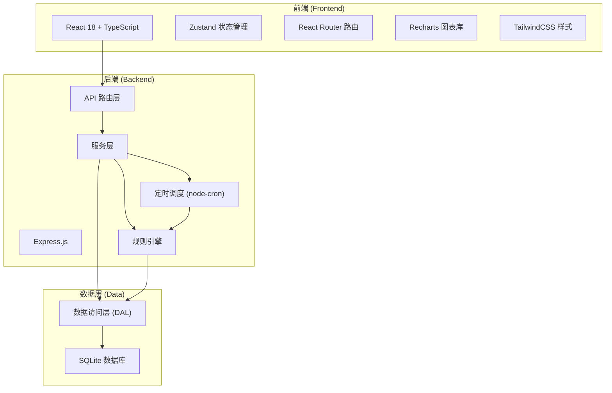
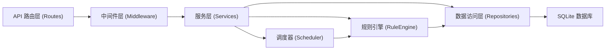
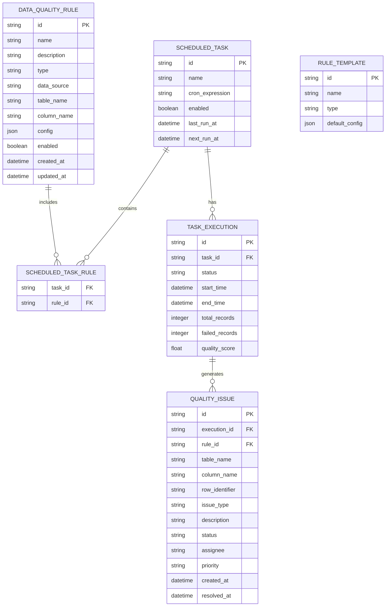

## 1. 架构设计



## 2. 技术栈描述

- **前端**：React@18 + TypeScript + TailwindCSS@3 + Vite + Zustand + Recharts + lucide-react
- **后端**：Express@4 + TypeScript + node-cron（定时调度）
- **规则引擎**：自定义 JSON 规则解析器，支持空值、唯一性、值域、依赖校验
- **数据库**：SQLite（开发环境），支持 PostgreSQL 扩展
- **初始化工具**：vite-init react-express-ts 模板

## 3. 路由定义

### 前端路由

| 路由路径 | 页面名称 | 功能说明 |
|----------|----------|----------|
| /dashboard | 仪表盘 | 质量概览统计、最近任务、趋势图表 |
| /rules | 规则列表 | 展示所有数据质量规则 |
| /rules/new | 新建规则 | 创建新的质量规则 |
| /rules/:id | 规则详情 | 查看和编辑规则配置 |
| /tasks | 任务调度 | 定时任务列表和执行记录 |
| /reports | 质量报告 | 校验结果和质量统计 |
| /issues | 问题跟踪 | 质量问题看板和详情 |
| /trends | 趋势分析 | 多维度趋势图表分析 |

### 后端 API 路由

| 方法 | 路径 | 功能说明 |
|------|------|----------|
| GET | /api/rules | 获取规则列表 |
| POST | /api/rules | 创建新规则 |
| GET | /api/rules/:id | 获取规则详情 |
| PUT | /api/rules/:id | 更新规则 |
| DELETE | /api/rules/:id | 删除规则 |
| POST | /api/rules/:id/test | 测试执行规则 |
| GET | /api/rules/templates | 获取规则模板 |
| GET | /api/tasks | 获取任务列表 |
| POST | /api/tasks | 创建定时任务 |
| PUT | /api/tasks/:id | 更新任务配置 |
| POST | /api/tasks/:id/run | 手动触发任务执行 |
| GET | /api/tasks/executions | 获取执行记录 |
| GET | /api/reports | 获取质量报告列表 |
| GET | /api/reports/:id | 获取报告详情 |
| GET | /api/issues | 获取问题列表 |
| PUT | /api/issues/:id | 更新问题状态 |
| GET | /api/trends/quality | 质量评分趋势数据 |
| GET | /api/trends/issues | 问题趋势数据 |
| GET | /api/stats/overview | 仪表盘统计数据 |

## 4. API 定义

### 数据类型定义

```typescript
// 规则类型
export type RuleType = 'null_check' | 'uniqueness' | 'value_range' | 'dependency';

export interface DataQualityRule {
  id: string;
  name: string;
  description: string;
  type: RuleType;
  dataSource: string;
  tableName: string;
  columnName: string;
  config: RuleConfig;
  enabled: boolean;
  createdAt: string;
  updatedAt: string;
}

export interface RuleConfig {
  nullCheck?: {
    allowNull: boolean;
  };
  uniqueness?: {
    columns: string[];
  };
  valueRange?: {
    min?: number;
    max?: number;
    allowedValues?: string[];
    pattern?: string;
  };
  dependency?: {
    sourceColumn: string;
    targetTable: string;
    targetColumn: string;
  };
}

// 任务与执行
export interface ScheduledTask {
  id: string;
  ruleIds: string[];
  cronExpression: string;
  enabled: boolean;
  lastRunAt?: string;
  nextRunAt?: string;
}

export interface TaskExecution {
  id: string;
  taskId: string;
  status: 'pending' | 'running' | 'success' | 'failed';
  startTime: string;
  endTime?: string;
  totalRecords: number;
  failedRecords: number;
  qualityScore: number;
}

// 质量问题
export interface QualityIssue {
  id: string;
  executionId: string;
  ruleId: string;
  ruleName: string;
  tableName: string;
  columnName: string;
  rowIdentifier: string;
  issueType: string;
  description: string;
  status: 'open' | 'in_progress' | 'resolved';
  assignee?: string;
  priority: 'low' | 'medium' | 'high';
  createdAt: string;
  resolvedAt?: string;
}

// 趋势数据
export interface TrendDataPoint {
  date: string;
  value: number;
  label?: string;
}
```

## 5. 服务端架构



### 核心模块说明

- **规则引擎 (RuleEngine)**：解析规则配置，执行 SQL 查询校验，计算质量评分
- **调度器 (Scheduler)**：基于 node-cron 管理定时任务，触发规则执行
- **数据访问层**：封装数据库操作，使用 Knex.js 查询构建器

## 6. 数据模型

### 6.1 ER 图



### 6.2 DDL 语句

```sql
-- 规则模板表
CREATE TABLE rule_templates (
  id TEXT PRIMARY KEY,
  name TEXT NOT NULL,
  description TEXT,
  type TEXT NOT NULL,
  default_config JSON NOT NULL,
  created_at DATETIME DEFAULT CURRENT_TIMESTAMP
);

-- 数据质量规则表
CREATE TABLE data_quality_rules (
  id TEXT PRIMARY KEY,
  name TEXT NOT NULL,
  description TEXT,
  type TEXT NOT NULL,
  data_source TEXT NOT NULL,
  table_name TEXT NOT NULL,
  column_name TEXT NOT NULL,
  config JSON NOT NULL,
  enabled BOOLEAN DEFAULT 1,
  created_at DATETIME DEFAULT CURRENT_TIMESTAMP,
  updated_at DATETIME DEFAULT CURRENT_TIMESTAMP
);

-- 定时任务表
CREATE TABLE scheduled_tasks (
  id TEXT PRIMARY KEY,
  name TEXT NOT NULL,
  cron_expression TEXT NOT NULL,
  enabled BOOLEAN DEFAULT 1,
  last_run_at DATETIME,
  next_run_at DATETIME,
  created_at DATETIME DEFAULT CURRENT_TIMESTAMP,
  updated_at DATETIME DEFAULT CURRENT_TIMESTAMP
);

-- 任务-规则关联表
CREATE TABLE scheduled_task_rules (
  task_id TEXT NOT NULL,
  rule_id TEXT NOT NULL,
  PRIMARY KEY (task_id, rule_id),
  FOREIGN KEY (task_id) REFERENCES scheduled_tasks(id) ON DELETE CASCADE,
  FOREIGN KEY (rule_id) REFERENCES data_quality_rules(id) ON DELETE CASCADE
);

-- 任务执行记录表
CREATE TABLE task_executions (
  id TEXT PRIMARY KEY,
  task_id TEXT NOT NULL,
  status TEXT NOT NULL,
  start_time DATETIME NOT NULL,
  end_time DATETIME,
  total_records INTEGER DEFAULT 0,
  failed_records INTEGER DEFAULT 0,
  quality_score REAL DEFAULT 100,
  FOREIGN KEY (task_id) REFERENCES scheduled_tasks(id) ON DELETE CASCADE
);

-- 质量问题表
CREATE TABLE quality_issues (
  id TEXT PRIMARY KEY,
  execution_id TEXT NOT NULL,
  rule_id TEXT NOT NULL,
  rule_name TEXT NOT NULL,
  table_name TEXT NOT NULL,
  column_name TEXT NOT NULL,
  row_identifier TEXT NOT NULL,
  issue_type TEXT NOT NULL,
  description TEXT,
  status TEXT NOT NULL DEFAULT 'open',
  assignee TEXT,
  priority TEXT NOT NULL DEFAULT 'medium',
  created_at DATETIME DEFAULT CURRENT_TIMESTAMP,
  resolved_at DATETIME,
  FOREIGN KEY (execution_id) REFERENCES task_executions(id) ON DELETE CASCADE,
  FOREIGN KEY (rule_id) REFERENCES data_quality_rules(id)
);

-- 初始化规则模板数据
INSERT INTO rule_templates (id, name, description, type, default_config) VALUES
('tpl_null_check', '非空校验', '确保指定列不包含空值', 'null_check', '{"allowNull": false}'),
('tpl_uniqueness', '唯一性校验', '确保指定列值唯一', 'uniqueness', '{"columns": []}'),
('tpl_value_range', '值域范围校验', '校验数值范围或枚举值', 'value_range', '{"min": null, "max": null, "allowedValues": []}'),
('tpl_dependency', '外键依赖校验', '确保关联表数据存在', 'dependency', '{"targetTable": "", "targetColumn": ""}');
```
