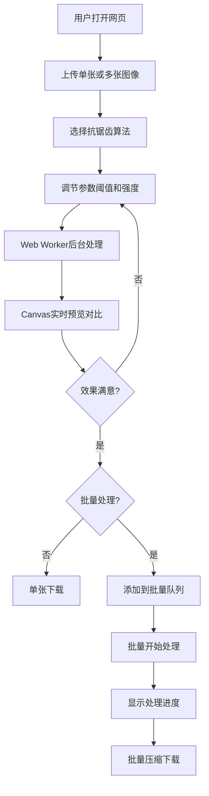

## 1. 产品概述

Web端图像抗锯齿工具，专为消除图像边缘的阶梯状锯齿而设计。支持超采样和边缘检测两种核心算法，通过实时预览和参数调节帮助用户获得最佳的平滑效果，同时支持批量处理提高工作效率。

- **核心价值**：提供简单易用的在线抗锯齿处理工具，无需安装专业软件即可快速优化图像边缘质量
- **目标用户**：设计师、游戏开发者、图像处理爱好者、需要优化图像质量的普通用户
- **目标市场**：填补在线轻量级图像抗锯齿工具的空白，提供专业级别的处理效果

## 2. 核心功能

### 2.1 用户角色

| 角色 | 注册方式 | 核心权限 |
|------|----------|----------|
| 普通用户 | 无需注册 | 上传图像、调整参数、实时预览、下载处理结果、批量处理 |

### 2.2 功能模块

1. **主处理页面**：图像上传区、Canvas预览区、参数控制面板、算法选择器
2. **批量处理模块**：多文件上传、批量参数应用、进度显示、批量下载
3. **结果导出模块**：格式选择、质量设置、单张/批量下载

### 2.3 页面详情

| 页面名称 | 模块名称 | 功能描述 |
|---------|----------|----------|
| 主处理页面 | 图像上传区 | 拖拽上传、点击上传、支持常见图片格式、显示文件信息 |
| 主处理页面 | Canvas预览区 | 原图/处理后对比、放大查看、实时预览、缩略导航 |
| 主处理页面 | 参数控制面板 | 算法切换、阈值调节、强度控制、高级参数设置 |
| 主处理页面 | 算法选择器 | 超采样抗锯齿(SSAA)、边缘检测抗锯齿(EDAA)、多重采样抗锯齿(MSAA) |
| 批量处理页面 | 文件列表 | 显示待处理文件、缩略图、状态、支持移除 |
| 批量处理页面 | 进度显示 | 总进度、单文件进度、处理速度、剩余时间 |
| 批量处理页面 | 批量操作 | 全选处理、批量下载、一键清除 |

## 3. 核心流程

用户上传图像 → 选择抗锯齿算法 → 调节参数阈值 → 实时预览效果 → 确认效果满意 → 单张下载或添加到批量队列 → 批量处理并导出

## 4. 用户界面设计

### 4.1 设计风格

采用**科技感深色主题**，体现图像处理工具的专业性。深灰色背景配合霓虹蓝点缀，营造现代科技感。

- **主色调**：深空灰 `#0f172a` 作为背景，深蓝 `#1e293b` 作为卡片背景
- **强调色**：霓虹蓝 `#38bdf8` 用于按钮、进度条、选中状态
- **辅助色**：紫色 `#a855f7` 用于算法标签，绿色 `#22c55e` 用于成功状态，橙色 `#f97316` 用于警告
- **按钮风格**：圆角8px，悬停有微妙发光效果，点击有缩放反馈
- **字体**：标题使用 `Space Grotesk`，正文使用 `Inter`，等宽字体使用 `JetBrains Mono`
- **布局风格**：三栏布局，左侧参数面板、中间预览区、右侧批量队列
- **图标风格**：线性图标，统一2px描边，霓虹蓝填充

### 4.2 页面设计概述

| 页面名称 | 模块名称 | UI元素 |
|---------|----------|--------|
| 主处理页面 | 图像上传区 | 虚线边框、拖拽高亮、文件图标、格式提示、悬停动画 |
| 主处理页面 | Canvas预览区 | 双Canvas叠加、分割线滑块、放大镜片、网格背景、状态栏 |
| 主处理页面 | 参数控制面板 | 滑块控件、数值输入、分段开关、下拉选择、帮助提示气泡 |
| 主处理页面 | 底部操作栏 | 重置按钮、应用按钮、下载按钮、格式选择器 |
| 批量处理页面 | 文件列表 | 卡片式布局、缩略图、进度条叠加、状态标签、删除按钮 |
| 批量处理页面 | 进度面板 | 总进度条环形图表、处理速度、剩余时间估算、已完成计数 |

### 4.3 响应式

- **桌面端优先**：三栏布局，左侧280px参数面板，中间自适应预览区，右侧320px批量队列
- **平板端**：左右面板可折叠收起，预览区居中放大
- **移动端**：单栏垂直布局，参数面板改为底部抽屉式，批量队列独立页面
- **触摸优化**：滑块和按钮增加触摸区域，支持双指缩放预览

### 4.4 交互动效

- 页面加载时参数面板从左滑入，预览区淡入
- 拖拽上传时边框发光脉动
- 参数调节时Canvas预览平滑过渡
- 处理进度条平滑增长，带有霓虹流光效果
- 算法切换时卡片翻转动画
- 按钮悬停微缩放+发光，点击涟漪效果
