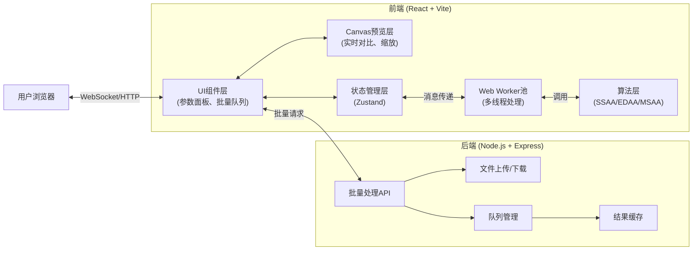

## 1. 架构设计



## 2. 技术描述

### 2.1 前端技术栈
- **框架**: React@18.2 + TypeScript@5
- **构建工具**: Vite@5
- **样式**: TailwindCSS@3 + CSS变量
- **状态管理**: Zustand@4 (轻量级状态管理)
- **图标**: lucide-react (线性图标库)
- **动画**: framer-motion (交互动效)
- **打包**: JSZip (批量下载压缩包)

### 2.2 后端技术栈
- **运行时**: Node.js@18
- **框架**: Express@4
- **中间件**: multer (文件上传), cors, helmet
- **文件处理**: sharp (高性能图像处理)
- **队列**: bull (基于Redis的任务队列)
- **缓存**: ioredis

### 2.3 核心算法
1. **SSAA (Super-Sampling Anti-Aliasing)**: 超采样抗锯齿，将图像放大N倍渲染后再缩小，通过平均采样消除锯齿
2. **EDAA (Edge Detection Anti-Aliasing)**: 边缘检测抗锯齿，使用Sobel算子检测边缘，仅对边缘区域进行模糊处理
3. **MSAA (Multi-Sampling Anti-Aliasing)**: 多重采样抗锯齿，对每个像素的多个子采样点进行计算

## 3. 目录结构

```
project/
├── frontend/
│   ├── src/
│   │   ├── components/
│   │   │   ├── ImageUploader.tsx      # 图像上传组件
│   │   │   ├── CanvasPreview.tsx      # Canvas预览组件
│   │   │   ├── ControlPanel.tsx       # 参数控制面板
│   │   │   ├── AlgorithmSelector.tsx  # 算法选择器
│   │   │   ├── BatchQueue.tsx         # 批量队列组件
│   │   │   ├── ProgressBar.tsx        # 进度条组件
│   │   │   └── Slider.tsx             # 自定义滑块组件
│   │   ├── workers/
│   │   │   └── imageProcessor.worker.ts  # Web Worker
│   │   ├── algorithms/
│   │   │   ├── ssaa.ts                # 超采样算法
│   │   │   ├── edaa.ts                # 边缘检测算法
│   │   │   ├── msaa.ts                # 多重采样算法
│   │   │   └── utils.ts               # 图像处理工具函数
│   │   ├── store/
│   │   │   └── useImageStore.ts       # 状态管理
│   │   ├── types/
│   │   │   └── index.ts               # TypeScript类型定义
│   │   ├── App.tsx
│   │   ├── main.tsx
│   │   └── index.css
│   ├── package.json
│   ├── tsconfig.json
│   └── vite.config.ts
├── backend/
│   ├── src/
│   │   ├── controllers/
│   │   │   ├── batchController.ts     # 批量处理控制器
│   │   │   └── fileController.ts      # 文件控制器
│   │   ├── services/
│   │   │   ├── imageService.ts        # 图像处理服务
│   │   │   └── queueService.ts        # 队列服务
│   │   ├── routes/
│   │   │   ├── batchRoutes.ts         # 批量处理路由
│   │   │   └── fileRoutes.ts          # 文件路由
│   │   ├── middleware/
│   │   │   └── upload.ts              # 文件上传中间件
│   │   ├── utils/
│   │   │   └── imageProcessor.ts      # 图像处理工具
│   │   └── server.ts                  # 服务入口
│   ├── package.json
│   └── tsconfig.json
└── README.md
```

## 4. 核心类型定义

```typescript
// 算法类型
type AlgorithmType = 'ssaa' | 'edaa' | 'msaa';

// 处理参数
interface ProcessingParams {
  algorithm: AlgorithmType;
  threshold: number;          // 边缘检测阈值 (0-255)
  intensity: number;          // 抗锯齿强度 (0-100)
  sampleRate: number;         // 超采样倍率 (2x, 4x, 8x)
  kernelSize: number;         // 卷积核大小 (3, 5, 7)
  edgeBlur: number;           // 边缘模糊程度
}

// 图像项
interface ImageItem {
  id: string;
  file: File;
  name: string;
  originalUrl: string;
  processedUrl?: string;
  originalData?: ImageData;
  processedData?: ImageData;
  status: 'pending' | 'processing' | 'completed' | 'error';
  progress: number;
  params?: ProcessingParams;
  error?: string;
}

// Worker消息
interface WorkerMessage {
  type: 'process' | 'cancel' | 'progress';
  id: string;
  imageData?: ImageData;
  params?: ProcessingParams;
  progress?: number;
  result?: ImageData;
  error?: string;
}
```

## 5. API 定义

### 5.1 文件上传
- **POST** `/api/upload` - 上传单张图像
- **请求**: `multipart/form-data`
- **响应**: `{ id: string, url: string, name: string }`

### 5.2 批量处理
- **POST** `/api/batch/process` - 创建批量处理任务
- **请求**: `{ imageIds: string[], params: ProcessingParams }`
- **响应**: `{ taskId: string, total: number }`

### 5.3 处理进度
- **GET** `/api/batch/progress/:taskId` - 获取批量处理进度
- **响应**: `{ completed: number, total: number, results: BatchResult[] }`

### 5.4 批量下载
- **GET** `/api/batch/download/:taskId` - 下载处理结果压缩包
- **响应**: `application/zip`

### 5.5 WebSocket 实时更新
- **连接**: `/ws`
- **事件**: `progress` - 实时推送处理进度

## 6. 核心算法实现

### 6.1 SSAA 超采样算法
1. 将图像放大N倍（使用双线性插值）
2. 对放大后的图像进行渲染
3. 将图像缩小回原始尺寸（使用区域平均采样）
4. 输出抗锯齿后的图像

### 6.2 EDAA 边缘检测算法
1. 使用Sobel算子检测图像边缘
2. 生成边缘掩码（超过阈值的像素标记为边缘）
3. 对边缘区域应用高斯模糊
4. 混合原始图像和模糊后的边缘区域
5. 输出处理结果

### 6.3 MSAA 多重采样算法
1. 对每个像素取N×N个子采样点
2. 计算每个子采样点的覆盖率
3. 根据覆盖率计算最终像素颜色
4. 输出抗锯齿后的图像

## 7. 性能优化策略

1. **Web Worker池**: 创建Worker池，限制并发处理数量，避免浏览器卡顿
2. **分片处理**: 大图像分成多个小块处理，减少单次处理内存占用
3. **节流预览**: 参数调节时使用节流，避免频繁触发处理
4. **离屏Canvas**: 使用OffscreenCanvas在Worker中直接处理图像数据
5. **内存管理**: 及时释放ImageData和Blob URL，避免内存泄漏
6. **懒加载**: 批量队列中的缩略图懒加载

## 8. 安全措施

1. **文件类型校验**: 仅允许jpg、png、webp格式
2. **文件大小限制**: 单文件最大10MB，批量单次最多20个文件
3. **XSS防护**: 文件名转义，CSP策略
4. **CORS配置**: 限制跨域请求来源
5. **请求频率限制**: 防止恶意请求
6. **文件自动清理**: 处理完成24小时后自动删除服务器文件
