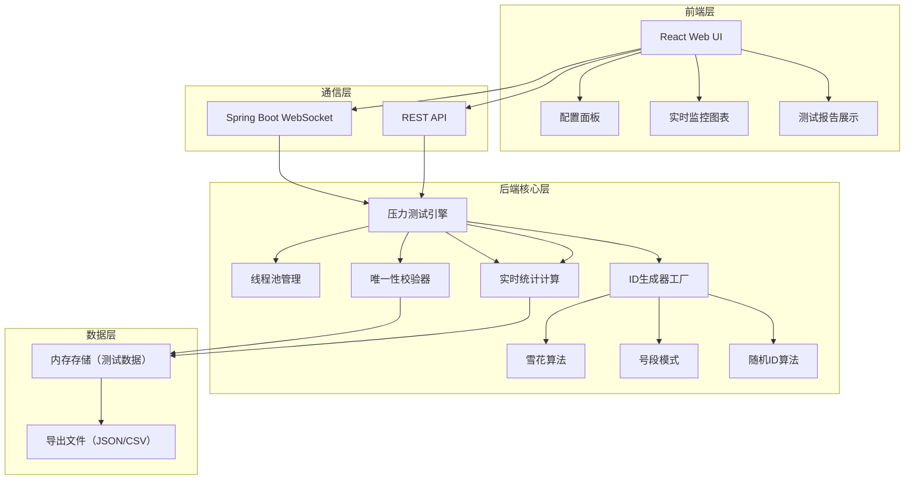
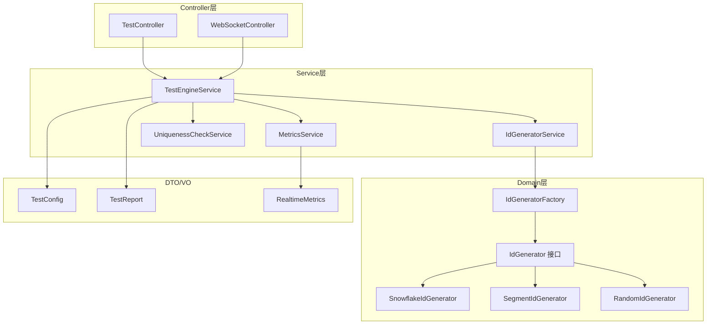
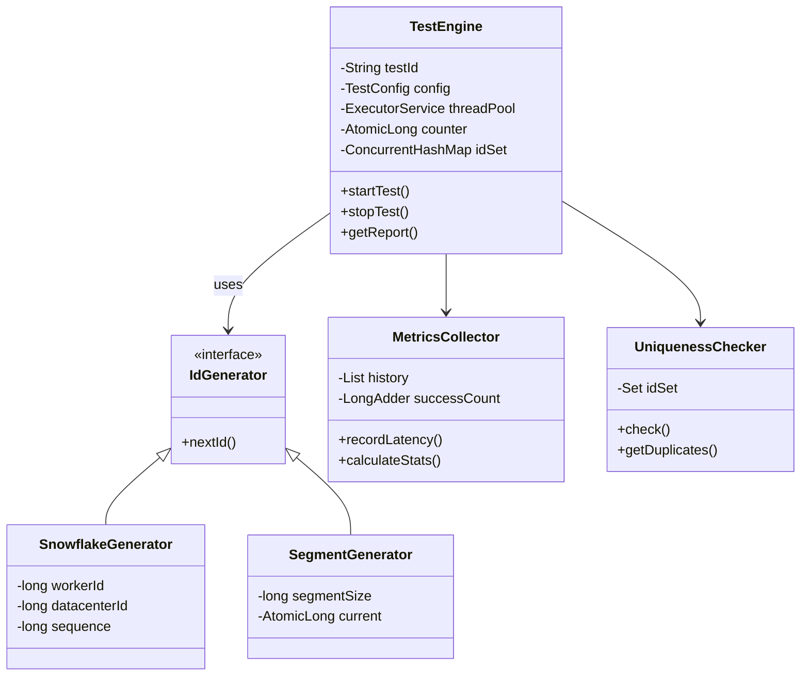

## 1. 架构设计



## 2. 技术描述

### 2.1 前端技术栈
- **框架**: React@18
- **构建工具**: Vite@5
- **样式**: TailwindCSS@3
- **图表**: ECharts@5
- **状态管理**: Zustand@4
- **UI组件**: Ant Design@5
- **WebSocket**: SockJS + Stomp
- **路由**: React Router@6

### 2.2 后端技术栈
- **框架**: Spring Boot@3.2
- **多线程**: Java ExecutorService + CompletableFuture
- **WebSocket**: Spring WebSocket
- **构建工具**: Maven
- **JDK版本**: Java 17+

### 2.3 核心依赖
- Lombok（简化代码）
- FastJSON2（JSON处理）

## 3. 路由定义

| 路由 | 页面 | 功能 |
|------|------|------|
| / | 首页/配置页 | 测试参数配置、算法选择 |
| /monitor | 实时监控页 | 实时展示测试进度和性能指标 |
| /report | 测试报告页 | 展示测试结果和唯一性校验 |

## 4. API 定义

### 4.1 TypeScript 类型定义

```typescript
// 算法类型
type IdAlgorithm = 'SNOWFLAKE' | 'SEGMENT' | 'RANDOM';

// 测试配置
interface TestConfig {
  algorithm: IdAlgorithm;
  threadCount: number;
  durationSeconds: number;
  idCount?: number;
  snowflakeConfig?: {
    workerId: number;
    datacenterId: number;
  };
  segmentConfig?: {
    segmentSize: number;
  };
}

// 实时指标
interface RealtimeMetrics {
  timestamp: number;
  qps: number;
  avgLatency: number;
  p50Latency: number;
  p95Latency: number;
  p99Latency: number;
  generatedCount: number;
}

// 测试报告
interface TestReport {
  id: string;
  config: TestConfig;
  startTime: number;
  endTime: number;
  totalGenerated: number;
  avgQps: number;
  peakQps: number;
  latencyStats: {
    avg: number;
    min: number;
    max: number;
    p50: number;
    p95: number;
    p99: number;
  };
  uniquenessCheck: {
    isUnique: boolean;
    duplicateCount: number;
    duplicateRate: number;
    duplicateIds: string[];
  };
  metricsHistory: RealtimeMetrics[];
}
```

### 4.2 REST API

| 方法 | 路径 | 描述 | 请求 | 响应 |
|------|------|------|------|
| POST | /api/test/start | 启动压力测试 | TestConfig | {testId: string} |
| GET | /api/test/stop | 停止测试 | - | {success: boolean} |
| GET | /api/test/:testId | 获取测试报告 | - | TestReport |
| GET | /api/test/list | 获取历史报告列表 | - | TestReport[] |
| GET | /api/report/:testId/export | 导出报告 | format=json/csv | 文件流 |

### 4.3 WebSocket 消息

```typescript
// 订阅主题
// /topic/test/{testId}/metrics → RealtimeMetrics

// 发送消息
// /app/test/{testId}/start → 开始测试
```

## 5. 后端架构图



## 6. 数据模型

### 6.1 核心类关系



### 6.2 项目目录结构

```
id-generator-benchmark/
├── backend/
│   ├── src/
│   │   └── main/
│   │       ├── java/
│   │       │   └── com/
│   │       │       └── benchmark/
│   │       │           ├── controller/
│   │       │           ├── service/
│   │       │           ├── generator/
│   │       │           ├── dto/
│   │       │           ├── config/
│   │       │           └── Application.java
│   │       └── resources/
│   │           └── application.yml
│   └── pom.xml
└── frontend/
    ├── src/
    │   ├── components/
    │   ├── pages/
    │   ├── store/
    │   ├── utils/
    │   └── App.tsx
    │   └── main.tsx
    ├── package.json
    └── vite.config.ts
    └── tailwind.config.js
```

