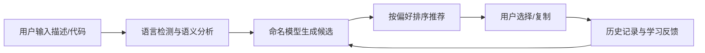

## 1. 产品概述
变量命名推荐工具是一款面向开发者的智能辅助工具，通过输入变量描述或代码上下文，自动推荐符合编程规范的变量名。支持多种命名风格，并具备历史学习能力，帮助开发者提高编码效率和代码质量。

- **核心价值**：解决开发者变量命名困难，统一代码风格，提升开发效率
- **目标用户**：软件开发者、编程初学者、代码审查人员

## 2. 核心功能

### 2.1 用户角色
| 角色 | 注册方式 | 核心权限 |
|------|----------|----------|
| 普通用户 | 无需注册 | 使用命名推荐、查看历史记录、管理命名偏好 |

### 2.2 功能模块
1. **主页**：输入区域、推荐结果展示、命名风格选择
2. **历史记录**：历史命名查询、收藏管理、学习反馈
3. **设置**：命名偏好配置、语言选择、导出配置

### 2.3 页面详情
| 页面名称 | 模块名称 | 功能描述 |
|----------|----------|----------|
| 主页 | 输入区域 | 支持文本描述和代码上下文两种输入模式 |
| 主页 | 风格选择器 | 支持camelCase、snake_case、PascalCase、kebab-case等命名风格 |
| 主页 | 推荐结果 | 展示多个推荐变量名，显示置信度，支持一键复制 |
| 历史记录 | 历史列表 | 展示用户历史命名记录，支持搜索和筛选 |
| 历史记录 | 收藏功能 | 收藏常用命名，快速访问 |
| 设置 | 偏好配置 | 设置默认命名风格、语言检测偏好 |

## 3. 核心流程

用户输入变量描述或粘贴代码上下文 → 系统进行语言检测和语义分析 → 命名模型生成候选变量名 → 根据用户偏好排序推荐 → 用户选择/复制命名 → 记录历史并反馈学习

## 4. 用户界面设计

### 4.1 设计风格
- **主色调**：深蓝色系 (#165DFF)，象征专业和技术
- **辅助色**：青色 (#0FC6C2) 用于强调交互，橙色 (#FF7D00) 用于警告提示
- **按钮风格**：圆润直角按钮，悬浮有轻微上浮和阴影效果
- **字体**：JetBrains Mono 作为代码展示字体，Inter 作为界面字体
- **布局风格**：卡片式布局，清晰的视觉层次，左侧输入右侧结果的左右分栏结构
- **图标风格**：线性简洁图标，统一24px尺寸

### 4.2 页面设计概述
| 页面名称 | 模块名称 | UI 元素 |
|----------|----------|---------|
| 主页 | 输入区域 | 带语法高亮的代码编辑器，占位提示动画，字数统计 |
| 主页 | 推荐卡片 | 渐变背景，置信度进度条，复制按钮微交互 |
| 历史记录 | 列表项 | 悬停高亮，收藏星标动画，时间戳格式化 |
| 设置 | 开关组件 | 平滑过渡动画，状态颜色变化 |

### 4.3 响应式
- 桌面端优先设计（1280px以上）
- 平板端（768-1279px）：左右分栏改为上下布局
- 移动端（<768px）：单列流式布局，优化触控区域大小

### 4.4 交互动效
- 页面加载：元素依次淡入，推荐结果卡片错落出现
- 输入时：实时检测状态指示，输入联想提示
- 复制成功：按钮变色+勾选动画+轻量toast提示
