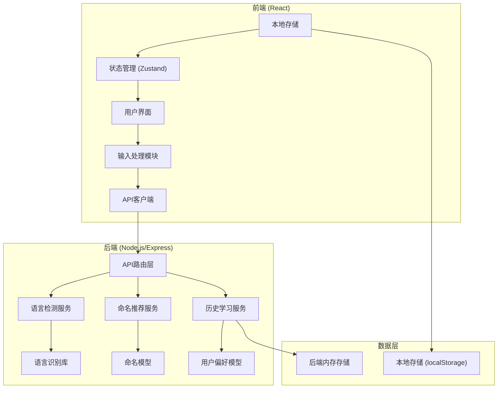
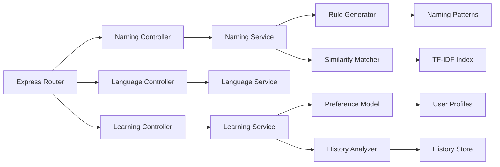
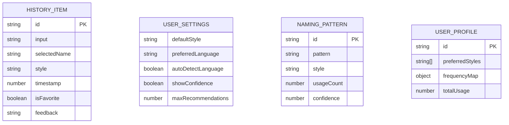

## 1. 架构设计



## 2. 技术描述

- **前端**: React@18 + TypeScript + Vite + TailwindCSS@3 + Zustand + Framer Motion
- **初始化工具**: Vite
- **后端**: Node.js + Express@4 + TypeScript
- **语言检测**: cld3-napi 或 franc-min
- **命名模型**: 基于规则的命名生成器 + TF-IDF 相似度匹配
- **数据存储**: localStorage（前端历史）、内存存储（后端学习模型）

## 3. 路由定义

| 路由 | 用途 |
|------|------|
| / | 主页 - 命名推荐主界面 |
| /history | 历史记录页面 |
| /settings | 设置页面 |

## 4. API 定义

### 4.1 TypeScript 类型定义

```typescript
// 命名风格类型
type NamingStyle = 'camelCase' | 'snake_case' | 'PascalCase' | 'kebab-case' | 'SCREAMING_SNAKE_CASE';

// 语言类型
type Language = 'zh' | 'en' | 'ja' | 'ko' | 'other';

// 变量类型
type VariableType = 'variable' | 'function' | 'class' | 'constant' | 'boolean';

// 推荐结果
interface Recommendation {
  id: string;
  name: string;
  style: NamingStyle;
  confidence: number;
  type: VariableType;
  description: string;
}

// 命名请求
interface NamingRequest {
  input: string;
  inputType: 'description' | 'code';
  targetStyle?: NamingStyle;
  variableType?: VariableType;
  context?: string;
}

// 命名响应
interface NamingResponse {
  success: boolean;
  recommendations: Recommendation[];
  detectedLanguage: Language;
  detectedType: VariableType;
  processingTime: number;
}

// 历史记录
interface HistoryItem {
  id: string;
  input: string;
  selectedName: string;
  style: NamingStyle;
  timestamp: number;
  isFavorite: boolean;
  feedback?: 'like' | 'dislike';
}

// 用户设置
interface UserSettings {
  defaultStyle: NamingStyle;
  preferredLanguage: Language;
  autoDetectLanguage: boolean;
  showConfidence: boolean;
  maxRecommendations: number;
}
```

### 4.2 API 端点

| 方法 | 路径 | 描述 |
|------|------|------|
| POST | /api/naming/recommend | 请求变量名推荐 |
| POST | /api/naming/convert | 在不同命名风格间转换 |
| GET | /api/language/detect | 检测输入文本语言 |
| POST | /api/history/feedback | 提交历史反馈用于学习 |
| GET | /api/learning/suggestions | 获取基于学习的个性化建议 |

## 5. 服务器架构图



## 6. 数据模型

### 6.1 数据模型定义



### 6.2 本地存储结构

```typescript
// localStorage 键名
const STORAGE_KEYS = {
  HISTORY: 'naming_history',
  SETTINGS: 'naming_settings',
  FAVORITES: 'naming_favorites',
  LEARNING_DATA: 'naming_learning_data'
};

// 默认设置
const DEFAULT_SETTINGS: UserSettings = {
  defaultStyle: 'camelCase',
  preferredLanguage: 'zh',
  autoDetectLanguage: true,
  showConfidence: true,
  maxRecommendations: 8
};
```
