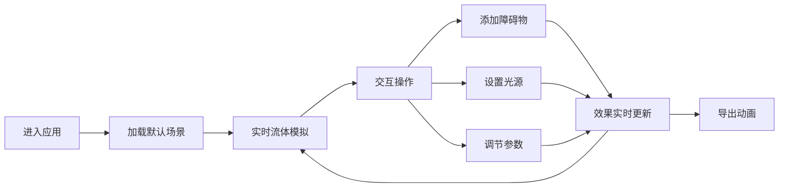

# 流体仿真可视化工具 产品需求文档

## 1. 产品概述

Web端流体仿真可视化工具，基于GPU加速实现实时流体动力学模拟，支持交互式添加障碍物、光源和材质，提供参数实时调节和动画导出功能。

- 主要用途：科研可视化、教育演示、创意设计
- 解决问题：传统流体模拟软件复杂难用，本工具提供Web端轻量级实时仿真体验
- 目标用户：科研人员、教育工作者、设计师、爱好者

## 2. 核心功能

### 2.1 用户角色

| 角色 | 注册方式 | 核心权限 |
|------|----------|----------|
| 普通用户 | 无需注册 | 使用所有仿真功能，导出动画 |

### 2.2 功能模块

1. **主仿真界面**：3D流体视图、控制面板、工具栏
2. **流体模拟引擎**：GPU加速的Navier-Stokes求解器
3. **交互工具**：障碍物添加、光源设置、材质编辑
4. **参数调节面板**：流体密度、粘度、速度、颜色等
5. **动画导出**：WebM/MP4格式录制导出

### 2.3 页面详情

| 页面名称 | 模块名称 | 功能描述 |
|----------|----------|----------|
| 主仿真界面 | 3D视图区 | 实时渲染流体模拟效果，支持旋转/缩放/平移 |
| 主仿真界面 | 左侧工具栏 | 障碍物工具、光源工具、材质工具、粒子喷射工具 |
| 主仿真界面 | 右侧控制面板 | 流体参数调节、模拟控制（播放/暂停/重置） |
| 主仿真界面 | 顶部导航栏 | 项目管理、导出选项、帮助中心 |
| 主仿真界面 | 底部状态栏 | 实时性能指标（FPS、GPU内存） |

## 3. 核心流程

用户进入应用后，默认加载流体模拟场景。可以通过工具栏添加障碍物和光源，调节流体参数观察效果变化，满意后可导出动画。

## 4. 用户界面设计

### 4.1 设计风格

- **主色调**：深空蓝 (#0A1628) 作为背景，科技感青色 (#00F5FF) 作为强调色
- **辅助色**：紫色渐变 (#7B2FFD) 用于交互元素，橙色 (#FF6B35) 用于警告/提示
- **按钮风格**：玻璃拟态效果，圆角8px，悬停时有发光效果
- **字体**：标题使用 Orbitron（科技感字体），正文使用 JetBrains Mono（等宽易读）
- **布局风格**：三栏布局，中心3D视图为主，两侧半透明控制面板
- **图标风格**：线性图标，统一24px尺寸，发光效果

### 4.2 页面设计概述

| 页面名称 | 模块名称 | UI元素 |
|----------|----------|--------|
| 主仿真界面 | 3D视图区 | 全屏流体渲染，鼠标交互提示，FPS计数器浮动显示 |
| 主仿真界面 | 左侧工具栏 | 垂直排列工具按钮，选中状态高亮，悬停显示工具提示 |
| 主仿真界面 | 右侧控制面板 | 分组折叠面板，滑块控件，实时数值显示 |
| 主仿真界面 | 顶部导航栏 | 毛玻璃效果，Logo左侧，菜单右侧，下拉子菜单 |
| 主仿真界面 | 底部状态栏 | 半透明背景，性能指标，模拟状态指示 |

### 4.3 响应性

- 桌面端优先设计（1920x1080）
- 平板端：控制面板自适应宽度，工具栏可折叠
- 移动端：简化界面，核心功能保留，触摸手势优化

### 4.4 3D场景指导

- **环境**：深色宇宙背景，微弱星点粒子，营造科技感
- **光照**：主光源平行光 + 环境光 + 点光源（可交互添加）
- **相机**：透视相机，默认3/4视角，支持OrbitControls交互
- **后处理**：Bloom发光效果，轻微色差，增强视觉冲击力
- **流体渲染**：体积渲染，半透明烟雾效果，光线步进算法
