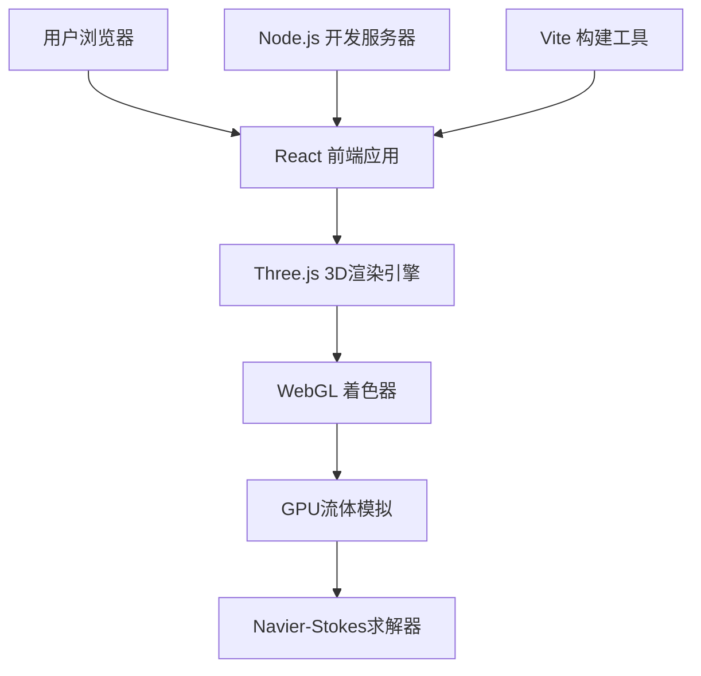

# 流体仿真可视化工具 技术架构文档

## 1. 架构设计



## 2. 技术描述

- **前端框架**：React@18 + TypeScript
- **构建工具**：Vite@5
- **样式方案**：TailwindCSS@3
- **3D引擎**：Three.js@0.160 + @react-three/fiber@8 + @react-three/drei@9
- **后处理**：@react-three/postprocessing@2
- **状态管理**：Zustand@4
- **动画导出**：MediaRecorder API + WebM
- **开发服务器**：Vite 内置开发服务器（Node.js）

## 3. 目录结构

```
fluid-simulator/
├── src/
│   ├── components/
│   │   ├── FluidCanvas.tsx        # 3D流体画布
│   │   ├── Toolbar.tsx            # 左侧工具栏
│   │   ├── ControlPanel.tsx       # 右侧控制面板
│   │   ├── Navbar.tsx             # 顶部导航
│   │   ├── StatusBar.tsx          # 底部状态栏
│   │   └── common/                # 通用组件
│   ├── shaders/
│   │   ├── fluidSim.vert          # 流体模拟顶点着色器
│   │   ├── fluidSim.frag          # 流体模拟片元着色器
│   │   ├── volumeRender.frag      # 体渲染着色器
│   │   └── postProcessing/        # 后处理着色器
│   ├── hooks/
│   │   ├── useFluidSimulation.ts  # 流体模拟Hook
│   │   └── usePerformance.ts      # 性能监控Hook
│   ├── store/
│   │   └── useSimulationStore.ts  # Zustand状态管理
│   ├── types/
│   │   └── index.ts               # 类型定义
│   ├── utils/
│   │   ├── gpgpu.ts               # GPGPU工具
│   │   └── exporter.ts            # 动画导出工具
│   ├── App.tsx
│   ├── main.tsx
│   └── index.css
├── public/
├── package.json
├── tsconfig.json
├── vite.config.ts
└── tailwind.config.js
```

## 4. 核心技术实现

### 4.1 GPU流体模拟

- **算法**：基于Stable Fluids的Navier-Stokes方程求解
- **实现**：WebGL着色器实现GPGPU计算
- **数据结构**：三维纹理存储速度场、密度场、压力场

### 4.2 流体渲染

- **体积渲染**：光线步进算法（Ray Marching）
- **半透明效果**：Alpha混合 + 深度排序
- **着色**：基于密度的颜色映射 + 光照计算

### 4.3 交互系统

- **障碍物**：射线检测 + 体素标记
- **光源**：可拖拽点光源 + 实时阴影
- **材质**：RGB颜色 + 透明度 + 折射率参数

### 4.4 动画导出

- **录制**：Canvas.captureStream() + MediaRecorder
- **格式**：WebM (VP9 codec)
- **帧率**：可配置30/60 FPS

## 5. 性能优化

- **分辨率自适应**：根据GPU性能动态调整模拟分辨率
- **多渲染目标**：MRT技术减少绘制调用
- **帧缓存复用**：Ping-Pong FBO减少内存开销
- **LOD策略**：远距离降低模拟精度
