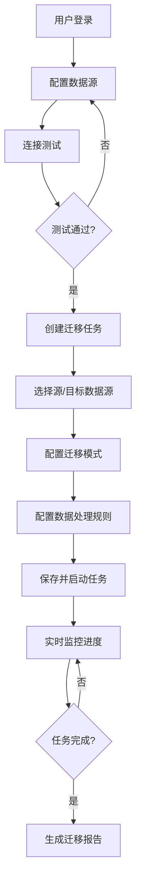

## 1. 产品概述

跨平台数据迁移工具是一个企业级数据同步解决方案，支持异构数据源（数据库、对象存储、消息队列）之间的全量与增量数据迁移，提供数据脱敏、格式转换和实时进度监控功能。

- 主要目的：解决企业异构数据源间数据流动难题，降低数据迁移复杂度
- 目标用户：数据工程师、运维人员、企业IT部门
- 核心价值：可视化配置、零代码迁移、实时监控、安全合规

## 2. 核心功能

### 2.1 用户角色

| 角色 | 登录方式 | 核心权限 |
|------|----------|----------|
| 管理员 | 账号密码 | 数据源管理、任务配置、用户管理、系统设置 |
| 操作员 | 账号密码 | 任务创建、执行监控、日志查看 |
| 只读用户 | 账号密码 | 任务查看、进度监控、报表导出 |

### 2.2 功能模块

1. **仪表盘**：迁移任务概览、成功率统计、资源监控
2. **数据源管理**：数据源配置、连接测试、数据源列表
3. **迁移任务**：任务创建、全量/增量配置、任务执行
4. **进度监控**：实时进度、吞吐量、错误日志
5. **数据处理**：脱敏规则配置、格式转换模板
6. **系统设置**：用户管理、权限配置、系统参数

### 2.3 页面详情

| 页面名称 | 模块名称 | 功能描述 |
|-----------|-------------|---------------------|
| 仪表盘 | 数据概览 | 任务统计卡片、执行趋势图、最近任务列表 |
| 数据源管理 | 数据源列表 | 分页查询、状态筛选、连接测试、编辑删除 |
| 数据源管理 | 数据源配置 | 多类型数据源表单、连接参数配置、测试连接 |
| 迁移任务 | 任务列表 | 任务状态、进度显示、操作按钮 |
| 迁移任务 | 任务配置 | 源/目标选择、迁移模式、数据处理规则配置 |
| 进度监控 | 实时监控 | 进度条、吞吐量图表、日志实时输出 |
| 数据处理 | 脱敏规则 | 脱敏算法配置、字段映射、规则预览 |
| 数据处理 | 格式转换 | JSON/XML/CSV转换模板、自定义脚本 |
| 系统设置 | 用户管理 | 用户增删改查、角色分配 |

## 3. 核心流程

## 4. 用户界面设计

### 4.1 设计风格

- **主色调**：深蓝色 (#165DFF) - 代表专业、可靠
- **辅助色**：青色 (#0FC6C2) - 代表成功、进度；橙色 (#FF7D00) - 代表警告
- **按钮风格**：圆角矩形 (8px)，悬停微浮起效果，点击按压反馈
- **字体**：Inter 作为主要字体，等宽字体用于代码和日志显示
- **布局风格**：侧边导航 + 顶部状态栏 + 卡片式内容区
- **图标风格**：线性图标，统一24px尺寸

### 4.2 页面设计概述

| 页面名称 | 模块名称 | UI 元素 |
|-----------|-------------|-------------|
| 仪表盘 | 数据概览 | 渐变统计卡片、面积趋势图、表格列表、状态徽章 |
| 数据源管理 | 配置表单 | 分步表单、动态字段、连接动画、状态提示 |
| 迁移任务 | 任务列表 | 卡片式列表、进度环形图、操作下拉菜单 |
| 进度监控 | 实时面板 | 进度条动画、实时日志滚动、吞吐量折线图 |
| 数据处理 | 规则配置 | 可视化字段映射、算法选择器、预览对比 |

### 4.3 响应式设计

- 桌面端：侧边导航展开，多列布局
- 平板端：侧边导航可折叠，双列布局
- 移动端：底部导航栏，单列布局，触控优化

### 4.4 动效设计

- 页面加载：元素渐入 + 轻微上移动画
- 进度更新：平滑过渡动画
- 任务状态变化：脉冲提示效果
- 按钮交互：悬停缩放 + 阴影变化
