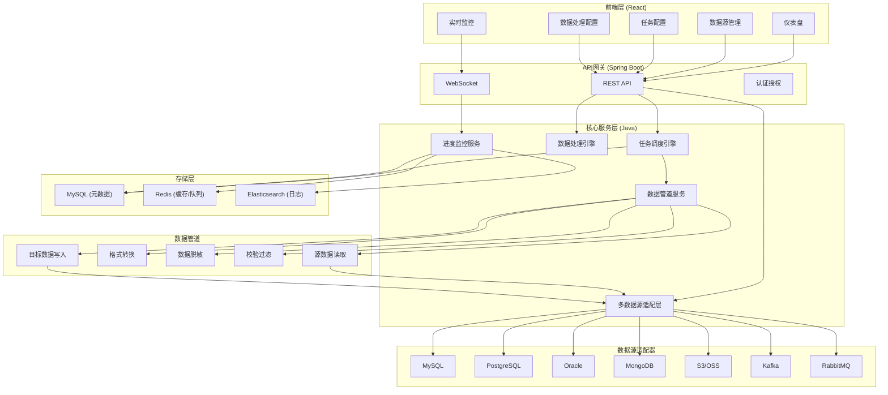
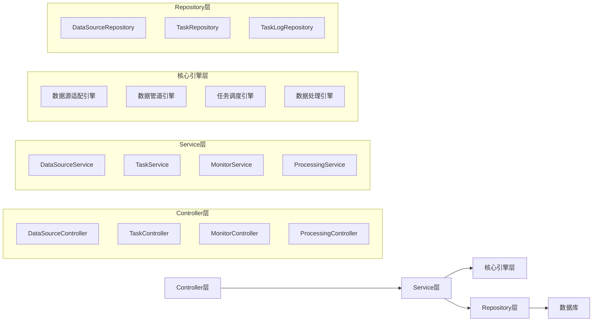
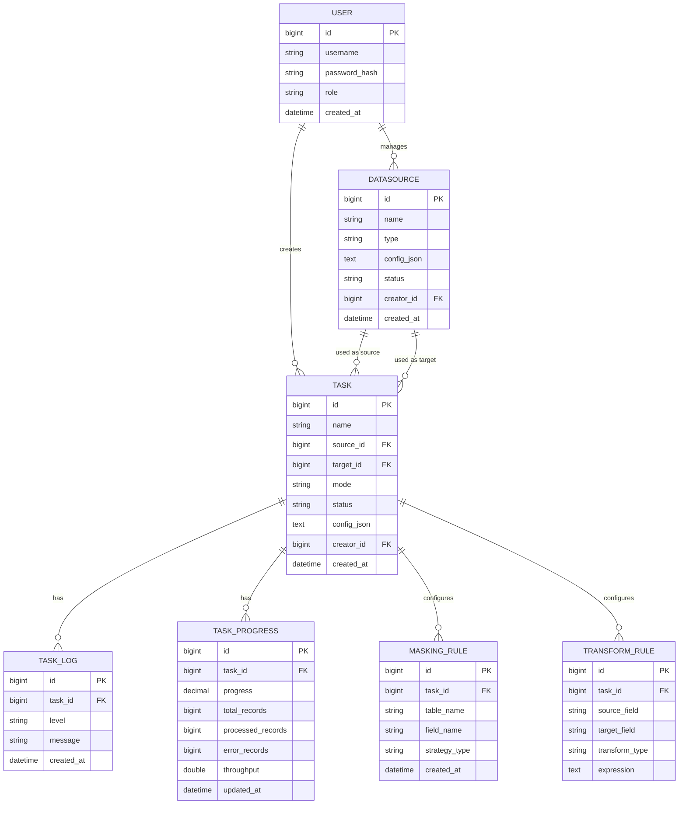

## 1. 总体架构设计



## 2. 技术栈说明

### 2.1 后端技术栈
- **框架**: Spring Boot 3.2.x + Spring Cloud
- **编程语言**: Java 17
- **ORM**: MyBatis-Plus
- **数据库连接池**: HikariCP
- **任务调度**: Quartz + 线程池
- **缓存**: Redis
- **消息队列**: RabbitMQ (内部任务队列)
- **实时推送**: WebSocket
- **数据源驱动**:
  - MySQL: mysql-connector-java
  - PostgreSQL: postgresql
  - Oracle: ojdbc8
  - MongoDB: mongodb-driver-sync
  - S3/OSS: aws-java-sdk-s3 + aliyun-sdk-oss
  - Kafka: kafka-clients
  - RabbitMQ: spring-rabbit

### 2.2 前端技术栈
- **框架**: React 18 + TypeScript
- **构建工具**: Vite 5.x
- **UI组件库**: Ant Design 5.x
- **状态管理**: Zustand
- **路由**: React Router v6
- **图表**: ECharts 5.x
- **HTTP客户端**: Axios
- **WebSocket**: SockJS + Stomp
- **样式**: Tailwind CSS 3.x

### 2.3 基础设施
- **元数据库**: MySQL 8.0
- **缓存/会话**: Redis 7.x
- **日志存储**: Elasticsearch 8.x
- **部署**: Docker + Docker Compose

## 3. 路由定义

| 路由路径 | 页面名称 | 说明 |
|----------|----------|------|
| / | 仪表盘 | 任务概览、统计数据 |
| /datasource | 数据源列表 | 数据源管理 |
| /datasource/create | 创建数据源 | 新增数据源配置 |
| /datasource/:id/edit | 编辑数据源 | 修改数据源配置 |
| /task | 任务列表 | 迁移任务管理 |
| /task/create | 创建任务 | 新建迁移任务 |
| /task/:id | 任务详情 | 任务配置查看 |
| /task/:id/monitor | 任务监控 | 实时进度监控 |
| /processing | 数据处理 | 脱敏和转换规则 |
| /settings | 系统设置 | 用户和系统配置 |
| /login | 登录页 | 用户登录 |

## 4. API 接口定义

### 4.1 数据源管理 API

```typescript
// 数据源类型
interface DataSource {
  id: string;
  name: string;
  type: 'mysql' | 'postgresql' | 'oracle' | 'mongodb' | 's3' | 'kafka' | 'rabbitmq';
  config: Record<string, any>;
  status: 'active' | 'inactive' | 'testing';
  createdAt: string;
  updatedAt: string;
}

// 创建数据源
POST /api/datasources
Request: { name: string; type: string; config: object }
Response: DataSource

// 测试连接
POST /api/datasources/:id/test
Response: { success: boolean; message: string }

// 获取数据源列表
GET /api/datasources?page=1&size=10&type=
Response: { list: DataSource[]; total: number }

// 删除数据源
DELETE /api/datasources/:id
Response: { success: boolean }
```

### 4.2 迁移任务 API

```typescript
// 迁移任务
interface MigrationTask {
  id: string;
  name: string;
  sourceId: string;
  targetId: string;
  mode: 'full' | 'incremental';
  status: 'pending' | 'running' | 'paused' | 'completed' | 'failed';
  progress: number;
  totalRecords: number;
  processedRecords: number;
  config: {
    tableMapping?: Record<string, string>;
    fieldMapping?: Record<string, string>;
    maskingRules?: MaskingRule[];
    transformRules?: TransformRule[];
    incrementalConfig?: {
      column: string;
      lastValue?: string;
    };
  };
  createdAt: string;
  startedAt?: string;
  finishedAt?: string;
}

// 创建任务
POST /api/tasks
Request: { name: string; sourceId: string; targetId: string; mode: string; config: object }
Response: MigrationTask

// 启动任务
POST /api/tasks/:id/start
Response: { success: boolean }

// 暂停任务
POST /api/tasks/:id/pause
Response: { success: boolean }

// 获取任务状态
GET /api/tasks/:id/status
Response: MigrationTask

// WebSocket 实时进度
Topic: /topic/tasks/:id/progress
Message: { progress: number; processedRecords: number; throughput: number; logs: string[] }
```

## 5. 后端架构分层



## 6. 核心模块设计

### 6.1 多数据源适配层

```java
// 数据源适配器接口
public interface DataSourceAdapter {
    boolean testConnection();
    DataSourceReader createReader();
    DataSourceWriter createWriter();
    List<String> listTables();
    TableSchema getTableSchema(String tableName);
}

// 抽象工厂
public interface DataSourceAdapterFactory {
    DataSourceAdapter createAdapter(DataSourceConfig config);
    boolean supports(String type);
}
```

### 6.2 数据管道设计

```java
// 数据管道
public class DataPipeline {
    private final DataSourceReader reader;
    private final DataProcessor processor;
    private final DataSourceWriter writer;
    private final PipelineMonitor monitor;
    
    public void execute(PipelineContext context) {
        reader.open(context);
        processor.open(context);
        writer.open(context);
        
        while (reader.hasNext()) {
            Record record = reader.next();
            processor.process(record);
            writer.write(record);
            monitor.updateProgress();
        }
        
        reader.close();
        processor.close();
        writer.close();
    }
}

// 数据处理器链
public interface DataProcessor {
    void process(Record record);
    default DataProcessor andThen(DataProcessor next) {
        return record -> {
            this.process(record);
            next.process(record);
        };
    }
}
```

### 6.3 数据脱敏模块

```java
public interface MaskingStrategy {
    String mask(String originalValue);
}

public class MaskingService {
    private final Map<String, MaskingStrategy> strategies = new HashMap<>();
    
    public String mask(String value, String strategyType) {
        return strategies.get(strategyType).mask(value);
    }
}

// 脱敏策略实现
public class PhoneMaskingStrategy implements MaskingStrategy {
    public String mask(String phone) {
        return phone.replaceAll("(\\d{3})\\d{4}(\\d{4})", "$1****$2");
    }
}

public class EmailMaskingStrategy implements MaskingStrategy {
    public String mask(String email) {
        int atIndex = email.indexOf('@');
        if (atIndex <= 1) return email;
        return email.charAt(0) + "***" + email.substring(atIndex - 1);
    }
}
```

## 7. 数据模型定义

### 7.1 ER 图



### 7.2 DDL 语句

```sql
-- 用户表
CREATE TABLE user (
    id BIGINT PRIMARY KEY AUTO_INCREMENT,
    username VARCHAR(50) UNIQUE NOT NULL,
    password_hash VARCHAR(255) NOT NULL,
    role VARCHAR(20) NOT NULL DEFAULT 'operator',
    created_at DATETIME DEFAULT CURRENT_TIMESTAMP
);

-- 数据源表
CREATE TABLE datasource (
    id BIGINT PRIMARY KEY AUTO_INCREMENT,
    name VARCHAR(100) NOT NULL,
    type VARCHAR(50) NOT NULL,
    config_json TEXT NOT NULL,
    status VARCHAR(20) DEFAULT 'inactive',
    creator_id BIGINT NOT NULL,
    created_at DATETIME DEFAULT CURRENT_TIMESTAMP,
    FOREIGN KEY (creator_id) REFERENCES user(id)
);

-- 任务表
CREATE TABLE task (
    id BIGINT PRIMARY KEY AUTO_INCREMENT,
    name VARCHAR(100) NOT NULL,
    source_id BIGINT NOT NULL,
    target_id BIGINT NOT NULL,
    mode VARCHAR(20) NOT NULL DEFAULT 'full',
    status VARCHAR(20) DEFAULT 'pending',
    config_json TEXT,
    creator_id BIGINT NOT NULL,
    created_at DATETIME DEFAULT CURRENT_TIMESTAMP,
    started_at DATETIME,
    finished_at DATETIME,
    FOREIGN KEY (source_id) REFERENCES datasource(id),
    FOREIGN KEY (target_id) REFERENCES datasource(id),
    FOREIGN KEY (creator_id) REFERENCES user(id)
);

-- 任务进度表
CREATE TABLE task_progress (
    id BIGINT PRIMARY KEY AUTO_INCREMENT,
    task_id BIGINT NOT NULL,
    progress DECIMAL(5,2) DEFAULT 0,
    total_records BIGINT DEFAULT 0,
    processed_records BIGINT DEFAULT 0,
    error_records BIGINT DEFAULT 0,
    throughput DOUBLE DEFAULT 0,
    updated_at DATETIME DEFAULT CURRENT_TIMESTAMP ON UPDATE CURRENT_TIMESTAMP,
    FOREIGN KEY (task_id) REFERENCES task(id)
);

-- 任务日志表
CREATE TABLE task_log (
    id BIGINT PRIMARY KEY AUTO_INCREMENT,
    task_id BIGINT NOT NULL,
    level VARCHAR(10) NOT NULL,
    message TEXT NOT NULL,
    created_at DATETIME DEFAULT CURRENT_TIMESTAMP,
    FOREIGN KEY (task_id) REFERENCES task(id)
);

-- 脱敏规则表
CREATE TABLE masking_rule (
    id BIGINT PRIMARY KEY AUTO_INCREMENT,
    task_id BIGINT NOT NULL,
    table_name VARCHAR(100) NOT NULL,
    field_name VARCHAR(100) NOT NULL,
    strategy_type VARCHAR(50) NOT NULL,
    created_at DATETIME DEFAULT CURRENT_TIMESTAMP,
    FOREIGN KEY (task_id) REFERENCES task(id)
);

-- 转换规则表
CREATE TABLE transform_rule (
    id BIGINT PRIMARY KEY AUTO_INCREMENT,
    task_id BIGINT NOT NULL,
    source_field VARCHAR(100) NOT NULL,
    target_field VARCHAR(100) NOT NULL,
    transform_type VARCHAR(50) NOT NULL,
    expression TEXT,
    created_at DATETIME DEFAULT CURRENT_TIMESTAMP,
    FOREIGN KEY (task_id) REFERENCES task(id)
);
```
