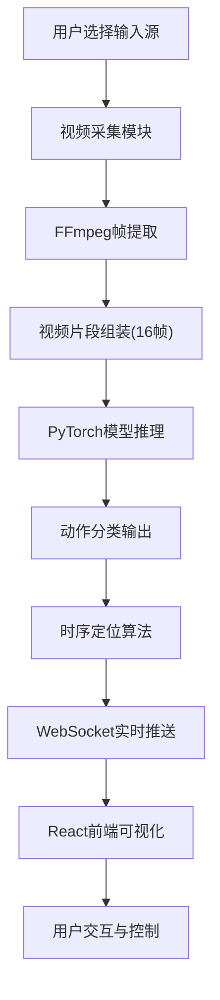

## 1. 产品概述
基于深度学习的实时视频动作识别系统，支持视频流实时分析、动作时序定位和多类别同时识别。系统能够自动检测视频中的人类动作（跑步、跳跃、挥手等），并提供精确的时间戳定位和置信度评估。

- **核心价值**：将视频内容转化为结构化的动作语义信息，为智能监控、体育分析、人机交互等场景提供技术支撑
- **目标用户**：AI开发者、安防监控人员、体育分析师、人机交互研究者
- **技术亮点**：采用Transformer架构的视频理解模型，结合WebSocket实现毫秒级实时推理

## 2. 核心 Features

### 2.1 Feature Module
1. **实时视频流识别**：支持摄像头实时采集、视频文件上传两种输入方式，逐帧进行动作识别
2. **动作时序定位**：精确标注每个动作在视频中的起始/结束时间点，生成时间轴可视化
3. **多类别同时识别**：支持同一时间段内多个动作的并行检测，输出Top-3置信度结果
4. **结果可视化面板**：实时展示识别结果、动作时间轴、置信度热力图
5. **模型配置管理**：支持切换TimeSformer/VideoMAE模型，调整推理参数

### 2.2 Page Details
| 页面名称 | 模块名称 | Feature描述 |
|---------|----------|------------|
| 主控制台 | 视频预览区 | 实时显示摄像头/视频画面，叠加识别结果标签 |
| 主控制台 | 实时结果面板 | 展示当前检测到的动作类别、置信度、持续时间 |
| 主控制台 | 时序定位轴 | 可视化展示所有检测动作的时间区间，支持点击跳转 |
| 主控制台 | 控制工具栏 | 开始/暂停识别、切换输入源、调整模型参数 |
| 主控制台 | 历史记录区 | 保存最近识别结果，支持导出JSON/CSV |

## 3. Core Process

### 3.1 核心业务流程
用户选择视频输入源（摄像头/文件）→ 系统启动视频采集与帧提取 → 每16帧组成一个视频片段送入模型推理 → 输出动作类别和置信度 → 时序定位模块进行动作边界检测 → WebSocket实时推送结果到前端 → 前端可视化展示

## 4. User Interface Design

### 4.1 Design Style
- **主色调**：深空蓝(#165DFF)作为主色，搭配科技感霓虹绿(#00FFA3)作为动作检测高亮色
- **辅助色**：警示橙(#FF7D00)用于高置信度动作，中性灰(#86909C)用于背景和边框
- **整体风格**：科技感深色主题，赛博朋克风格，突出数据可视化和实时动态效果
- **字体**：使用JetBrains Mono作为等宽字体展示数据，Inter作为UI字体
- **布局**：三栏式布局，左侧视频预览，中间实时结果，右侧时序时间轴

### 4.2 Page Design Overview
| 页面名称 | 模块名称 | UI Elements |
|---------|----------|-------------|
| 主控制台 | 视频预览区 | 60%屏宽，16:9比例，圆角边框，实时叠加动作标签，边框颜色随置信度变化 |
| 主控制台 | 实时结果面板 | 卡片式设计，动作名称大号字体，置信度进度条动画，实时FPS显示 |
| 主控制台 | 时序定位轴 | 横向时间轴，不同颜色块代表不同动作，悬停显示详细信息，点击跳转 |
| 主控制台 | 控制工具栏 | 图标按钮组，开始/暂停/录制/设置，悬停动画效果 |

### 4.3 交互与动效
- 检测到新动作时，结果面板有滑入动画和脉冲高亮效果
- 置信度进度条使用平滑过渡动画
- 时序时间轴支持拖拽缩放，自动滚动到当前位置
- 视频画面中动作标签随检测结果实时更新，带淡入淡出效果
