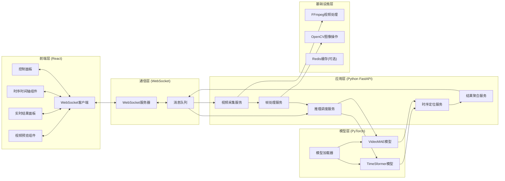
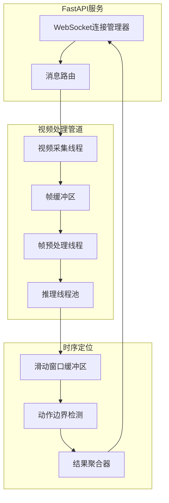

## 1. Architecture Design

### 1.1 整体系统架构



## 2. Technology Description

### 2.1 前端技术栈
- **框架**: React@18 + TypeScript
- **构建工具**: Vite@5
- **样式**: TailwindCSS@3 + CSS动画
- **WebSocket**: 原生WebSocket API + 重连机制
- **状态管理**: React Context + useReducer
- **图标**: Lucide React
- **可视化**: 自定义Canvas时序轴组件

### 2.2 后端技术栈
- **Web框架**: FastAPI@0.109
- **WebSocket**: FastAPI WebSocket + 连接池管理
- **深度学习**: PyTorch@2.1 + torchvision@0.16
- **视频处理**: FFmpeg-python + OpenCV-python
- **视频模型**: pytorchvideo (TimeSformer/VideoMAE)
- **数据处理**: NumPy + Pillow
- **异步处理**: asyncio + concurrent.futures

### 2.3 核心技术选型说明
1. **TimeSformer**: Facebook AI提出的视频Transformer模型，采用时空分离注意力机制，适合实时视频理解
2. **VideoMAE**: 字节跳动提出的掩码自编码器，在小样本场景下表现优异，支持自监督预训练
3. **FFmpeg**: 高性能视频编解码，支持RTSP/RTMP/WebCam多种输入源
4. **WebSocket**: 全双工实时通信，保证识别结果毫秒级推送

## 3. Project Structure

```
action-recognition-system/
├── backend/                    # Python后端
│   ├── app/
│   │   ├── main.py            # FastAPI入口，WebSocket路由
│   │   ├── config.py          # 配置管理
│   │   └── schemas.py         # Pydantic数据模型
│   ├── services/
│   │   ├── video_capture.py   # 视频采集服务
│   │   ├── frame_processor.py # 帧处理服务
│   │   ├── inference.py       # 模型推理服务
│   │   ├── temporal_locator.py# 时序定位服务
│   │   └── websocket_manager.py # WebSocket连接管理
│   ├── models/
│   │   ├── base.py            # 模型基类
│   │   ├── timesformer.py     # TimeSformer实现
│   │   ├── videomae.py        # VideoMAE实现
│   │   └── model_loader.py    # 模型加载器
│   ├── utils/
│   │   ├── ffmpeg_utils.py    # FFmpeg工具函数
│   │   └── video_utils.py     # 视频处理工具
│   └── requirements.txt       # Python依赖
└── frontend/                   # React前端
    ├── src/
    │   ├── components/
    │   │   ├── VideoPlayer.tsx    # 视频播放器
    │   │   ├── ResultPanel.tsx    # 实时结果面板
    │   │   ├── Timeline.tsx       # 时序时间轴
    │   │   └── ControlBar.tsx     # 控制工具栏
    │   ├── hooks/
    │   │   └── useWebSocket.ts    # WebSocket Hook
    │   ├── context/
    │   │   └── AppContext.tsx     # 全局状态
    │   ├── types/
    │   │   └── index.ts           # TypeScript类型定义
    │   ├── App.tsx
    │   └── main.tsx
    └── package.json
```

## 4. API & Message Definitions

### 4.1 WebSocket 消息协议

#### 客户端 → 服务端消息
```typescript
// 开始识别
interface StartMessage {
  type: 'start';
  source: 'camera' | 'file';
  cameraIndex?: number;
  filePath?: string;
  modelType: 'timesformer' | 'videomae';
  fps: number;
  confidenceThreshold: number;
}

// 停止识别
interface StopMessage {
  type: 'stop';
}

// 暂停/继续
interface PauseMessage {
  type: 'pause' | 'resume';
}

// 配置更新
interface ConfigMessage {
  type: 'config';
  confidenceThreshold: number;
  modelType: 'timesformer' | 'videomae';
}
```

#### 服务端 → 客户端消息
```typescript
// 识别结果
interface RecognitionResult {
  type: 'result';
  timestamp: number;
  frameIndex: number;
  predictions: Array<{
    action: string;
    confidence: number;
    boundingBox?: [number, number, number, number];
  }>;
  fps: number;
  latency: number;
}

// 时序定位结果
interface TemporalResult {
  type: 'temporal';
  action: string;
  startTime: number;
  endTime: number;
  duration: number;
  avgConfidence: number;
}

// 视频帧数据 (用于前端展示)
interface FrameData {
  type: 'frame';
  timestamp: number;
  width: number;
  height: number;
}

// 状态更新
interface StatusUpdate {
  type: 'status';
  status: 'idle' | 'connecting' | 'running' | 'paused' | 'error';
  message?: string;
}
```

### 4.2 动作类别定义
```python
ACTION_CLASSES = {
    0: '跑步',
    1: '跳跃',
    2: '挥手',
    3: '走路',
    4: '站立',
    5: '坐下',
    6: '蹲下',
    7: '其他'
}
```

## 5. Server Architecture



### 5.1 关键设计要点
1. **多线程/异步架构**: 视频采集、预处理、推理、结果推送分别在不同线程运行，通过队列解耦
2. **滑动窗口时序定位**: 维护最近N帧的预测结果，使用动态规划算法检测动作边界
3. **帧采样策略**: 根据模型输入要求(如16帧/clip)进行滑窗采样，相邻clip有50%重叠
4. **连接池管理**: 支持多客户端同时连接，每个连接独立维护识别会话

## 6. 核心算法说明

### 6.1 动作时序定位算法
```
输入: 逐帧预测结果序列 P = [p1, p2, ..., pn]
其中 pi = {action, confidence}

输出: 动作区间列表 T = [(s1, e1, a1), (s2, e2, a2), ...]

算法步骤:
1. 对每个动作类别，构建置信度时间序列
2. 使用高斯滤波平滑置信度曲线
3. 应用双阈值法检测动作起始点(上升沿)和结束点(下降沿)
4. 合并间隔小于阈值的相邻同类别区间
5. 过滤持续时间过短或平均置信度过低的区间
```

### 6.2 实时推理优化
1. **模型量化**: 支持FP16半精度推理，显存占用减少50%
2. **批处理**: 积累多帧后批量推理，提高GPU利用率
3. **帧跳过**: 根据设备性能动态调整跳帧数，保证实时性
